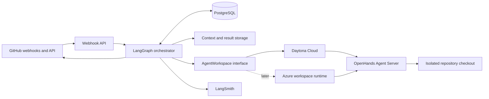

# Agentic Software Delivery Platform Specification

Status: Proposed implementation specification

Last reviewed: 2026-07-18

Implementation language: TypeScript wherever supported

Initial workspace provider: Daytona Cloud

Initial coding harness: OpenHands Agent Server

Orchestration: LangGraph.js

Observability: LangSmith

Final hosting target: Microsoft Azure

This specification defines an incremental path from one manually invoked coding agent to an Azure-hosted, webhook-driven
system that can coordinate specialized scrum-master, coding, reviewing, and repair agents. Each phase must produce a
working vertical capability. Later phases extend stable contracts rather than replacing an unproven prototype with a
broad platform build.

## 1. Product objective

Build an internal software-delivery system that can:

1. Convert a bounded work item into a versioned agent assignment.
2. Run up to ten coding-related agents concurrently in isolated workspaces.
3. Preserve a coding workspace across coding and repair iterations.
4. Independently validate agent changes and retain command evidence.
5. Chain role-specific agents through deterministic LangGraph transitions.
6. Start or resume workflows from authenticated external webhooks.
7. Publish agent work as branches and draft pull requests.
8. Trace orchestration and model activity without treating traces as workflow state.
9. Run the control plane in Azure and, if required, replace Daytona with an Azure-native workspace implementation.

## 2. Guiding decisions

### 2.1 TypeScript owns the control plane

The webhook API, LangGraph workflows, provider clients, schemas, GitHub integration, reconciliation, and observability
code use TypeScript. Python is limited to the OpenHands implementation already packaged in the Agent Server runtime and
to an eventual worker-side shim only if an Azure runtime cannot call the Agent Server directly.

### 2.2 Daytona owns initial workspace lifecycle

Each active coding or repair workflow receives a Daytona sandbox. The sandbox contains the repository checkout,
generated context, OpenHands Agent Server, dependency state, and validation artifacts. The orchestrator stores
identifiers, not live SDK objects.

### 2.3 LangGraph owns workflow truth

LangGraph and its PostgreSQL checkpointer own role sequencing, retries, budgets, terminal outcomes, and resumability.
Agent prose, LangSmith traces, GitHub comments, and Daytona state are evidence or external state; none replaces the
workflow checkpoint.

### 2.4 OpenHands owns coding behavior

OpenHands explores the repository, edits files, runs permitted commands, and reports its result. It does not decide
whether its own validation is sufficient, whether another role should run, or whether a retry budget is available.

### 2.5 Webhooks signal; reconciliation proves

Webhook handlers authenticate, persist, normalize, and acknowledge events. They do not perform long-running work. A
periodic reconciliation process repairs missed deliveries and compares LangGraph, workspace-provider, and source-control
state.

### 2.6 No human-approval workflow is in scope

The system may create or update draft pull requests automatically. Human approval nodes, LangGraph interrupts for
approval, merge authorization, and automatic merging are outside this specification. Existing repository policies remain
authoritative.

## 3. Target architecture



## 4. System boundaries

| Capability                       | Initial owner                            | Final owner                                                 |
| -------------------------------- | ---------------------------------------- | ----------------------------------------------------------- |
| Workflow state and transitions   | LangGraph.js                             | LangGraph.js on Azure Container Apps                        |
| Durable checkpoints              | Local/in-memory, then PostgreSQL         | Azure Database for PostgreSQL                               |
| Agent workspace                  | Daytona Cloud                            | Daytona Cloud or Azure `AgentWorkspace` adapter             |
| Coding loop                      | OpenHands Agent Server                   | OpenHands Agent Server                                      |
| Context bundles                  | Local files, then object storage         | Azure Blob Storage                                          |
| Source control and pull requests | GitHub                                   | GitHub                                                      |
| Secrets                          | Local environment, then provider secrets | Azure Key Vault                                             |
| Agent and graph traces           | LangSmith Cloud                          | LangSmith Cloud unless separately licensed for self-hosting |
| Platform telemetry               | Local logs                               | Application Insights and OpenTelemetry                      |

## 5. Repository architecture

The implementation should converge on this pnpm workspace without requiring the entire structure in the first phase:

```text
agent-platform/
|-- apps/
|   |-- orchestrator/
|   |-- webhook-api/
|   `-- reconciler/
|-- packages/
|   |-- contracts/
|   |-- workspace/
|   |-- daytona-workspace/
|   |-- openhands-client/
|   |-- github-client/
|   |-- context-bundle/
|   `-- observability/
|-- prompts/
|   |-- scrum-master/
|   |-- coder/
|   |-- reviewer/
|   `-- repairer/
|-- tests/
|   |-- contract/
|   |-- integration/
|   `-- fixtures/
|-- package.json
|-- pnpm-workspace.yaml
`-- tsconfig.json
```

## 6. Shared contracts

All external boundaries use versioned Zod schemas. JSON representations must contain a `schemaVersion` and reject
unknown breaking changes.

### 6.1 Assignment

An assignment contains:

- Workflow run ID and role execution ID.
- Repository identifier and immutable base commit SHA.
- Objective and acceptance criteria.
- Relevant paths and evidence references.
- Explicit validation commands.
- Allowed and forbidden path patterns.
- Maximum turns, tokens, elapsed time, and repair attempts.
- Context-bundle URI and SHA-256 digest.
- Prompt version and worker-image version.

### 6.2 WorkspaceHandle

A workspace handle contains only serializable provider state:

- Provider name.
- Provider workspace ID.
- Workspace lifecycle state.
- Repository path.
- Agent Server URL reference, never its secret.
- OpenHands conversation ID when one exists.
- Creation, last-activity, retention, and expiry timestamps.

### 6.3 AgentResult

Every role returns a discriminated result with:

- `completed`, `blocked`, `failed`, `cancelled`, or `timed_out` status.
- Role-specific structured output.
- Base and resulting commit SHAs when applicable.
- Changed-file inventory.
- Validation evidence references.
- Token, cost, turn, and elapsed-time metrics when available.
- Artifact manifest and digests.
- Typed failure classification instead of an unstructured exception alone.

### 6.4 WebhookEnvelope

Normalized events contain:

- Provider and provider delivery ID.
- Repository and installation identifiers.
- Event and action names.
- Relevant issue, pull request, check, and commit identifiers.
- Received timestamp.
- Payload digest and retained raw-payload reference.
- Correlation key used to find or create a LangGraph thread.

## 7. Security model

1. Treat repository content, issue text, comments, logs, and generated artifacts as untrusted evidence rather than
   control-plane instructions.
2. Use a GitHub App and short-lived installation tokens instead of personal access tokens.
3. Keep model, GitHub, Daytona, LangSmith, and Azure credentials outside assignment files and repository checkouts.
4. Give each workspace a unique branch and isolated filesystem.
5. Restrict repositories, organizations, commands, paths, concurrency, elapsed time, turns, and model spend through
   deterministic policy.
6. Run independent validation outside the agent's self-reported result.
7. Never trigger privileged work from an unauthenticated webhook or an untrusted fork context.
8. Retain enough evidence to connect a webhook delivery, graph run, workspace, model trace, commit, and pull request
   without logging secret values.

## 8. Phase sequence

| Phase | Specification                                                           | Working capability                                                              |
| ----- | ----------------------------------------------------------------------- | ------------------------------------------------------------------------------- |
| 1     | [Direct worker prototype](phase-1-direct-worker-prototype.md)           | One TypeScript process controls one OpenHands agent in Daytona.                 |
| 2     | [Local LangGraph workflow](phase-2-local-langgraph-workflow.md)         | One deterministic graph creates a validated draft PR.                           |
| 3     | [Durable resumable workspaces](phase-3-durable-resumable-workspaces.md) | Workflows and workspaces survive process restarts and repair turns.             |
| 4     | [Specialized agent chain](phase-4-specialized-agent-chain.md)           | Scrum-master, coder, reviewer, and repairer roles coordinate through contracts. |
| 5     | [Webhook automation](phase-5-webhook-automation.md)                     | Authenticated events start and resume workflows safely.                         |
| 6     | [Azure control plane](phase-6-azure-control-plane.md)                   | TypeScript services, state, artifacts, and secrets run in Azure.                |
| 7     | [Azure-native workspaces](phase-7-azure-native-workspaces.md)           | An optional Azure adapter replaces Daytona without changing graph contracts.    |

Each phase begins only after the previous phase's executable acceptance checks pass. A later operational preference must
not retroactively expand an earlier phase's scope.

## 9. Cross-phase quality gates

Every phase must:

1. Pin external images and major package versions.
2. Validate all persisted and received data at runtime.
3. Include focused unit tests for policy and state transitions.
4. Include at least one integration test against the newly introduced boundary.
5. Document required environment variables without including values.
6. Emit correlation IDs in logs and traces.
7. Demonstrate cleanup after both success and failure.
8. Record measured duration, compute use, model use, and failure reason for live agent trials.

## 10. Global non-goals

- Automatic merge or bypass of repository policies.
- Human approval workflows or approval interrupts.
- A general-purpose multi-tenant agent platform.
- Supporting multiple source-control providers before GitHub works end to end.
- Supporting multiple workspace providers before Daytona works end to end.
- Building a custom coding-agent loop while OpenHands meets the requirement.
- Treating LangSmith as a checkpoint or event-replay database.
- Storing secrets in prompts, context bundles, traces, or Git remotes.
- Guaranteeing that an agent can complete every selected work item.

## 11. Program completion criteria

The program is complete when the Azure-hosted system can accept authenticated events, execute up to ten isolated role
runs concurrently, resume retained coding workspaces, produce independently validated changes, chain review and bounded
repair work, publish or update draft pull requests, reconcile missed events, and expose correlated workflow and model
traces without relying on a human-approval or automatic-merge path.
