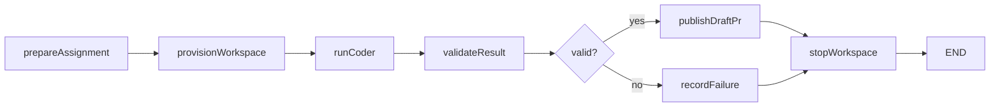

# Phase 2: Local LangGraph Workflow

Status: Proposed

Depends on: [Phase 1](phase-1-direct-worker-prototype.md)

Produces: One locally executed, traced LangGraph workflow that runs a coder, validates its result, publishes a draft
pull request, and terminates without a human-approval step.

## 1. Objective

Move sequencing and policy out of the prototype CLI and into a deterministic LangGraph.js state machine. Preserve the
proven Daytona/OpenHands worker rather than rewriting it. Demonstrate that workflow state is serializable, traceable,
and testable independently from the coding agent.

## 2. Deliverables

```text
agent-platform/
|-- apps/orchestrator/
|   |-- src/graph.ts
|   |-- src/state.ts
|   |-- src/cli.ts
|   |-- src/nodes/
|   |   |-- prepare-assignment.ts
|   |   |-- provision-workspace.ts
|   |   |-- run-coder.ts
|   |   |-- validate-result.ts
|   |   |-- publish-draft-pr.ts
|   |   `-- stop-workspace.ts
|   `-- test/
|-- packages/workspace/
|   `-- src/agent-workspace.ts
|-- packages/github-client/
|   |-- src/app-auth.ts
|   |-- src/branches.ts
|   `-- src/pull-requests.ts
`-- packages/observability/
    `-- src/langsmith.ts
```

## 3. Graph design



No graph node requests or waits for human approval. `publishDraftPr` publishes automatically after deterministic
validation succeeds.

## 4. Granular implementation tasks

### 4.1 Provider boundary

- [ ] P2-001 Define the `AgentWorkspace` TypeScript interface in a provider-neutral package.
- [ ] P2-002 Include `create`, `start`, `execute`, `executeCommand`, `upload`, `download`, `stop`, `archive`, and
      `destroy` operations.
- [ ] P2-003 Define serializable `WorkspaceHandle` and `ExecutionHandle` schemas.
- [ ] P2-004 Adapt the Phase 1 `DaytonaWorkspace` to implement `AgentWorkspace` without changing its proven behavior.
- [ ] P2-005 Add contract tests that run against the fake provider and can later run against Daytona and Azure
      implementations.
- [ ] P2-006 Prevent LangGraph state from storing SDK clients, HTTP clients, streams, promises, or class instances.

### 4.2 Graph state

- [ ] P2-007 Define a LangGraph state schema containing run ID, assignment, workspace handle, conversation ID, worker
      result, validation result, publication result, terminal status, and typed failure.
- [ ] P2-008 Define reducers only for append-only event summaries and artifact references.
- [ ] P2-009 Ensure node outputs are partial state updates rather than mutated input objects.
- [ ] P2-010 Add a graph schema version for future checkpoint migrations.
- [ ] P2-011 Add serialization tests that round-trip every reachable state through JSON.
- [ ] P2-012 Add test fixtures for prepared, running, validated, published, failed, and cleaned-up states.

### 4.3 Nodes

- [ ] P2-013 Implement `prepareAssignment` to validate the assignment, resolve prompt text, and build the context
      manifest.
- [ ] P2-014 Make `prepareAssignment` idempotent by deriving stable artifact names from `runId` and content digests.
- [ ] P2-015 Implement `provisionWorkspace` to create or reuse only the workspace already recorded for the run.
- [ ] P2-016 Make `provisionWorkspace` verify provider labels before reusing an existing workspace ID.
- [ ] P2-017 Implement `runCoder` as the only node that invokes OpenHands in this phase.
- [ ] P2-018 Make `runCoder` store the conversation ID and raw result artifact before parsing the final role result.
- [ ] P2-019 Implement `validateResult` to run required commands independently and enforce path, SHA, patch, and budget
      policies.
- [ ] P2-020 Make `validateResult` return a typed disposition of `publishable` or `failed`, with reasons.
- [ ] P2-021 Implement `recordFailure` to preserve evidence and choose a terminal status without retrying automatically.
- [ ] P2-022 Implement `stopWorkspace` as a cleanup node reachable from both publication and failure paths.
- [ ] P2-023 Make cleanup idempotent when the workspace is already stopped or unavailable.

### 4.4 GitHub App integration

- [ ] P2-024 Register a development GitHub App with metadata read, contents write, pull requests write, and checks read
      permissions only.
- [ ] P2-025 Implement GitHub App JWT generation and short-lived installation-token exchange.
- [ ] P2-026 Keep the private key outside repository files and redact it from errors and traces.
- [ ] P2-027 Implement repository allowlist checks before requesting an installation token.
- [ ] P2-028 Implement branch existence lookup and reject collisions not owned by the same `runId`.
- [ ] P2-029 Apply the validated patch to a fresh clean checkout at the recorded base SHA.
- [ ] P2-030 Create a commit with run ID, prompt version, and base SHA metadata.
- [ ] P2-031 Push `agent/<run-id>` with a short-lived installation token.
- [ ] P2-032 Create a draft pull request containing objective, acceptance criteria, validation summary, changed files,
      run ID, and evidence links.
- [ ] P2-033 If a draft PR for the same run already exists, update it instead of creating a duplicate.
- [ ] P2-034 Verify the remote commit SHA after push and store it in graph state.

### 4.5 LangGraph compilation and routing

- [ ] P2-035 Build the graph with explicit named nodes and conditional edges after validation.
- [ ] P2-036 Compile initially with a memory checkpointer for local development.
- [ ] P2-037 Use `runId` as the initial thread ID and reject accidental reuse for a different assignment digest.
- [ ] P2-038 Add a CLI command to invoke a graph from a validated assignment file.
- [ ] P2-039 Add a CLI command to inspect the current state and terminal outcome for a thread.
- [ ] P2-040 Add a CLI cancellation command that marks the graph cancelled and stops the workspace.
- [ ] P2-041 Ensure the graph reaches `END` after success, deterministic failure, cancellation, or cleanup failure.

### 4.6 LangSmith instrumentation

- [ ] P2-042 Add `langsmith` and configure tracing only through documented environment variables.
- [ ] P2-043 Attach `runId`, repository, base SHA, graph version, prompt version, worker image, and model profile as
      trace metadata.
- [ ] P2-044 Create spans around context preparation, Daytona lifecycle calls, OpenHands invocation, validation, and
      GitHub publication.
- [ ] P2-045 Store large logs and patches outside LangSmith and trace only bounded summaries and artifact references.
- [ ] P2-046 Redact authorization headers, API keys, signed URLs, and Git credential material before tracing.
- [ ] P2-047 Confirm LangSmith trace failure cannot change the graph's business outcome.

### 4.7 Tests

- [ ] P2-048 Unit test every node with fixed state and mocked dependencies.
- [ ] P2-049 Test the publishable route from prepared assignment through stopped workspace.
- [ ] P2-050 Test validation failure routes through evidence preservation and cleanup without GitHub publication.
- [ ] P2-051 Test repeated invocation of `publishDraftPr` creates only one branch and one PR.
- [ ] P2-052 Test cancellation before workspace creation, during coder execution, and after publication.
- [ ] P2-053 Test cleanup failure preserves the primary result and records a separate cleanup error.
- [ ] P2-054 Run one live end-to-end graph against the Phase 1 repair fixture.
- [ ] P2-055 Verify the live run creates a draft PR whose commit matches the independently validated patch.
- [ ] P2-056 Verify the LangSmith trace links all graph nodes through the same run metadata.

## 5. Acceptance criteria

1. The graph contains no human-approval or interrupt node.
2. All graph state can be serialized and reconstructed from JSON.
3. A successful run creates exactly one draft pull request automatically.
4. A validation failure creates no branch or pull request.
5. Re-running an idempotent publication node does not duplicate external state.
6. Cleanup executes after every terminal route.
7. LangSmith displays the graph and provider spans without stored secrets.
8. Focused node, graph-routing, and live end-to-end tests pass.

## 6. Non-goals

- Durable PostgreSQL checkpoints.
- Workspace restore after orchestrator restart.
- Multiple agent roles or repair loops.
- Webhook handling.
- Azure hosting.
- PR approval, merge, or automatic merge.

## 7. Completion evidence

Retain the graph diagram, state schema, passing test output, one sanitized LangSmith trace URL, the created draft PR
URL, the source and remote commit SHAs, validation artifacts, and proof that a repeated publication attempt did not
create a duplicate PR.
