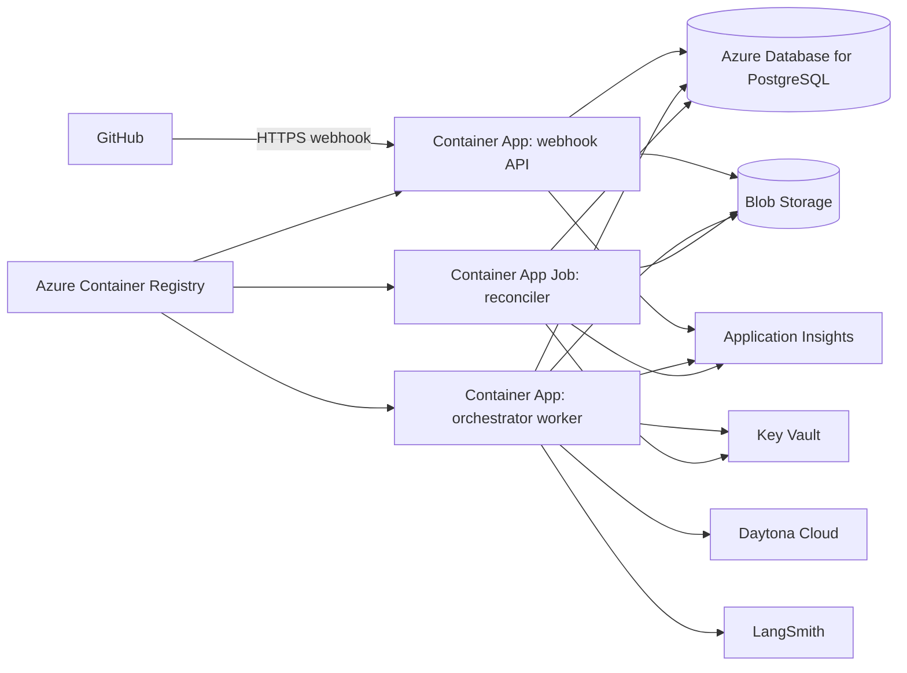

# Phase 6: Azure Control Plane

Status: Proposed

Depends on: [Phase 5](phase-5-webhook-automation.md)

Produces: An Azure-hosted TypeScript webhook API, orchestrator, and reconciler using managed PostgreSQL, Blob Storage,
Key Vault, ACR, and platform telemetry, while Daytona remains the workspace provider.

## 1. Objective

Deploy the proven control plane to Azure without simultaneously changing the agent-workspace runtime. Preserve the
graph, role, event, and provider contracts. Use managed identities and private service connectivity where supported,
scale request handling independently from workflow execution, and validate recovery under real platform restarts.

## 2. Azure topology

## 3. Deployment units

| Unit                | Azure service                         | Scaling model                                            | Public ingress            |
| ------------------- | ------------------------------------- | -------------------------------------------------------- | ------------------------- |
| Webhook API         | Container Apps                        | HTTP concurrency, minimum one after production readiness | GitHub webhook route only |
| Orchestrator worker | Container Apps                        | Queue/backlog driven, zero to configured maximum         | None                      |
| Reconciler          | Container Apps Job                    | Scheduled and manually invokable                         | None                      |
| Schema migration    | Container Apps Job or CI one-shot job | On deployment only                                       | None                      |

## 4. Granular implementation tasks

### 4.1 Infrastructure source and environments

- [ ] P6-001 Select Bicep as the infrastructure-as-code format unless an existing repository standard requires
      Terraform.
- [ ] P6-002 Create reusable modules for resource group dependencies, networking, identity, registry, Container Apps,
      PostgreSQL, Blob Storage, Key Vault, and monitoring.
- [ ] P6-003 Create parameter files for development, staging, and production without secret values.
- [ ] P6-004 Define deterministic resource names, required tags, region, environment, workload owner, and cost center.
- [ ] P6-005 Pin API versions for Azure resources.
- [ ] P6-006 Add infrastructure formatting, validation, and preview commands.
- [ ] P6-007 Add a deployment output contract containing only non-secret endpoints and resource identifiers.
- [ ] P6-008 Document subscription, region, quota, DNS, and GitHub App prerequisites.

### 4.2 Network and identity

- [ ] P6-009 Create a virtual network and delegated subnets required by the chosen Container Apps environment and
      private endpoints.
- [ ] P6-010 Place PostgreSQL, Blob Storage, Key Vault, and ACR behind private endpoints where the service plan supports
      them.
- [ ] P6-011 Configure private DNS zones and links for every private endpoint.
- [ ] P6-012 Restrict the webhook API ingress to HTTPS and its webhook route; keep management endpoints internal or
      authenticated.
- [ ] P6-013 Disable public ingress for orchestrator, reconciler, and migration workloads.
- [ ] P6-014 Create separate user-assigned managed identities for API, worker, reconciler, migration, and deployment
      roles.
- [ ] P6-015 Grant each identity only the storage, registry, Key Vault, database-bootstrap, and telemetry permissions it
      requires.
- [ ] P6-016 Keep GitHub App, Daytona, model-provider, LangSmith, and webhook credentials out of infrastructure
      parameters and container images.
- [ ] P6-017 Verify denied access for each workload against services outside its role.

### 4.3 Container build and registry

- [ ] P6-018 Create separate production Dockerfiles or targets for webhook API, orchestrator worker, reconciler, and
      migration job.
- [ ] P6-019 Use pinned base-image digests and a non-root runtime user.
- [ ] P6-020 Build only production workspace dependencies into each image.
- [ ] P6-021 Add container health checks consistent with service behavior.
- [ ] P6-022 Generate a software bill of materials for each image.
- [ ] P6-023 Scan images for known vulnerabilities and secret material before push.
- [ ] P6-024 Push immutable commit-SHA tags to ACR and record image digests.
- [ ] P6-025 Configure Container Apps to deploy immutable image digests rather than mutable tags.

### 4.4 Azure Database for PostgreSQL

- [ ] P6-026 Provision Azure Database for PostgreSQL Flexible Server with supported PostgreSQL version, backups,
      retention, and zone configuration appropriate to the environment.
- [ ] P6-027 Disable public network access after private connectivity is verified.
- [ ] P6-028 Configure TLS enforcement and certificate validation in the Node PostgreSQL client.
- [ ] P6-029 Select Entra authentication for application identities where supported by all required libraries; otherwise
      store rotated database credentials in Key Vault.
- [ ] P6-030 Create migration and runtime roles with least privilege.
- [ ] P6-031 Configure connection-pool sizes against server connection limits and maximum Container App replicas.
- [ ] P6-032 Configure query, lock, statement, and idle-transaction timeouts.
- [ ] P6-033 Run the Phase 3 schema migrations through the one-shot migration workload.
- [ ] P6-034 Verify LangGraph checkpoint compatibility against the managed PostgreSQL version.
- [ ] P6-035 Test point-in-time restore into a non-production server and verify checkpoint and inbox records.

### 4.5 Azure Blob artifact store

- [ ] P6-036 Create private containers for context, results, command logs, webhook payloads, patches, and diagnostics,
      or use immutable prefixes with equivalent access separation.
- [ ] P6-037 Implement `AzureBlobArtifactStore` using the existing `ArtifactStore` interface.
- [ ] P6-038 Authenticate with `DefaultAzureCredential` and managed identity in Azure.
- [ ] P6-039 Preserve immutable run/role/attempt object keys and SHA-256 metadata.
- [ ] P6-040 Verify the downloaded content digest rather than trusting object metadata alone.
- [ ] P6-041 Configure encryption, soft delete, versioning, and lifecycle rules appropriate to each artifact class.
- [ ] P6-042 Do not expose public containers or persistent public object URLs.
- [ ] P6-043 Generate short-lived, narrowly scoped access only when a component cannot use managed identity.
- [ ] P6-044 Migrate required local Phase 5 artifacts and verify record-to-object digests.
- [ ] P6-045 Run contract tests against Azurite and a staging storage account.

### 4.6 Azure Key Vault and secret loading

- [ ] P6-046 Provision Key Vault with RBAC authorization, soft delete, and purge protection.
- [ ] P6-047 Store the GitHub App private key, webhook secret, Daytona API key, model-provider keys, LangSmith key, and
      any fallback database credential as separate secrets.
- [ ] P6-048 Load secrets at runtime through the secret-provider abstraction.
- [ ] P6-049 Cache secret values only for a bounded duration and never persist them in graph state.
- [ ] P6-050 Add rotation runbooks for every secret and validate at least one non-disruptive rotation in staging.
- [ ] P6-051 Ensure logs and exception serializers redact resolved secret values and Key Vault retrieval metadata that
      contains sensitive references.

### 4.7 Container Apps configuration

- [ ] P6-052 Provision one Container Apps environment with Log Analytics integration and required workload profile.
- [ ] P6-053 Deploy the webhook API with HTTPS ingress, health probes, request limits, and a revision strategy.
- [ ] P6-054 Configure the webhook API minimum replica count according to measured GitHub delivery latency needs.
- [ ] P6-055 Deploy the orchestrator worker without ingress.
- [ ] P6-056 Select a durable queue or database-backed claim mechanism compatible with the Phase 5 inbox and configure
      worker scaling from backlog.
- [ ] P6-057 Cap worker replicas so aggregate workspace acquisition cannot exceed configured Daytona and PostgreSQL
      limits.
- [ ] P6-058 Configure graceful shutdown longer than lease release and checkpoint operations.
- [ ] P6-059 Deploy the reconciler as a scheduled Container Apps Job with singleton execution protection.
- [ ] P6-060 Deploy database migration as an explicit one-shot job that must succeed before application revision
      promotion.
- [ ] P6-061 Configure CPU, memory, ephemeral disk, execution timeout, and replica limits from measured Phase 5 use.
- [ ] P6-062 Verify the worker can scale to zero while active Daytona sandboxes remain represented by durable leases.

### 4.8 Configuration and environment validation

- [ ] P6-063 Define one Zod environment schema per deployment unit.
- [ ] P6-064 Separate non-secret configuration from Key Vault secret references.
- [ ] P6-065 Validate required endpoints, identifiers, limits, and feature flags at process startup.
- [ ] P6-066 Fail readiness when PostgreSQL, required Blob containers, or migration version are unavailable.
- [ ] P6-067 Keep downstream Daytona, GitHub, model, and LangSmith outages out of basic liveness checks.
- [ ] P6-068 Add a startup configuration summary that includes no credentials.

### 4.9 Observability

- [ ] P6-069 Instrument all services with OpenTelemetry and Azure Monitor export.
- [ ] P6-070 Preserve `runId`, delivery ID, graph thread ID, role attempt, workspace ID, commit SHA, PR number, and
      LangSmith trace identifiers as correlated structured fields.
- [ ] P6-071 Record request latency, inbox lag, queue depth, active workflows, workspace acquisition time, role
      duration, retry counts, reconciliation drift, and terminal outcomes.
- [ ] P6-072 Add distributed trace propagation from webhook receipt through dispatch and graph advancement.
- [ ] P6-073 Keep prompts, patches, source contents, raw webhook bodies, and secrets out of default telemetry.
- [ ] P6-074 Create dashboards for ingress, workflows, providers, database, artifacts, costs, and failures.
- [ ] P6-075 Create alerts for invalid-signature spikes, webhook errors, inbox backlog, stale leases, migration
      failures, database saturation, artifact errors, and exhausted budgets.
- [ ] P6-076 Add a synthetic staging probe that submits an authenticated fixture event and verifies durable receipt
      without starting paid agent work.

### 4.10 Deployment and rollback

- [ ] P6-077 Add CI stages for dependency install, typecheck, lint, unit tests, integration tests, image build, scan,
      IaC validation, and deployment preview.
- [ ] P6-078 Require explicit environment controls already used by the repository for production deployment; do not add
      a runtime human-approval graph node.
- [ ] P6-079 Apply additive database migrations before deploying application revisions that require them.
- [ ] P6-080 Deploy revisions with zero traffic, run smoke tests, then shift traffic progressively.
- [ ] P6-081 Keep the prior compatible revision available for application rollback.
- [ ] P6-082 Define forward-fix procedures for non-reversible database migrations.
- [ ] P6-083 Verify rollback does not orphan inbox leases, graph threads, or Daytona sandboxes.
- [ ] P6-084 Record deployed infrastructure version, application image digests, schema version, and prompt registry
      version.

### 4.11 Resilience, scale, and cost proof

- [ ] P6-085 Run a staging end-to-end webhook workflow through Azure and Daytona.
- [ ] P6-086 Restart the orchestrator revision during active work and verify PostgreSQL recovery.
- [ ] P6-087 Scale workers to zero and verify pending durable work resumes when capacity returns.
- [ ] P6-088 Execute ten concurrent fixture workflows and verify Azure scaling respects the global workspace cap.
- [ ] P6-089 Temporarily block Daytona access and verify durable retry and alert behavior.
- [ ] P6-090 Temporarily block Blob access and verify no graph claims evidence was persisted.
- [ ] P6-091 Restore PostgreSQL from backup in an isolated environment and run reconciliation without external mutation.
- [ ] P6-092 Measure baseline and ten-run Azure compute, database, storage, egress, logging, and Daytona costs.
- [ ] P6-093 Configure budgets and anomaly alerts for Azure, Daytona, model providers, and LangSmith where provider APIs
      support them.
- [ ] P6-094 Document production capacity, recovery objectives, retention, incident ownership, and operational runbooks.

## 5. Acceptance criteria

1. The complete Phase 5 workflow runs from Azure while Daytona remains the workspace provider.
2. Public ingress is limited to the authenticated webhook API surface.
3. Workloads access Azure data and secret services with least-privilege identities.
4. PostgreSQL checkpoints and Blob artifacts survive application revision restarts.
5. Orchestrator workers scale to zero and recover durable queued work.
6. Ten concurrent fixture workflows respect all configured provider and database limits.
7. Deployment, migration, rollback, secret rotation, backup restore, and provider-outage drills produce retained
   evidence.
8. Azure Monitor and LangSmith provide correlated platform and agent traces without becoming workflow authorities.

## 6. Non-goals

- Replacing Daytona with an Azure workspace runtime.
- Self-hosting LangSmith without a separate licensing and operations decision.
- Human approval nodes or automatic merge.
- General multi-region active-active operation.
- Supporting additional cloud providers.

## 7. Completion evidence

Retain IaC validation and deployment outputs, image digests and scan results, managed-identity access tests, migration
and restore evidence, staging workflow traces, scale and outage drill results, dashboards, alert tests, measured cost,
and the production operations runbook.
