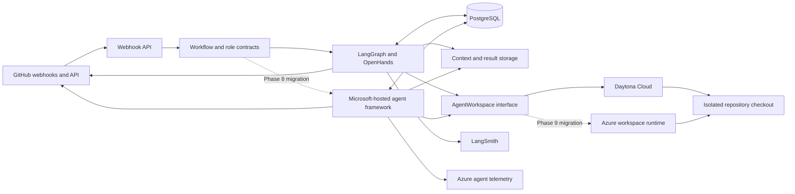

# Agentic Software Delivery Platform Documentation

Status: Historical specification index; use the approved direction below for future work

Last reviewed: 2026-07-19

> **Current direction:** Use the
> [integration-driven workflow platform implementation plan](integration-workflow-platform-plan.md) for future work.
> Use the [full-featured workflow editor plan](workflow-editor-plan.md) for the authoritative workflow resource,
> authoring UX, typed handoff, repository-agent, AI model node, artifact, and variable design.
> Agency owns provider adapters, PostgreSQL workflow definitions, and LangGraph execution. Nango owns connection
> authentication and credential lifecycle only. The phase documents below describe the experimental implementation
> retained at the pause-point; they are not approval to deploy Azure resources or continue the fixed-role architecture.

Implementation language: TypeScript wherever supported

Initial workspace provider: Daytona Cloud

Initial coding harness: OpenHands Agent Server

Orchestration: LangGraph.js

Observability: LangSmith

Final hosting target: Microsoft Azure

This specification defines an incremental path from one manually invoked coding agent to an Azure-hosted, webhook-driven
system that can coordinate specialized scrum-master, coding, reviewing, and repair agents. Each phase must produce a
working vertical capability. Later phases extend stable contracts rather than replacing an unproven prototype with a
broad platform build.

## 1. Product objective

Build an internal software-delivery system that can:

1. Convert a bounded work item into a versioned agent assignment.
2. Run up to ten coding-related agents concurrently in isolated workspaces.
3. Preserve a coding workspace across coding and repair iterations.
4. Independently validate agent changes and retain command evidence.
5. Chain role-specific agents through deterministic LangGraph transitions.
6. Start or resume workflows from authenticated external webhooks.
7. Publish agent work as branches and draft pull requests, independently review exact candidate SHAs, and either merge
   an approved SHA or abandon the pull request after bounded repair attempts.
8. Trace orchestration and model activity without treating traces as workflow state.
9. Migrate data, secrets, and application compute to Azure as separate changes.
10. Evaluate and migrate orchestration or role execution to a Microsoft-hosted agent framework one boundary at a time.
11. Replace Daytona only after every higher-level component is proven and an Azure workspace passes the same provider
    contract.

## 2. Guiding decisions

### 2.1 TypeScript owns the control plane

The webhook API, LangGraph workflows, provider clients, schemas, GitHub integration, reconciliation, and observability
code use TypeScript. Python is limited to the OpenHands implementation already packaged in the Agent Server runtime and
to an eventual worker-side shim only if an Azure runtime cannot call the Agent Server directly.

### 2.2 Daytona owns workspace lifecycle until the final phase

Each active coding or repair workflow receives a Daytona sandbox. The sandbox contains the repository checkout,
generated context, OpenHands Agent Server, dependency state, and validation artifacts. The orchestrator stores
identifiers, not live SDK objects.

### 2.3 LangGraph owns initial workflow truth

LangGraph and its PostgreSQL checkpointer own role sequencing, retries, budgets, terminal outcomes, and resumability.
Agent prose, LangSmith traces, GitHub comments, and Daytona state are evidence or external state; none replaces the
workflow checkpoint. Phase 8 may replace this boundary only after the Microsoft-hosted implementation proves equivalent
state ownership, deterministic routing, idempotency, and recovery.

### 2.4 OpenHands owns initial coding behavior

OpenHands explores the repository, edits files, runs permitted commands, and reports its result. It does not decide
whether its own validation is sufficient, whether another role should run, or whether a retry budget is available. Phase
8 evaluates replacement of role execution independently from orchestration and workspace hosting.

### 2.5 Webhooks signal; reconciliation proves

Webhook handlers authenticate, persist, normalize, and acknowledge events. They do not perform long-running work. A
periodic reconciliation process repairs missed deliveries and compares LangGraph, workspace-provider, and source-control
state.

### 2.6 Autonomous outcomes do not use human-approval nodes

The system creates or updates draft pull requests, independently reviews the exact candidate SHA, repairs in the
retained coder workspace, and squash-merges only the approved SHA. A third non-approved review round abandons the pull
request with evidence in GitHub and Linear. Human approval nodes and LangGraph approval interrupts remain outside this
specification. Existing repository checks and branch protections remain authoritative; the system does not bypass them.

### 2.7 Cloud migration replaces one boundary at a time

Azure-managed data and secrets precede Azure-hosted application compute. Microsoft-hosted orchestration or role
execution follows only after the hosted control plane is stable. Daytona remains in place until the final phase because
filesystem persistence, command transport, process isolation, stop, resume, archive, and recovery must all be replaced
together behind `AgentWorkspace`.

## 3. Target architecture



## 4. System boundaries

| Capability                       | Initial owner                            | Evidence-gated final owner                                       |
| -------------------------------- | ---------------------------------------- | ---------------------------------------------------------------- |
| Workflow state and transitions   | LangGraph.js                             | Phase 8 Microsoft-hosted orchestration or retained LangGraph.js  |
| Durable checkpoints              | Local/in-memory, then PostgreSQL         | Azure PostgreSQL plus any selected Phase 8 hosted state          |
| Agent workspace                  | Daytona Cloud                            | Phase 9 Azure adapter, or retained Daytona after formal deferral |
| Coding loop                      | OpenHands Agent Server                   | Phase 8 Microsoft-hosted role runtime or retained OpenHands      |
| Context bundles                  | Local files, then object storage         | Azure Blob Storage                                               |
| Source control and pull requests | GitHub                                   | GitHub                                                           |
| Secrets                          | Local environment, then provider secrets | Azure Key Vault                                                  |
| Agent and graph traces           | LangSmith Cloud                          | Phase 8 selected trace services with Azure correlation           |
| Platform telemetry               | Local logs                               | Application Insights and OpenTelemetry                           |

## 5. Repository architecture

The implementation deliberately remains one deployable package and one image. Process entry points select API, worker,
reconciler, or migration behavior without splitting contracts into additional workspace packages:

```text
apps/agentic/
|-- docs/agent-platform/
|-- drizzle/
|-- infra/
|   |-- environments/
|   `-- modules/
|-- prompts/
|-- src/
|   |-- azure/
|   |-- controlPlane/
|   |-- orchestrator/
|   |-- persistence/
|   `-- workspace/
|-- Dockerfile
|-- package.json
`-- tsconfig.json
```

## 6. Shared contracts

All external boundaries use versioned Zod schemas. JSON representations must contain a `schemaVersion` and reject
unknown breaking changes.

### 6.1 Assignment

An assignment contains:

- Workflow run ID and role execution ID.
- Repository identifier and immutable base commit SHA.
- Objective and acceptance criteria.
- Relevant paths and evidence references.
- Explicit validation commands.
- Allowed and forbidden path patterns.
- Maximum turns, tokens, elapsed time, and repair attempts.
- Context-bundle URI and SHA-256 digest.
- Prompt version and worker-image version.

### 6.2 WorkspaceHandle

A workspace handle contains only serializable provider state:

- Provider name.
- Provider workspace ID.
- Workspace lifecycle state.
- Repository path.
- Agent Server URL reference, never its secret.
- OpenHands conversation ID when one exists.
- Creation, last-activity, retention, and expiry timestamps.

### 6.3 AgentResult

Every role returns a discriminated result with:

- `completed`, `blocked`, `failed`, `cancelled`, or `timed_out` status.
- Role-specific structured output.
- Base and resulting commit SHAs when applicable.
- Changed-file inventory.
- Validation evidence references.
- Token, cost, turn, and elapsed-time metrics when available.
- Artifact manifest and digests.
- Typed failure classification instead of an unstructured exception alone.

### 6.4 WebhookEnvelope

Normalized events contain:

- Provider and provider delivery ID.
- Repository and installation identifiers.
- Event and action names.
- Relevant issue, pull request, check, and commit identifiers.
- Received timestamp.
- Payload digest and retained raw-payload reference.
- Correlation key used to find or create a LangGraph thread.

## 7. Security model

1. Treat repository content, issue text, comments, logs, and generated artifacts as untrusted evidence rather than
   control-plane instructions.
2. Use a GitHub App and short-lived installation tokens instead of personal access tokens.
3. Keep model, GitHub, Daytona, LangSmith, and Azure credentials outside assignment files and repository checkouts.
4. Give each workspace a unique branch and isolated filesystem.
5. Restrict repositories, organizations, commands, paths, concurrency, elapsed time, turns, and model spend through
   deterministic policy.
6. Run independent validation outside the agent's self-reported result.
7. Never trigger privileged work from an unauthenticated webhook or an untrusted fork context.
8. Retain enough evidence to connect a webhook delivery, graph run, workspace, model trace, commit, and pull request
   without logging secret values.

## 8. Phase sequence

| Phase | Specification                                                               | Current disposition                              |
| ----- | --------------------------------------------------------------------------- | ------------------------------------------------ |
| 1     | [Direct worker prototype](phase-1-direct-worker-prototype.md)               | Implemented in source                            |
| 2     | [Local LangGraph workflow](phase-2-local-langgraph-workflow.md)             | Implemented in source                            |
| 3     | [Local specialized agent chain](phase-3-local-specialized-agent-chain.md)   | Implemented in source                            |
| 4     | [Durable resumable workspaces](phase-4-durable-resumable-workspaces.md)     | Implemented in source                            |
| 5     | [Webhook automation](phase-5-webhook-automation.md)                         | Implemented in source                            |
| 6     | [Azure-managed data and secrets](phase-6-azure-managed-data-and-secrets.md) | Deployment source complete; live acceptance open |
| 7     | [Azure-hosted control plane](phase-7-azure-hosted-control-plane.md)         | Deployment source complete; live acceptance open |
| 8     | [Microsoft-hosted agent runtime](phase-8-microsoft-hosted-agent-runtime.md) | Deferred: no approved candidate or parity proof  |
| 9     | [Azure-native workspaces](phase-9-azure-native-workspaces.md)               | Deferred: no qualifying entry driver             |

Implementation may proceed behind disabled provider and deployment gates, but production activation requires the prior
phase's executable acceptance evidence. The [Azure deployment and acceptance runbook](azure-deployment-runbook.md)
defines the Phase 6 and Phase 7 promotion order. A later operational preference must not retroactively expand an earlier
phase's scope.

## 9. Cross-phase quality gates

Every phase must:

1. Pin external images and major package versions.
2. Validate all persisted and received data at runtime.
3. Include focused unit tests for policy and state transitions.
4. Include at least one integration test against the newly introduced boundary.
5. Document required environment variables without including values.
6. Emit correlation IDs in logs and traces.
7. Demonstrate cleanup after both success and failure.
8. Record measured duration, compute use, model use, and failure reason for live agent trials.

## 10. Global non-goals

- Bypassing repository checks, branch protection, or exact-SHA merge guards.
- Human approval workflows or approval interrupts.
- A general-purpose multi-tenant agent platform.
- Supporting multiple source-control providers before GitHub works end to end.
- Supporting multiple workspace providers before Daytona works end to end.
- Building a custom coding-agent loop while OpenHands meets the requirement.
- Treating LangSmith as a checkpoint or event-replay database.
- Storing secrets in prompts, context bundles, traces, or Git remotes.
- Guaranteeing that an agent can complete every selected work item.

## 11. Program completion criteria

The source implementation is complete when the Azure-hosted system is deployable to accept authenticated events, execute
up to ten isolated role runs concurrently, resume retained coding workspaces, produce independently validated changes,
chain review and bounded repair work, merge only an approved exact SHA or abandon with evidence, reconcile missed
events, and expose correlated workflow and model traces without relying on a human-approval path. Operational acceptance
additionally requires the retained live evidence named by Phases 6 and 7. Every migrated component must meet its legacy
contract and rollback threshold. Phase 9 completes with either a proven Azure `AgentWorkspace` rollout or a formally
recorded decision to retain Daytona.
