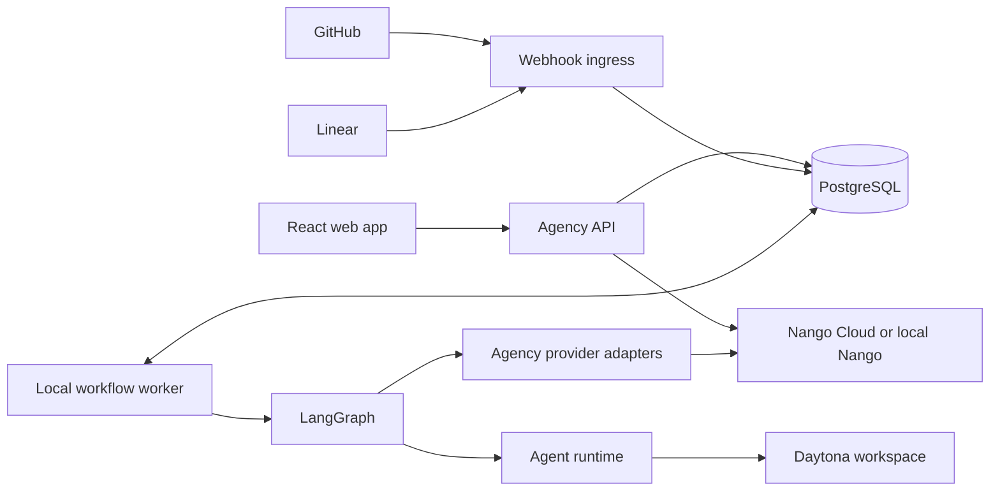

# Integration-Driven Agent Workflow Platform: Implementation Plan

Status: Proposed implementation plan; confirmed architecture decisions are binding

Last reviewed: 2026-07-19

## 1. Why this plan exists

The experimental implementation proves useful pieces in isolation, but it hardcodes GitHub, Linear, one repository, one
team, fixed agent roles, and one delivery graph. The previous reset plan moved workflows into repository JSON and
removed PostgreSQL, LangGraph, and Linear. That is no longer the intended product.

This plan establishes the current product boundary:

> Agency connects to external tools through replaceable provider adapters, stores workflow definitions and immutable
> published versions in PostgreSQL, edits them through a React Flow interface, and executes each published version
> through LangGraph. Nango handles connection authentication and credential lifecycle only.

The complete path must work locally before any Azure deployment work resumes.

## 2. Confirmed architecture decisions

1. GitHub, Linear, and future Azure DevOps support are integrations, not control-plane assumptions.
2. GitHub is the first repository provider and Linear is the first task provider.
3. PostgreSQL is authoritative for integration metadata, workflow drafts and versions, trigger bindings, runs, node
   attempts, and output references.
4. LangGraph owns workflow execution, checkpointing, interrupts, resumability, and node handoffs.
5. React Flow is the workflow editor and run projection. It does not own executable state.
6. Nango is the selected credential broker.
7. Nango owns authorization flows, encrypted credentials, token refresh, revocation, and authenticated API transport.
8. Agency owns provider API operations, provider-native schemas, webhook semantics, normalized events, trigger matching,
   workflow definitions, schedules, retries, and execution.
9. Raw provider credentials and refresh tokens are never stored in Agency PostgreSQL.
10. Repository-discovered `.github/agents/*.agent.md` files remain eligible agent definitions. Workflows do not live in
    repository JSON.
11. Local end-to-end proof is required before cloud hosting or Azure-managed service migration.

## 3. Product outcome

An operator can:

1. Open Settings and connect GitHub and Linear accounts through Nango.
2. Select provider resources such as a GitHub repository and Linear team without entering access tokens.
3. View Linear work items on a provider-neutral taskboard.
4. Create a workflow in a node editor using manual, provider-event, and schedule triggers.
5. Connect trigger, agent, condition, and terminal nodes into a validated graph.
6. Publish an immutable workflow version.
7. Start the workflow manually or from a verified Linear or GitHub event.
8. Watch the active LangGraph node, transitions, attempts, and outputs in the same graph projection.
9. Restart the local application without losing connections, definitions, checkpoints, or run history.

The local milestone is complete only when one real Linear issue event starts a published workflow, an agent operates in
an isolated GitHub repository workspace, and the resulting run can be inspected from trigger through terminal outcome.

## 4. Responsibility boundaries

### 4.1 Nango credential broker

Nango is infrastructure behind an Agency-owned interface. It may:

- Start provider authorization and connection sessions.
- Store and refresh OAuth credentials.
- Report connection health and granted scopes.
- Revoke a connection.
- Attach credentials to an Agency-defined native provider API request through its proxy.
- Return credentials directly only when a provider operation cannot use proxy transport and the security design has
  explicitly allowed it.

Nango must not:

- Define Agency provider capabilities.
- Supply product-visible actions or normalized business objects.
- Own provider webhook meanings or trigger filters.
- Own schedules, retries, workflow nodes, transitions, or run history.
- Execute agent tools or LangGraph nodes.
- Become the source of truth for which resources a workflow targets.

The initial port should describe authentication and transport rather than expose Nango terminology:

```ts
interface IntegrationCredentialBroker {
  createAuthorization(request: AuthorizationRequest): Promise<AuthorizationSession>
  getConnection(connectionId: string): Promise<BrokerConnection>
  request<T>(connectionId: string, request: ProviderHttpRequest): Promise<ProviderHttpResponse<T>>
  revokeConnection(connectionId: string): Promise<void>
}
```

Only the Nango adapter knows Nango connection IDs, connect sessions, proxy headers, or API endpoints.

### 4.2 Agency provider adapters

Provider adapters own native API knowledge and expose product capabilities. Initial capability contracts are:

```ts
interface RepositoryProvider {
  listRepositories(connectionId: string): Promise<RepositorySummary[]>
  getRepository(ref: RepositoryRef): Promise<Repository>
  getCommit(ref: CommitRef): Promise<Commit>
  createBranch(request: CreateBranchRequest): Promise<Branch>
  createOrUpdatePullRequest(request: PullRequestRequest): Promise<PullRequest>
}

interface TaskProvider {
  listContainers(connectionId: string): Promise<TaskContainer[]>
  listTasks(request: ListTasksRequest): Promise<TaskPage>
  getTask(ref: TaskRef): Promise<Task>
  addComment(request: AddTaskCommentRequest): Promise<TaskComment>
  updateTask(request: UpdateTaskRequest): Promise<Task>
}
```

Provider-neutral contracts contain only concepts Agency actually uses. Provider-specific identifiers and extension data
remain available without forcing every provider into a lowest-common-denominator schema. Narrow Zod schemas validate
every external response before it reaches orchestration.

### 4.3 Trigger ingestion

Agency owns event ingress:

1. Verify the provider signature before parsing trusted identifiers.
2. Persist the delivery idempotently with a payload digest and retained evidence reference.
3. Normalize the event into a provider-neutral envelope while preserving provider-specific detail.
4. Match enabled trigger bindings deterministically.
5. Start one run for one immutable published workflow version.
6. Acknowledge the webhook without running long-lived agent work in the request.

Nango may provide credentials used by Agency to register provider webhooks, but Nango does not route or interpret those
events. Schedule and CRON triggers are also owned by Agency.

### 4.4 Workflow execution

PostgreSQL stores mutable drafts and immutable published versions. Publishing validates and snapshots:

- Node and edge definitions.
- Trigger bindings and filters.
- Referenced integration resource bindings.
- Agent definition references and content digests.
- Node configuration schemas and runtime policy.

At run creation, Agency loads exactly one published version and compiles it into a LangGraph graph. Checkpoint thread
IDs use the Agency run ID. A running workflow never observes later draft edits or connection-resource changes.

## 5. Persistence model

The existing fixed-role schema must be replaced incrementally with provider-neutral records:

| Record                    | Purpose                                                                                       |
| ------------------------- | --------------------------------------------------------------------------------------------- |
| `integration_connections` | Provider, capability set, Nango connection reference, status, scopes, and non-secret metadata |
| `integration_resources`   | Selected repositories, teams, projects, or organizations bound to a connection                |
| `workflow_definitions`    | Stable workflow identity, mutable draft metadata, and current published version pointer       |
| `workflow_drafts`         | Editable React Flow nodes, edges, viewport, and revision for optimistic concurrency           |
| `workflow_versions`       | Immutable executable snapshot, publication metadata, and content digest                       |
| `trigger_bindings`        | Manual, provider-event, interval, or CRON configuration tied to a workflow version            |
| `event_deliveries`        | Verified provider deliveries, deduplication key, normalized envelope, and evidence reference  |
| `workflow_runs`           | Version, trigger, status, LangGraph thread ID, timestamps, and terminal outcome               |
| `node_runs`               | Node-level state, attempt count, input/output references, timing, and failure classification  |
| `run_artifacts`           | Workspace, commit, validation, log, and other durable evidence references                     |

Secrets are excluded by schema and by API contract. Deleting an Agency connection revokes it through Nango and marks
dependent resource and trigger bindings unusable without deleting historical runs.

## 6. Workflow model

Version 1 supports these node kinds:

| Node               | Purpose                                                                       |
| ------------------ | ----------------------------------------------------------------------------- |
| `manual-trigger`   | Operator-started run with schema-validated input                              |
| `provider-trigger` | Verified provider event and deterministic filters                             |
| `schedule-trigger` | Interval or CRON schedule with an explicit timezone                           |
| `agent`            | Execute one repository-discovered agent through the configured agent runtime  |
| `condition`        | Deterministic branch over typed state; no model-selected routing in version 1 |
| `provider-action`  | Invoke one explicit Agency provider capability                                |
| `terminal`         | Record successful, failed, cancelled, or abandoned completion                 |

Edges describe valid transitions and optional condition outcomes. Publishing rejects missing triggers, unreachable
nodes, cycles without an explicit bounded-loop policy, invalid provider capabilities, unavailable resources,
incompatible ports, and agent references that cannot be resolved.

## 7. Local process topology

The first implementation remains locally operable while preserving boundaries that can later be deployed separately:



The API, webhook ingress, scheduler, and worker may initially run in one Node.js process. They communicate through
persisted records and explicit services rather than process-global workflow state. PostgreSQL and any required local
support services start through one documented development command.

## 8. Implementation phases

### Phase 0: retire conflicting direction

1. Mark the repository-configured workflow plan superseded.
2. Make this document the authoritative next implementation plan.
3. Preserve the current experimental source as evidence, not as the target architecture.
4. Inventory fixed roles, stages, provider fields, and Azure assumptions only as each later phase replaces them.

Exit gate: documentation contains one unambiguous workflow, integration, persistence, and local-first direction.

### Phase 1: Nango connection proof

1. Add `IntegrationCredentialBroker` contracts and a Nango adapter.
2. Add environment validation for Nango server URL, secret key, and provider configuration identifiers.
3. Add PostgreSQL connection metadata without any credential columns.
4. Implement connect-session creation, callback completion, health retrieval, and revocation.
5. Add Settings API endpoints and a minimal Settings connection UI.
6. Prove one authenticated GitHub native API request and one Linear native API request through Agency-owned adapters.
7. Test redaction so tokens cannot enter logs, API responses, database records, or test snapshots.

Exit gate: a local operator connects GitHub and Linear, restarts Agency, lists native provider resources, and
disconnects both accounts without Agency persisting raw credentials.

### Phase 2: generic provider capabilities

1. Extract repository and task contracts from fixed GitHub and Linear service code.
2. Implement `GitHubRepositoryProvider` and `LinearTaskProvider` using broker-authenticated transport.
3. Add integration resource selection and persistence.
4. Replace embedded repository and team environment assumptions at touched call sites.
5. Add contract tests using provider HTTP fixtures plus narrow live smoke commands that are skipped without credentials.

Exit gate: the taskboard reads Linear through `TaskProvider`, and repository selection reads GitHub through
`RepositoryProvider`; neither feature imports Nango or provider credential details.

### Phase 3: database-owned workflow definitions

1. Add draft, version, node, edge, and trigger schemas with migrations.
2. Implement optimistic draft updates and immutable publication transactions.
3. Resolve repository agent definitions and store their immutable digest during publication.
4. Add graph validation with actionable node and edge errors.
5. Remove repository workflow JSON from the target product path.

Exit gate: an API test creates, edits, validates, publishes, reloads, and versions a workflow entirely through
PostgreSQL, and changing a draft does not change an existing version.

### Phase 4: React Flow workflow experience

1. Add the approved React Flow dependency.
2. Add Workflows list, editor, validation, publication, and version views.
3. Add a node palette for the version 1 node kinds and capability-aware configuration panels.
4. Preserve stable node dimensions and accessible keyboard interactions.
5. Display dirty, validating, invalid, publishing, and conflict states explicitly.

Exit gate: desktop and mobile browser tests create and publish a valid workflow without direct JSON editing, with no
layout overflow or overlapping controls.

### Phase 5: LangGraph compiler and durable runs

1. Compile one published workflow version into a generic LangGraph graph.
2. Persist run and node-attempt records alongside PostgreSQL checkpoints.
3. Implement manual starts, typed state, bounded retries, cancellation, resume, and terminal outcomes.
4. Stream durable run events to the web app and project them onto the React Flow graph.
5. Remove fixed scrum-master, engineer, reviewer, and repair routing from the generic execution path.

Exit gate: a manual multi-agent workflow survives a process restart, resumes from its checkpoint, and displays the same
immutable graph and node history after completion.

### Phase 6: provider events and schedules

1. Add provider-neutral delivery and event-envelope contracts.
2. Implement verified GitHub and Linear webhook handlers with idempotent delivery storage.
3. Add deterministic trigger matching and one-run-per-delivery/version guarantees.
4. Add interval and CRON scheduling with timezone, misfire, pause, and duplicate-fire behavior.
5. Add reconciliation for missed or partially processed deliveries.

Exit gate: duplicate GitHub and Linear deliveries start at most one run, schedules survive restart, and event handlers
return before long-running work executes.

### Phase 7: local end-to-end product proof

1. Connect real GitHub and Linear accounts through Nango.
2. Bind one repository and one Linear team.
3. Publish a workflow triggered by a bounded Linear issue event.
4. Execute an agent in an isolated workspace against the selected repository.
5. Publish configured evidence through the GitHub provider and update Linear through the task provider.
6. Restart the process during a controlled run and prove checkpoint recovery.
7. Capture run, node, provider-call, commit, validation, and terminal evidence in the UI.

Exit gate: the complete real-provider path succeeds twice from a clean local start and its evidence is sufficient to
diagnose a deliberately injected provider or agent failure.

### Phase 8: cloud transition planning

Only after Phase 7 passes:

1. Map local process roles to deployable boundaries without changing product contracts.
2. Move PostgreSQL, secrets, ingress, and workers to Azure one boundary at a time.
3. Decide whether Nango remains hosted, is self-hosted, or is deployed privately based on security and operations data.
4. Re-run the Phase 7 acceptance scenario after every infrastructure boundary change.

Azure resource implementation is not authorized by this plan alone.

## 9. Verification requirements

Each phase includes focused unit and contract tests, then the repository-wide `pnpm verify` gate. Integration tests must
cover malformed provider responses, expired or revoked connections, Nango unavailability, duplicate webhooks,
publication races, invalid graphs, restart recovery, and secret redaction. Live tests use dedicated test accounts and
must never print credentials.

No phase is described as working from mocks alone. The relevant local exit gate must be demonstrated against real GitHub
and Linear APIs before proceeding to the next external boundary.

## 10. Deferred decisions

The following require evidence from the local implementation rather than assumptions:

- Hosted versus self-hosted Nango for production.
- Whether any provider operation requires direct credential access instead of Nango proxy transport.
- Exact Azure process topology and managed services.
- Additional repository and task providers after GitHub and Linear.
- Richer workflow loops, parallel joins, human approval nodes, and arbitrary provider actions.
- Whether agent files are reloaded at run start or every published version retains a complete immutable snapshot.

None of these deferred decisions may weaken the confirmed ownership boundary: Agency owns providers and workflows; Nango
owns credentials and authenticated transport only.
