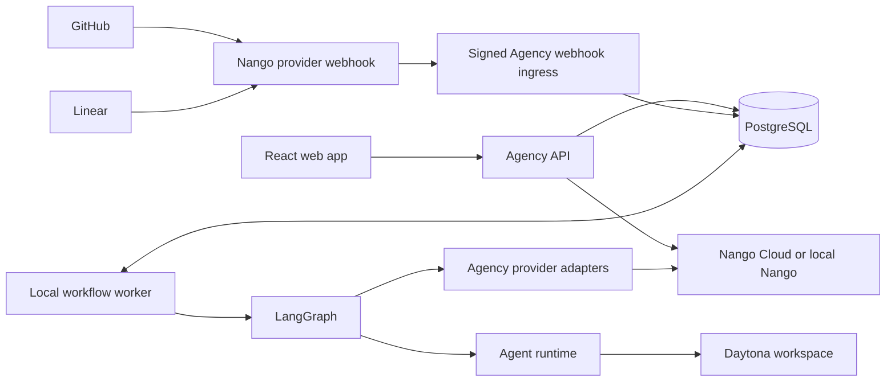

# Integration-Driven Agent Workflow Platform: Implementation Plan

Status: Active authoritative implementation plan; confirmed architecture decisions are binding

Last reviewed: 2026-07-19

## 1. Why this plan exists

The experimental implementation proves useful pieces in isolation, but it hardcodes GitHub, Linear, one repository, one
team, fixed agent roles, and one delivery graph. The previous reset plan moved workflows into repository JSON and
removed PostgreSQL, LangGraph, and Linear. That is no longer the intended product.

This plan establishes the current product boundary:

> Agency connects to external tools through replaceable provider adapters, stores workflow definitions and immutable
> published versions in PostgreSQL, edits them through a React Flow interface, and executes each published version
> through LangGraph. Nango handles connection authentication, credential lifecycle, authenticated transport, and signed
> provider-webhook relay; Agency owns every product-facing integration and workflow behavior.

The [full-featured workflow editor plan](workflow-editor-plan.md) is the authoritative companion for workflow resource
ownership, editor information architecture, typed node handoffs, repository-agent snapshots, direct model inference,
artifacts, and variables. Its confirmed decisions supersede older workflow-specific details in this plan where they
differ.

The complete path must work locally before any Azure deployment work resumes.

## 2. Confirmed architecture decisions

1. GitHub, Linear, and future Azure DevOps support are integrations, not control-plane assumptions.
2. GitHub is the first repository provider and Linear is the first task provider.
3. The Agency PostgreSQL journal is authoritative for integration metadata, workflow drafts and versions, executable
   packages, trigger bindings, runs, activations, attempts, selected outputs, effects, waits, events, and evidence.
4. LangGraph provides scheduling, checkpoint mechanics, interrupts, and resume algorithms over the Agency journal. A
   checkpoint cannot independently establish product-visible completion or historical truth.
5. React Flow is the workflow editor and run projection. It does not own executable state.
6. Nango is the selected integration infrastructure instead of a workflow-owning service such as Pipedream.
7. Nango owns authorization flows, encrypted credentials, token refresh, revocation, authenticated API transport,
   provider-webhook receipt, provider signature verification where supported, and signed forwarding to Agency.
8. Agency owns capability catalogs, provider API operations, provider-native schemas, forwarded-webhook validation and
   interpretation, normalized events, trigger matching, workflow definitions, schedules, retries, and execution.
9. Raw provider credentials and refresh tokens are never stored in Agency PostgreSQL.
10. Repository-discovered `.github/**/*.agent.md` files remain eligible agent definitions. Workflows do not live in
    repository JSON.
11. Local end-to-end proof is required before cloud hosting or Azure-managed service migration.

### 2.1 Provider and capability model

Provider identity and product capability are separate dimensions. A provider connection may implement one or more
capabilities, and product features depend on capabilities rather than provider names.

| Provider / surface | Repository capability | Task capability | Version 1 status                                    |
| ------------------ | --------------------- | --------------- | --------------------------------------------------- |
| GitHub App         | Yes                   | No              | Implement repositories and pull-request events      |
| Linear             | No                    | Yes             | Implement teams, issues, comments, and issue events |
| Azure DevOps       | Future                | Future          | Add without changing workflow or product contracts  |
| GitHub Issues      | N/A                   | Future          | Add as a task capability on a GitHub connection     |

An integration catalog entry declares provider identity, supported capabilities, authorization strategy, resource kinds,
actions, and trigger event definitions. An integration connection is one operator-authorized instance of that entry. A
resource binding selects a repository, team, project, or equivalent resource from a connection. No workflow, taskboard
query, or run may branch on `github` or `linear`; it selects a capability and resolves the configured adapter.

## 3. Product outcome

An operator can:

1. Open Settings and securely connect GitHub and Linear accounts.
2. Discover accessible provider resources without entering access tokens and bind them when a product surface or
   workflow step needs them.
3. View Linear work items on a provider-neutral taskboard.
4. Create a workflow in a node editor using manual, provider-event, and schedule triggers.
5. Connect trigger, agent, condition, and terminal nodes into a validated graph.
6. Publish an immutable workflow version.
7. Start the workflow manually or from a verified Linear or GitHub event.
8. Watch the active workflow step, transitions, attempts, and outputs in the same graph projection.
9. Restart the local application without losing connections, definitions, checkpoints, or run history.

The local milestone is complete only when one real Linear issue event starts a published workflow, an agent operates in
an isolated GitHub repository workspace, and the resulting run can be inspected from trigger through terminal outcome.

### 3.1 Product surfaces

The web application has three primary operational surfaces:

| Page      | Responsibilities                                                                                        |
| --------- | ------------------------------------------------------------------------------------------------------- |
| Settings  | Discover integrations; connect, reconnect, inspect health/scopes and accessible data, and disconnect them |
| Taskboard | Read and update tasks through `TaskProvider`; version 1 shows Linear without embedding Linear contracts |
| Workflows | List, draft, validate, publish, manually run, inspect versions, and observe active and historical runs  |

#### 3.1.1 App shell and navigation

- Primary navigation exposes Taskboard, Workflows, and Settings in that order. Run details and workflow versions are
   subordinate routes under Workflows rather than additional top-level destinations.
- Every selected connection, resource, task, workflow, version, and run has a stable URL that survives refresh and can
   be shared. Filters and selected views use typed URL state.
- Desktop uses persistent navigation and a restrained, work-focused content area. Mobile uses a compact header and
   navigation drawer; primary commands remain reachable without horizontal page overflow.
- Route changes preserve pending workflow edits until they are saved or explicitly discarded. Browser back/forward
   navigation restores the prior list filters, selected resource, editor view, and run tab.
- Every page provides purposeful loading, empty, permission-denied, disconnected, stale-data, and recoverable-error
   states. Retrying a failed read does not repeat a prior mutation.
- Destructive actions use confirmation dialogs that name the affected connection, workflow, or run and explain blocked
   dependent resources. Success notifications are concise; actionable failures remain visible near the failed control.
- All controls meet WCAG 2.2 AA keyboard, focus, name, role, state, contrast, and reduced-motion expectations. Status is
   never communicated by color alone, and focus returns predictably after dialogs and drawers close.

#### 3.1.2 Settings

- The default view lists Agency integration catalog entries grouped by capability, showing GitHub repositories and
   Linear tasks first. Future providers appear through the same catalog contract rather than page-specific UI.
- Each integration shows disconnected, connecting, connected, degraded, reconnect-required, and revoking states, plus
   granted scopes, last health check, accessible resource counts, and a provider link when safe.
- Connect starts a Nango authorization session in a popup or redirect and shows a resumable pending state. Popup blocked,
   user-cancelled, callback failure, expired session, and insufficient-scope outcomes have distinct recovery actions.
- A successful connection discovers accessible resources in the background. GitHub repositories and Linear teams can be
   searched, paginated, and refreshed for connection diagnostics, but Settings does not select a global resource.
- Reconnect preserves resource bindings owned by workflows, taskboard URLs, and other product surfaces when the provider
   still exposes those resources. Missing or inaccessible
   resources are marked stale and must be rebound before dependent workflows can publish or run.
- Disconnect identifies dependent taskboard selections and workflow bindings before confirmation, revokes through
   Nango, and preserves historical run evidence. Credentials, tokens, private keys, and raw Nango responses never appear.
- Local development shows webhook ingress health, last redacted receipt time, and whether the callback is reachable. It
   does not persist or present an ephemeral tunnel URL as durable production configuration.

#### 3.1.3 Taskboard

- The taskboard requires a selected task-capable connection and resource. With one valid binding it opens directly;
   multiple bindings use a compact selector, and no binding links to Settings.
- Version 1 presents Linear tasks through provider-neutral status groups. Cards show identifier, title, status, priority,
   assignee, labels, and freshness when available without requiring Linear-specific fields.
- Operators can search and filter by status, assignee, label, and updated time. Filters are URL-backed and resettable;
   pagination or incremental loading preserves the current viewport and selection.
- Selecting a task opens a detail pane with provider-neutral fields, description, comments, related Agency runs, and
   explicit update and comment commands. Provider extension data may appear in a clearly secondary section.
- Mutations use optimistic UI only when rollback is deterministic. Conflicts or provider rejection restore the confirmed
   value and show the provider-safe error without losing typed input.
- Empty groups remain visible on desktop so status meaning does not shift. Mobile uses one status group at a time with a
   segmented status control instead of compressing the board into unreadable columns.
- A degraded or disconnected provider leaves the last confirmed board readable with a stale indicator and disables
   mutations until reconnection. It never silently presents cached data as current.

#### 3.1.4 Workflows list and versions

- The list shows workflow name, draft state, published version, enabled triggers, last run status/time, and the resource
   bindings needed to understand where it operates.
- Operators can create, search, filter, open, duplicate, archive, and manually run a workflow. Archive is unavailable
   while a run is active and never removes immutable versions or run history.
- Draft, published, invalid, disabled-by-connection, and archived states are explicit. A workflow with no published
   version cannot be enabled or manually run.
- Version history is read-only and shows publication time, publisher, changed steps, agent versions, trigger bindings,
  resource bindings, and runs created from that version. Content digests remain in permissioned technical details.

#### 3.1.5 Workflow editor

- Desktop defaults to a React Flow canvas with a collapsed settings dock, searchable Add step, spatial selection commands,
   and a stable fallback command area. Mobile defaults to a complete ordered workflow outline; the canvas remains an
   optional synchronized overview.
- Add step contains manual, provider-event, schedule, agent, model, condition, provider-action, and terminal steps.
   Choices are generated from integration capabilities, bindings, repository agents, and current connection context.
- Steps have stable dimensions, concise labels, status-independent geometry, typed inputs/outputs, and visible validation
   state. The dock, dialogs, and outline edit configuration, trigger filters, schedules, input defaults, and connection
   mappings with schema-backed controls rather than raw JSON.
- Keyboard users can add, select, move, connect, configure, and delete nodes and edges; undo and redo cover local graph
   edits. Canvas zoom, fit, and navigation have labeled icon controls and cannot resize the surrounding layout.
- Draft changes autosave with optimistic revision checks and explicit dirty, saving, saved, offline, and conflict states.
   Publishing is always an explicit command and never occurs as a side effect of autosave.
- Validation runs continuously and before publication and identifies the affected step, connection, input, trigger,
   mapping, agent, connection, or resource. Selecting an issue focuses the relevant graph or outline item and exact field.
- Publication shows the immutable version to be created and blocks on unresolved validation errors or stale resources.
   A later draft edit never changes the graph displayed for an existing run.
- Test step, Run to here, and Test draft use named simulated fixtures and never become historical evidence. Manual Run is
   available only for a published version; it opens a schema-generated input form, shows the exact version, bindings,
   unpublished-change warning, expected paid work, and effects, prevents duplicate submission, and opens the created run.

#### 3.1.6 Workflow run projection

- Live and historical runs use the exact immutable published graph in read-only React Flow mode. The graph overlays
   queued, running, waiting, succeeded, failed, cancelled, and abandoned state without moving nodes.
- The run header shows workflow/version, trigger source, start and elapsed time, overall state, selected resources, and
   valid commands such as cancel or resume. Terminal runs cannot display active commands.
- Selecting a node shows attempt history, validated input, redacted output, timing, failure classification, logs, and
   evidence references. Inputs or outputs too large for graph state resolve through bounded artifact views.
- A chronological event view remains available beside the graph for screen-reader access and precise diagnosis. The
   active node and latest transition are announced without repeatedly stealing focus.
- The resumable event stream reconnects from the last persisted sequence after network loss. A disconnected browser
   shows stale live status but does not affect execution; refresh reconstructs the same projection from PostgreSQL.
- Empty, queued, interrupted, retrying, provider-failed, agent-failed, cancelled, and completed outcomes each have a
   distinct, actionable presentation. Secret redaction applies equally to graph details, event history, logs, and errors.

React Flow is an authoring and projection component, never the source of executable state. All page requirements above
must be reconstructed from API and PostgreSQL state after a refresh or process restart.

### 3.2 API boundaries

Initial HTTP resources are Agency contracts and expose Agency connection IDs, capability keys, and resource bindings;
they do not expose Nango credentials or require clients to understand Nango connection IDs.

| Surface       | Initial endpoints                                                                                                                       |
| ------------- | --------------------------------------------------------------------------------------------------------------------------------------- |
| Integrations  | `GET /api/integrations`, `GET /api/integration-connections`, `POST /api/integration-connections/authorization-sessions`                 |
| Connection    | `GET /api/integration-connections/:id`, `DELETE /api/integration-connections/:id`, `GET/PUT /api/integration-connections/:id/resources` |
| Tasks         | `GET /api/tasks`, `GET /api/tasks/:id`, `PATCH /api/tasks/:id`, `POST /api/tasks/:id/comments`                                          |
| Workflows     | `GET/POST /api/workflows`, `GET/PATCH /api/workflows/:id/draft`, `POST /api/workflows/:id/validate`, `POST /api/workflows/:id/publish`  |
| Runs          | `POST /api/workflows/:id/runs`, `GET /api/workflow-runs/:id`, `POST /api/workflow-runs/:id/cancel`, `GET /api/workflow-runs/:id/events` |
| Provider hook | `POST /api/webhooks/nango`                                                                                                              |

Draft updates include an expected revision and return a conflict with the current revision when stale. Publish and run
creation accept idempotency keys. Task routes resolve the configured task connection and resource binding rather than a
provider name. The run-events endpoint is a resumable server-sent event stream backed by persisted sequence numbers;
disconnecting a browser does not affect execution.

## 4. Responsibility boundaries

### 4.1 Nango integration infrastructure

Nango is infrastructure behind an Agency-owned interface. It may:

- Start provider authorization and connection sessions.
- Store and refresh OAuth credentials.
- Report connection health and granted scopes.
- Revoke a connection.
- Attach credentials to an Agency-defined native provider API request through its proxy.
- Receive provider webhooks at the Nango-generated provider URL, validate provider signatures where supported, resolve
  the Nango connection, and forward the unmodified provider payload in a Nango-signed envelope to Agency.
- Return credentials directly only when a provider operation cannot use proxy transport and the security design has
  explicitly allowed it.

Nango must not:

- Define Agency provider capabilities.
- Supply product-visible actions or normalized business objects.
- Own provider webhook meanings or trigger filters.
- Own schedules, retries, workflow nodes, transitions, or run history.
- Execute agent tools or LangGraph nodes.
- Become the source of truth for which resources a workflow targets.

The initial port should describe authentication and transport rather than expose Nango terminology:

```ts
interface IntegrationCredentialBroker {
  createAuthorization(request: AuthorizationRequest): Promise<AuthorizationSession>
  getConnection(connectionId: string): Promise<BrokerConnection>
  request<T>(connectionId: string, request: ProviderHttpRequest): Promise<ProviderHttpResponse<T>>
  revokeConnection(connectionId: string): Promise<void>
}
```

Only the Nango adapter knows Nango connection IDs, connect sessions, proxy headers, or API endpoints.

### 4.2 Agency provider adapters

Provider adapters own native API knowledge and expose product capabilities. Adapter resolution uses the persisted
connection's capability and provider keys, never environment-selected global providers. Initial capability contracts
are:

```ts
interface RepositoryProvider {
  listRepositories(connectionId: string): Promise<RepositorySummary[]>
  getRepository(ref: RepositoryRef): Promise<Repository>
  getCommit(ref: CommitRef): Promise<Commit>
  createBranch(request: CreateBranchRequest): Promise<Branch>
  createOrUpdatePullRequest(request: PullRequestRequest): Promise<PullRequest>
}

interface TaskProvider {
  listContainers(connectionId: string): Promise<TaskContainer[]>
  listTasks(request: ListTasksRequest): Promise<TaskPage>
  getTask(ref: TaskRef): Promise<Task>
  addComment(request: AddTaskCommentRequest): Promise<TaskComment>
  updateTask(request: UpdateTaskRequest): Promise<Task>
}
```

Provider-neutral contracts contain only concepts Agency actually uses. Provider-specific identifiers and extension data
remain available without forcing every provider into a lowest-common-denominator schema. Narrow Zod schemas validate
every external response before it reaches orchestration.

### 4.3 Trigger ingestion

Provider events follow this boundary:

1. The provider sends an event to the Nango-generated provider webhook URL.
2. Nango validates the provider signature where the provider supports it, resolves the connection, and forwards the
   provider payload to `POST /api/webhooks/nango` in a Nango-signed envelope.
3. Agency reads a bounded raw body and verifies `NANGO_WEBHOOK_SIGNING_KEY` before trusting envelope identifiers or
   parsing provider semantics. Missing or invalid signatures are rejected.
4. Agency persists the delivery idempotently with provider delivery ID when available, payload digest, connection,
   receipt time, and a redacted or encrypted evidence reference. The request returns `202` before workflow execution.
5. An asynchronous Agency processor validates the provider payload, normalizes it into a provider-neutral envelope while
   preserving provider-specific extension data, and records processing success or a classified failure.
6. Agency matches enabled trigger bindings deterministically and starts at most one run for each delivery and immutable
   workflow version.

Nango routes and authenticates delivery but does not interpret product meaning. Agency owns event names, filters,
deduplication, normalization, trigger matching, retries, and run creation. Provider event definitions are contributed by
integration adapters so every connected integration can expose its supported triggers without owning workflows.

Version 1 event keys are stable Agency contracts mapped from native payloads:

| Capability / provider | Initial trigger event keys                                                                                             |
| --------------------- | ---------------------------------------------------------------------------------------------------------------------- |
| GitHub repository     | `pull_request.created`, `pull_request.updated`, `pull_request.reopened`, `pull_request.closed`, `pull_request.merged`  |
| Linear task           | `task.created`, `task.updated`, `task.removed`, `task.comment.created`, `task.comment.updated`, `task.comment.removed` |

GitHub `pull_request.synchronize` maps to `pull_request.updated`; a closed pull request maps to `pull_request.merged`
when the native payload says it merged and otherwise to `pull_request.closed`. Provider-specific fields remain available
for deterministic filters. GitHub Issues events become task events only when the future GitHub task adapter is
implemented; they are not smuggled through the repository capability.

### 4.4 Schedules

Interval and CRON triggers are Agency-owned trigger bindings, not integration-provider jobs. Each binding stores its
timezone, enabled state, next fire time, misfire policy, overlap policy, and last scheduling decision. The scheduler
claims due fires transactionally, writes a durable synthetic delivery, and applies the same one-delivery/version rule as
provider events. Restarts must not lose a due fire or produce an unbounded duplicate. Schedule inputs are validated
against the published workflow input schema before a run is created.

### 4.5 Workflow execution and handoffs

PostgreSQL stores mutable drafts and immutable published versions. Publishing validates, compiles, and stores one
content-addressed executable package containing:

- Node and edge definitions.
- Trigger bindings and filters.
- Referenced integration resource bindings.
- Agent definition references and approved content snapshots.
- Node configuration schemas and runtime policy.
- Workflow input schema, node input/output schemas, and edge mappings.
- JSON Schema dialect, node executor versions, mapping semantics, compiler version, compiled plan digest, constants, and
   event decoder versions.

At run creation, Agency loads and verifies exactly one published executable package, rechecks dynamic authorization and
capability access, seals trigger input, resource identities, repository base commit, effective model policy, and exact
agent snapshots in a run manifest, then instantiates the pinned compiled plan. Checkpoint thread IDs use the Agency run
ID. A running workflow never observes later draft, agent-source, compiler, or connection-resource changes.

Each trigger creates a typed initial state. Every executable node receives only its declared input projection plus
immutable run context, and returns a schema-validated output patch and evidence references. Edges explicitly map source
outputs into destination inputs; incompatible ports fail publication. The Agency journal atomically records attempt
completion, selected output, downstream activation, event sequence, effect state, and checkpoint cursor. LangGraph uses
that committed state to select the next valid transition. Agents do not call one another directly, mutate another node's
output, or infer routing from prose. Large outputs and secrets stay outside graph state and are represented by durable,
access-controlled references.

## 5. Persistence model

The existing fixed-role schema must be replaced incrementally with provider-neutral records:

| Record                    | Purpose                                                                                       |
| ------------------------- | --------------------------------------------------------------------------------------------- |
| `integration_connections` | Provider, capability set, Nango connection reference, status, scopes, and non-secret metadata |
| `integration_resources`   | Discovered repositories, teams, projects, or organizations available through a connection      |
| `workflow_definitions`    | Stable workflow identity, mutable draft metadata, and current published version pointer       |
| `workflow_drafts`         | Editable React Flow nodes, edges, viewport, and revision for optimistic concurrency           |
| `workflow_versions`       | Immutable publication metadata and content-addressed executable package reference              |
| `trigger_bindings`        | Manual, provider-event, interval, or CRON configuration tied to a workflow version            |
| `event_deliveries`        | Verified provider deliveries, deduplication key, normalized envelope, and evidence reference  |
| `schedule_fires`          | Durable due time, claim, misfire decision, input, and deduplication key for one schedule fire |
| `workflow_runs`           | Package, sealed manifest, trigger, status, cancellation generation, sequence, and outcome      |
| `activations`             | Logical step execution scoped by branch, collection item, or loop iteration                     |
| `node_attempts`           | Leased activation attempts, fencing, immutable input/output, usage, timing, and failure          |
| `workflow_effects`        | Stable external mutation identities, idempotency data, results, and reconciliation state        |
| `workflow_waits`          | Correlated event/decision waits, authorization, expiry, claim, and winning resume event          |
| `workflow_run_events`     | Ordered durable status and transition events used by live and replayed run projections        |
| `run_artifacts`           | Workspace, commit, validation, log, and other durable evidence references                     |

Secrets are excluded by schema and by API contract. Deleting an Agency connection revokes it through Nango and marks
dependent resource and trigger bindings unusable without deleting historical runs.

## 6. Workflow model

The first executable baseline supports these step kinds. The focused workflow editor plan's release matrix governs when
additional families become visible, testable, publishable, and executable:

| Node               | Purpose                                                                       |
| ------------------ | ----------------------------------------------------------------------------- |
| `manual-trigger`   | Operator-started run with schema-validated input                              |
| `provider-trigger` | Verified provider event and deterministic filters                             |
| `schedule-trigger` | Interval or CRON schedule with an explicit timezone                           |
| `agent`            | Execute one repository-discovered agent through the configured agent runtime  |
| `condition`        | Deterministic branch over typed state; no model-selected routing in version 1 |
| `provider-action`  | Invoke one explicit Agency provider capability                                |
| `terminal`         | Record successful, failed, cancelled, or abandoned completion                 |

Edges describe valid transitions and optional condition outcomes. Publishing rejects missing triggers, unreachable
nodes, cycles without an explicit bounded-loop policy, invalid provider capabilities, unavailable resources,
incompatible ports, and agent references that cannot be resolved.

Workflow-level inputs are JSON-schema-compatible values with defaults and required fields. Manual runs collect them in
the UI, schedules store validated values on the trigger binding, and provider triggers derive them through explicit
field mappings from normalized events. A retry creates another attempt for the same activation. The first committed
successful selection and every downstream binding that consumes it are immutable; recomputation after consumption
requires a new run.

## 7. Local process topology

The first implementation remains locally operable while preserving boundaries that can later be deployed separately:



The API, webhook ingress, scheduler, and worker may initially run in one Node.js process. They communicate through
persisted records and explicit services rather than process-global workflow state. PostgreSQL and any required local
support services start through one documented development command.

## 8. Implementation phases

### Validated baseline on 2026-07-19

The local proof completed before this plan revision is retained as implementation evidence, not mistaken for the Phase 1
exit gate:

- Agency verifies Nango-signed raw webhook bodies and rejects missing or invalid signatures.
- Real Linear and GitHub App events traversed provider to Nango to the temporary HTTPS tunnel to Agency.
- GitHub App issue `reopened` and `closed` events arrived as attributed Nango forwards after the GitHub App subscribed
  to Issues events.
- Agency obtained a short-lived GitHub App token from Nango and completed a read-only request against the selected
  private repository without local GitHub App credentials.
- The callback currently emits only a redacted receipt. It does not yet persist deliveries, normalize product events,
  match triggers, or start workflows.
- The temporary tunnel URL is an operational dependency for local webhook tests and must not be committed or treated as
  durable ingress.

### Phase 0: retire conflicting direction

1. Mark the repository-configured workflow plan superseded.
2. Make this document the authoritative next implementation plan.
3. Preserve the current experimental source as evidence, not as the target architecture.
4. Inventory fixed roles, stages, provider fields, and Azure assumptions only as each later phase replaces them.

Exit gate: documentation contains one unambiguous workflow, integration, persistence, and local-first direction.

### Phase 1: Nango connection proof

1. Add `IntegrationCredentialBroker` contracts and a Nango adapter.
2. Add environment validation for Nango server URL, secret key, and provider configuration identifiers.
3. Add PostgreSQL connection metadata without any credential columns.
4. Implement connect-session creation, callback completion, health retrieval, and revocation.
5. Add `POST /api/webhooks/nango`, verify every request with `NANGO_WEBHOOK_SIGNING_KEY`, reject invalid signatures, and
   acknowledge valid deliveries before starting asynchronous work.
6. Expose the local endpoint through a documented HTTPS tunnel, register its public URL in the Nango dashboard for the
   subscribed GitHub and Linear integrations, and record the development callback URL without committing ephemeral
   tunnel hostnames.
7. Add Settings API endpoints and the connection, resource discovery, health, reconnect, stale-resource, and disconnect
   UX defined in section 3.1.2.
8. Prove one authenticated GitHub native API request and one Linear native API request through Agency-owned adapters.
9. Send one real signed Nango webhook to the registered URL and retain redacted evidence that Agency received and
   classified it. Provider-event normalization, trigger matching, and workflow starts remain Phase 6 work.
10. Test redaction so tokens cannot enter logs, API responses, database records, or test snapshots.
11. Reconcile connection metadata from Nango after restart and surface callback/tunnel health without persisting an
    ephemeral tunnel hostname as production configuration.

Exit gate: a local operator connects GitHub and Linear, restarts Agency, lists native provider resources, and
disconnects both accounts without Agency persisting raw credentials. Nango can also deliver a signed webhook to the
registered local callback, and Agency rejects the same payload when its signature is absent or invalid. Browser tests
cover successful authorization, cancellation, popup failure, reconnect, insufficient scope, stale resources, and
disconnect impact on desktop and mobile.

### Phase 2: generic provider capabilities

1. Add an Agency integration catalog with separate provider, capability, resource, action, and trigger definitions.
2. Extract repository and task contracts from fixed GitHub and Linear service code.
3. Implement `GitHubRepositoryProvider` and `LinearTaskProvider` using broker-authenticated transport.
4. Resolve adapters by connection and capability rather than provider-specific branches.
5. Add repository and team resource discovery, contextual binding persistence, stale-resource detection, and rebinding.
6. Replace embedded repository and team environment assumptions at touched call sites.
7. Route the taskboard entirely through `TaskProvider` and implement the resource selection, URL-backed filters, task
   detail, mutation, stale-data, and responsive status-group UX defined in section 3.1.3.
8. Add contract tests using provider HTTP fixtures plus narrow live smoke commands that are skipped without credentials.

Exit gate: the taskboard reads Linear through `TaskProvider`, and repository selection reads GitHub through
`RepositoryProvider`; neither feature imports Nango or provider credential details. A contract-test-only second adapter
can implement each capability without changing the taskboard, workflow contracts, or resource-selection API. Desktop
and mobile browser tests cover loading, empty, filtered, paginated, detail, successful mutation, rollback, stale, and
disconnected states without provider-specific branching.

### Phase 3: database-owned workflow definitions

1. Add draft, version, node, edge, and trigger schemas with migrations.
2. Add workflow input schemas, node input/output schemas, explicit edge mappings, and trigger-input mappings.
3. Implement optimistic draft updates and immutable publication transactions that create the content-addressed
   executable package before the version becomes published.
4. Resolve repository agent definitions and store their approved content snapshots during publication.
5. Snapshot integration capability and resource references without snapshotting credentials.
6. Add graph validation with actionable node, edge, port, mapping, trigger, and resource errors.
7. Remove repository workflow JSON from the target product path.

Exit gate: an API test creates, edits, validates, compiles, publishes, reloads, and versions a workflow entirely through
PostgreSQL; the version cannot become published without its verified executable package, and changing a draft does not
change an existing version.

### Phase 4: React Flow workflow experience

1. Add the approved React Flow dependency.
2. Add the Workflows list, versions, editor, and run surfaces defined in sections 3.1.4 through 3.1.6.
3. Add searchable Add step for only the families executable in the deployed phase plus capability-aware configuration.
4. Add typed port mapping, manual-run input, schedule, provider-event, resource, and filter editors.
5. Render the immutable published graph for live and historical runs with status, transition, attempt, input/output, and
   evidence overlays sourced from persisted run data.
6. Implement autosave revision handling, undo/redo, conflict recovery, validation focus, fixture infrastructure,
   explicit publication, and duplicate-safe manual run creation only after the durable run contracts in Phase 5 exist.
7. Preserve stable node dimensions and complete keyboard interactions on desktop and mobile layouts.
8. Display loading, empty, dirty, saving, offline, validating, invalid, publishing, conflict, queued, running, waiting,
   retrying, interrupted, stale-stream, and terminal states explicitly.

Exit gate: desktop and mobile browser tests create, autosave, recover a revision conflict, validate, publish, and inspect
an immutable version without direct JSON editing, layout overflow, overlapping controls, color-only status, or keyboard
traps. Manual run, cancellation, live stream, and historical-run acceptance activate only after Phase 5. Automated
accessibility checks and keyboard-only scenarios cover both canvas and ordered-outline authoring.

### Phase 5: LangGraph compiler and durable runs

1. Verify and instantiate the exact compiled plan stored in one published executable package; never compile a historical
   published version under current code.
2. Persist run, activation, attempt, effect, wait, and ordered event records and coordinate checkpoints through the
   authoritative PostgreSQL journal.
3. Implement schema-validated input projection and output patches as the only agent-to-agent handoff mechanism.
4. Implement manual starts, typed state, immutable selected outputs, bounded retries, cancellation generations,
   interrupts, resume, effect reconciliation, and terminal outcomes.
5. Stream durable run events to the web app and project them onto the React Flow graph.
6. Remove fixed scrum-master, engineer, reviewer, and repair routing from the generic execution path.

Exit gate: a manual multi-agent workflow survives a process restart, resumes from its checkpoint, and displays the same
immutable graph and node history after completion.

### Phase 6: provider events and schedules

1. Add provider-neutral delivery and event-envelope contracts plus provider-owned event catalogs.
2. Persist each verified Nango-forwarded delivery before asynchronous provider parsing, including a stable deduplication
   key, payload digest, connection, processing state, and redacted evidence reference.
3. Implement GitHub pull-request and Linear task/comment normalizers for the version 1 event keys.
4. Add deterministic resource and payload filters plus one run per
   `(provider, connection, delivery identity, workflow version, trigger binding)` guarantee. Use the signed Nango
   envelope identity when no provider delivery ID exists and quarantine identity reuse with a different payload digest.
5. Add interval and CRON scheduling with timezone, input validation, misfire, pause, overlap, and duplicate-fire
   behavior.
6. Add reconciliation for missed, stale, or partially processed deliveries and schedule fires.

Exit gate: duplicate GitHub and Linear deliveries start at most one run, schedules survive restart, and event handlers
return before long-running work executes. Pull-request created/updated/merged events and Linear task
created/updated/comment-created events each pass a real-provider smoke test through the same trigger-matching contract.

### Phase 7: local end-to-end product proof

1. Connect real GitHub and Linear accounts through Nango.
2. Bind one repository and one Linear team.
3. Publish a workflow triggered by a bounded Linear issue event.
4. Execute an agent in an isolated workspace against the selected repository.
5. Publish configured evidence through the GitHub provider and update Linear through the task provider.
6. Restart the process during a controlled run and prove checkpoint recovery.
7. Capture run, node, provider-call, commit, validation, and terminal evidence in the UI.
8. Repeat the proof from a clean local start using one documented command for PostgreSQL and required support services;
   the public tunnel remains a replaceable development ingress dependency, not a cloud architecture decision.

Exit gate: the complete real-provider path succeeds twice from a clean local start and its evidence is sufficient to
diagnose a deliberately injected provider or agent failure.

### Phase 8: cloud transition planning

Only after Phase 7 passes:

1. Map local process roles to deployable boundaries without changing product contracts.
2. Move PostgreSQL, secrets, ingress, and workers to Azure one boundary at a time.
3. Decide whether Nango remains hosted, is self-hosted, or is deployed privately based on security and operations data.
4. Re-run the Phase 7 acceptance scenario after every infrastructure boundary change.

Azure resource implementation is not authorized by this plan alone.

## 9. Verification requirements

Each phase includes focused unit and contract tests, then the repository-wide `pnpm verify` gate. Integration tests must
cover malformed provider responses, expired or revoked connections, Nango unavailability, duplicate webhooks,
publication races, invalid graphs, restart recovery, and secret redaction. Live tests use dedicated test accounts and
must never print credentials.

No phase is described as working from mocks alone. The relevant local exit gate must be demonstrated against real GitHub
and Linear APIs before proceeding to the next external boundary.

## 10. Deferred decisions

The following require evidence from the local implementation rather than assumptions:

- Hosted versus self-hosted Nango for production.
- Whether any provider operation requires direct credential access instead of Nango proxy transport.
- Exact Azure process topology and managed services.
- Additional repository and task providers after GitHub and Linear.
- Human approval nodes, mutating model tools, and arbitrary provider actions pending their complete authorization and
   security designs.

None of these deferred decisions may weaken the confirmed ownership boundary: Agency owns providers and workflows; Nango
owns credentials and authenticated transport only.
