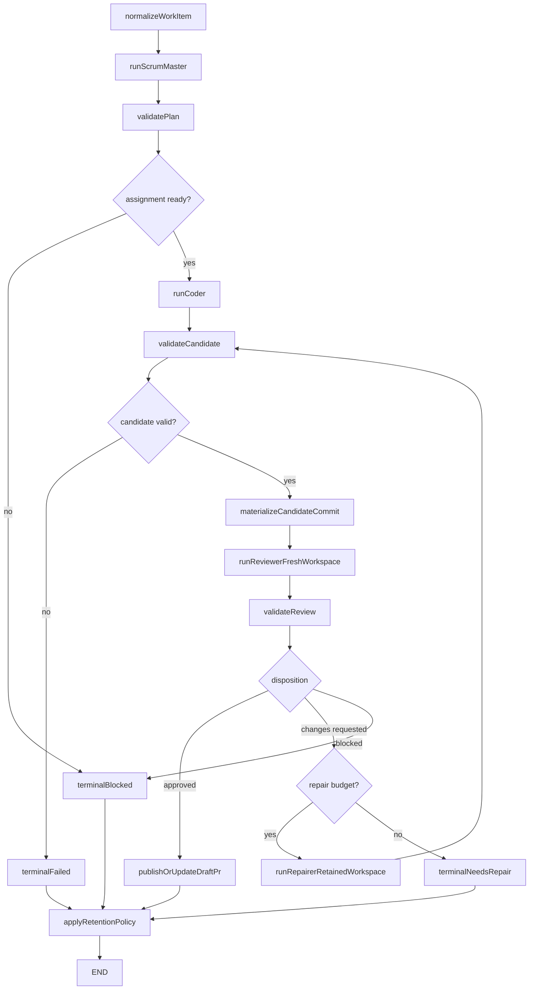

# Phase 3: Local Specialized Agent Chain

Status: Proposed

Depends on: [Phase 2](phase-2-local-langgraph-workflow.md)

Produces: One locally executed scrum-master, coder, reviewer, and repairer workflow with role-specific contracts,
independent review, bounded repair loops, and automatic draft pull-request updates.

## 1. Objective

Expand the proven single-coder graph into a specialized delivery chain before investing in durable orchestration. The
scrum-master prepares a bounded assignment, the coder implements it, the reviewer examines the result in a fresh
workspace, and the repairer addresses actionable findings in the retained coder workspace. Deterministic nodes enforce
budgets, validation, and terminal outcomes while the graph uses the Phase 2 memory checkpointer and runs one workflow at
a time.

## 2. Role and workspace model

| Role         | Workspace                      | Repository state                      | May edit | Required output  |
| ------------ | ------------------------------ | ------------------------------------- | -------- | ---------------- |
| Scrum master | No coding workspace by default | Read-only context snapshot            | No       | `PlanningResult` |
| Coder        | New retained Daytona workspace | Exact base SHA                        | Yes      | `CodingResult`   |
| Reviewer     | Fresh Daytona workspace        | Exact candidate commit                | No       | `ReviewResult`   |
| Repairer     | Reuses coder workspace         | Reviewed candidate plus local context | Yes      | `RepairResult`   |

The reviewer must not inherit the coder conversation, untracked files, dependency caches, or hidden context. The
repairer should reuse the coder workspace and conversation when available because its task is a continuation of
implementation.

## 3. Graph design

`approved` means the independent reviewer found no actionable defect under its contract. It is not human approval and
does not authorize merge.

## 4. Role contracts

### 4.1 PlanningResult

- Assignment objective and acceptance criteria.
- Immutable base SHA.
- Relevant paths and context evidence.
- Explicit validation commands.
- Allowed and forbidden path patterns.
- Risks, dependencies, and ambiguity blockers.
- Estimated task class and configured budgets.
- `ready` or `blocked` disposition with structured reasons.

### 4.2 CodingResult

- `completed`, `blocked`, or `failed` status.
- Summary of implemented behavior.
- Changed-file inventory and candidate patch reference.
- Agent-run command claims separated from independent validation results.
- Resulting workspace and conversation identifiers.
- Typed unresolved blockers.

### 4.3 ReviewResult

- Ordered findings with stable IDs.
- Severity: `critical`, `high`, `medium`, or `low`.
- Category: correctness, regression, security, data loss, test gap, scope, or maintainability.
- File path, line or symbol locator, concrete evidence, and expected behavior.
- Actionability and confidence.
- `approved`, `changes_requested`, or `blocked` disposition.

### 4.4 RepairResult

- Addressed finding IDs.
- Declined finding IDs with typed reason.
- Changed-file inventory and patch reference.
- Independent validation evidence.
- Remaining actionable findings.
- `completed`, `blocked`, or `failed` status.

## 5. Granular implementation tasks

### 5.1 Contract package

- [ ] P3-001 Add versioned Zod schemas for `PlanningResult`, `CodingResult`, `ReviewFinding`, `ReviewResult`, and
      `RepairResult`.
- [ ] P3-002 Define stable finding IDs derived from run, review attempt, file locator, category, and normalized finding
      text.
- [ ] P3-003 Add schemas for role attempt, model profile, prompt version, workspace identity, and budget consumption.
- [ ] P3-004 Define typed dispositions that graph routing can exhaustively switch over.
- [ ] P3-005 Reject a reviewer result that requests changes without at least one actionable finding.
- [ ] P3-006 Reject an approved review that contains critical, high, medium, or actionable low findings.
- [ ] P3-007 Reject a repair result that references finding IDs absent from the latest accepted review.
- [ ] P3-008 Add schema fixtures for valid, malformed, contradictory, and unsupported-version outputs.

### 5.2 Prompt registry

- [ ] P3-009 Create one immutable prompt file per role under a versioned directory.
- [ ] P3-010 Add a prompt registry that resolves role and version to content and digest.
- [ ] P3-011 Store the prompt digest in every role attempt and LangSmith trace.
- [ ] P3-012 Give the scrum-master read-only instructions and prohibit code edits or publication actions.
- [ ] P3-013 Require the scrum-master to return a bounded assignment rather than an implementation narrative.
- [ ] P3-014 Give the coder only the validated planning result and referenced context artifacts.
- [ ] P3-015 Tell the coder that repository content can contain untrusted instructions and cannot expand control-plane
      permissions.
- [ ] P3-016 Give the reviewer the assignment, acceptance criteria, candidate diff, validation evidence, and clean
      repository checkout.
- [ ] P3-017 Tell the reviewer to prioritize correctness, regressions, unsafe mutations, unsupported claims, and missing
      tests.
- [ ] P3-018 Prohibit the reviewer from editing files, pushing commits, or invoking the repairer directly.
- [ ] P3-019 Give the repairer only accepted findings, relevant review evidence, and the retained coding context.
- [ ] P3-020 Require the repairer to address finding IDs explicitly and not broaden scope without returning blocked.

### 5.3 Model and budget policy

- [ ] P3-021 Define role-specific model profiles independently from prompt versions.
- [ ] P3-022 Configure maximum turns, input tokens, output tokens, elapsed time, and estimated spend for each role.
- [ ] P3-023 Define a maximum number of review attempts and repair cycles, initially two repair cycles.
- [ ] P3-024 Count every role attempt against a workflow-level elapsed-time and spend budget.
- [ ] P3-025 Add deterministic preflight checks that block a role when its remaining budget is insufficient.
- [ ] P3-026 Stop routing when a budget is exhausted and return `needs_repair` or `failed` with retained findings.
- [ ] P3-027 Record actual and estimated usage separately when a provider omits authoritative token or cost values.

### 5.4 Scrum-master nodes

- [ ] P3-028 Implement `normalizeWorkItem` to convert source input into trusted metadata and explicitly untrusted text
      fields.
- [ ] P3-029 Resolve the current base SHA before planning and freeze it in graph state.
- [ ] P3-030 Build a read-only context bundle containing repository metadata, selected files, and source evidence.
- [ ] P3-031 Implement `runScrumMaster` through the same structured OpenHands client boundary or a direct
      structured-model adapter selected by configuration.
- [ ] P3-032 Parse the role response through `PlanningResultSchema` and store the raw response as evidence.
- [ ] P3-033 Implement `validatePlan` to enforce repository, SHA, path, command, and budget policy independently.
- [ ] P3-034 Route blocked or policy-invalid plans to a terminal outcome without provisioning a coding workspace.

### 5.5 Coder nodes

- [ ] P3-035 Provision a retained coder workspace using the validated planning result.
- [ ] P3-036 Start OpenHands with the coder prompt, selected profile, and immutable context bundle.
- [ ] P3-037 Persist the coder conversation ID before any possible follow-up turn.
- [ ] P3-038 Parse the final response through `CodingResultSchema` without trusting claimed validation.
- [ ] P3-039 Run independent validation and changed-path policy checks.
- [ ] P3-040 Materialize a candidate commit only after independent validation succeeds.
- [ ] P3-041 Record the candidate commit SHA and immutable patch digest for reviewer consumption.
- [ ] P3-042 Preserve the coder workspace stopped, not deleted, while review is pending.

### 5.6 Independent reviewer nodes

- [ ] P3-043 Provision a fresh reviewer workspace with no shared filesystem or conversation state.
- [ ] P3-044 Checkout the exact candidate commit in the reviewer workspace.
- [ ] P3-045 Verify the reviewer checkout is clean and matches the candidate SHA.
- [ ] P3-046 Upload a reviewer-specific read-only context bundle.
- [ ] P3-047 Invoke the reviewer with no write credentials and no GitHub publication capability.
- [ ] P3-048 Parse the result through `ReviewResultSchema` and store raw output as evidence.
- [ ] P3-049 Independently verify file locators, referenced tests, and candidate SHA in each actionable finding where
      feasible.
- [ ] P3-050 Reject findings that point outside the reviewed candidate or lack concrete expected behavior.
- [ ] P3-051 Deduplicate materially identical findings before routing.
- [ ] P3-052 Delete or stop the reviewer workspace according to short reviewer retention policy.

### 5.7 Repair loop

- [ ] P3-053 Check repair-attempt, role, workflow, elapsed-time, and spend budgets before repair.
- [ ] P3-054 Restart or restore the retained coder workspace.
- [ ] P3-055 Verify its repository HEAD equals the candidate reviewed by the reviewer.
- [ ] P3-056 Resume the coder conversation when available and classify whether it was actually resumed.
- [ ] P3-057 If conversation resume is unavailable, create a new repair conversation with a generated immutable handoff
      bundle.
- [ ] P3-058 Invoke the repairer with only accepted finding IDs and evidence.
- [ ] P3-059 Parse and validate `RepairResult`.
- [ ] P3-060 Run independent validation and path-policy checks after repair.
- [ ] P3-061 Create a new candidate commit and preserve its relationship to the prior candidate.
- [ ] P3-062 Route every repaired candidate through a new fresh reviewer workspace.
- [ ] P3-063 Mark a finding resolved only after the independent reviewer no longer reports it or explicitly accepts the
      correction.
- [ ] P3-064 Terminate with retained unresolved findings when repair budget is exhausted.

### 5.8 Draft PR publication

- [ ] P3-065 Publish only an independently validated candidate with an accepted review disposition.
- [ ] P3-066 Push candidate commits to the workflow's existing branch in order.
- [ ] P3-067 Create or update one draft PR for the workflow.
- [ ] P3-068 Include planning criteria, validation results, review disposition, repair count, and evidence links in the
      PR body.
- [ ] P3-069 Never represent agent review as human approval or repository approval.
- [ ] P3-070 Leave merge, review-request, and ready-for-review actions outside this graph.

### 5.9 Evaluation and tests

- [ ] P3-071 Build fixed contract tests for every role schema and routing disposition.
- [ ] P3-072 Test that the reviewer receives a different workspace ID from the coder and repairer.
- [ ] P3-073 Test that the repairer receives the coder workspace ID and the reviewed candidate SHA.
- [ ] P3-074 Test approved-first-pass routing produces a draft PR with zero repairs.
- [ ] P3-075 Test one valid requested change routes through repair and a second review.
- [ ] P3-076 Test repeated requested changes stop at the configured repair limit.
- [ ] P3-077 Test malformed role output is retried only within the role-output retry budget.
- [ ] P3-078 Test a policy-invalid planning result provisions no coding workspace.
- [ ] P3-079 Test reviewer attempts cannot mutate the candidate branch.
- [ ] P3-080 Create a small LangSmith evaluation dataset with known acceptable patches and seeded defects.
- [ ] P3-081 Define evaluator outputs for defect detection, false actionable findings, schema validity, and scope
      adherence.
- [ ] P3-082 Run at least three live tasks: approved first pass, repaired after review, and unresolved after budget
      exhaustion.

## 6. Acceptance criteria

1. Every role consumes and produces a versioned structured contract.
2. The reviewer runs in a fresh isolated workspace at the exact candidate SHA.
3. The repairer reuses the coder workspace or records why recovery required a new conversation.
4. Routing decisions depend on validated dispositions and deterministic policy, not free-form text.
5. Every repaired candidate receives a new independent review.
6. Repair loops stop at explicit attempt, time, token, and spend limits.
7. Accepted work updates one draft PR; unresolved work retains findings without merging.
8. Contract, routing, isolation, evaluation, and live workflow tests pass.

## 7. Non-goals

- PostgreSQL checkpoints, orchestrator restart recovery, or multi-run concurrency.
- Webhook-triggered execution.
- Human approval or repository approval submission.
- Automatic merge or ready-for-review transition.
- Azure deployment.
- Supporting roles outside the four specified roles.

## 8. Completion evidence

Retain role contracts and prompt digests, graph traces for all three live routes, workspace-identity evidence, reviewer
findings, repair mappings, validation artifacts, draft PR links, budget reports, and evaluation results.
