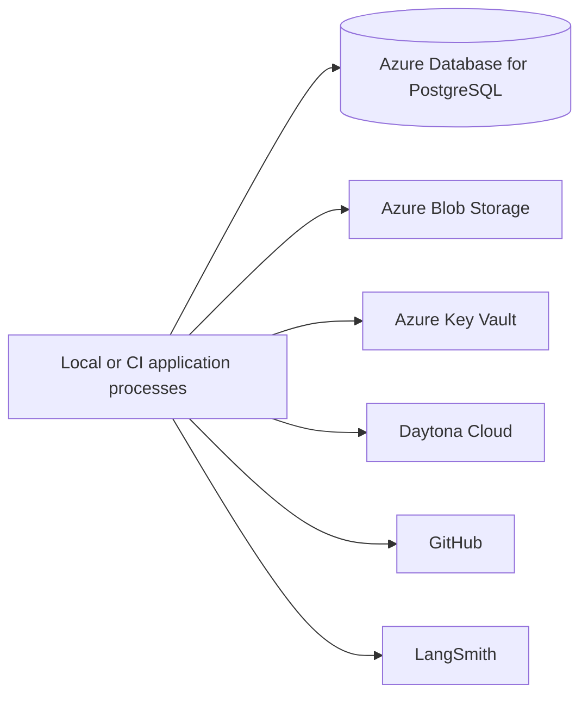

# Phase 6: Azure-Managed Data and Secrets

Status: Proposed

Depends on: [Phase 5](phase-5-webhook-automation.md)

Produces: The unchanged webhook and workflow processes use Azure Database for PostgreSQL, Azure Blob Storage, and Azure
Key Vault while they can still run from local or CI-hosted compute and Daytona remains the workspace provider.

## 1. Objective

Replace local persistence, artifact storage, and secret loading with Azure-managed services before moving application
compute. Preserve graph, role, event, publication, and workspace contracts. Prove data migration, access control, backup
recovery, secret rotation, and service parity independently from Container Apps deployment.

## 2. Migration boundary

Application processes remain outside Azure in this phase. Development access may use an explicitly approved network path
and developer identity; production workload identities and private-only application ingress arrive with Phase 7.

## 3. Granular implementation tasks

### 3.1 Infrastructure source and environments

- [ ] P6-001 Select Bicep as the infrastructure-as-code format unless an existing repository standard requires
      Terraform.
- [ ] P6-002 Create reusable modules for PostgreSQL, Blob Storage, Key Vault, their networking, and operator identity.
- [ ] P6-003 Create parameter files for development, staging, and production without secret values.
- [ ] P6-004 Define deterministic resource names, required tags, region, environment, workload owner, and cost center.
- [ ] P6-005 Pin Azure resource API versions and service tiers.
- [ ] P6-006 Add infrastructure formatting, validation, preview, and deployment commands.
- [ ] P6-007 Emit only non-secret endpoints and resource identifiers from deployment outputs.
- [ ] P6-008 Document subscription, region, quota, DNS, network, and identity prerequisites.

### 3.2 Network and identity

- [ ] P6-009 Create the virtual network, private endpoints, and private DNS zones required by PostgreSQL, Blob Storage,
      and Key Vault.
- [ ] P6-010 Define the temporary approved access path used by local or CI processes during this phase.
- [ ] P6-011 Create separate identities for infrastructure deployment, schema migration, application data access, and
      secret administration.
- [ ] P6-012 Grant each identity only the data-plane and control-plane permissions it requires.
- [ ] P6-013 Verify denied access to databases, containers, secrets, and administrative operations outside each role.
- [ ] P6-014 Keep GitHub App, Daytona, model-provider, LangSmith, and webhook credentials out of infrastructure
      parameters, state, and deployment outputs.
- [ ] P6-015 Record how temporary local or CI access will be removed when Phase 7 hosts the application in Azure.

### 3.3 Azure Database for PostgreSQL

- [ ] P6-016 Provision Azure Database for PostgreSQL Flexible Server with the supported PostgreSQL version, backups,
      retention, and environment-appropriate availability settings.
- [ ] P6-017 Configure TLS enforcement and certificate validation in the Node PostgreSQL client.
- [ ] P6-018 Use Entra authentication where supported by the required libraries; otherwise store a rotated database
      credential in Key Vault.
- [ ] P6-019 Create migration and runtime roles with least privilege.
- [ ] P6-020 Configure connection-pool sizes and query, lock, statement, and idle-transaction timeouts.
- [ ] P6-021 Run the Phase 4 and Phase 5 schema migrations through an explicit one-shot command.
- [ ] P6-022 Verify LangGraph checkpoint, workflow lease, webhook inbox, and reconciliation compatibility.
- [ ] P6-023 Migrate required non-production records and reconcile row counts and assignment digests.
- [ ] P6-024 Test point-in-time restore into a separate server and verify checkpoint and inbox recovery.
- [ ] P6-025 Disable public network access once the approved execution path supports private connectivity.

### 3.4 Azure Blob artifact store

- [ ] P6-026 Create private containers or equivalent prefixes for context, results, command logs, webhook payloads,
      patches, and diagnostics.
- [ ] P6-027 Implement `AzureBlobArtifactStore` behind the existing `ArtifactStore` interface.
- [ ] P6-028 Authenticate with `DefaultAzureCredential` without embedding storage keys.
- [ ] P6-029 Preserve immutable run, role, and attempt object keys plus SHA-256 metadata.
- [ ] P6-030 Verify downloaded content digests independently from object metadata.
- [ ] P6-031 Configure encryption, soft delete, versioning, and lifecycle rules by artifact class.
- [ ] P6-032 Prohibit public containers and persistent public object URLs.
- [ ] P6-033 Generate short-lived, narrowly scoped access only when a component cannot use an Azure identity.
- [ ] P6-034 Migrate required Phase 5 artifacts and verify every record-to-object digest.
- [ ] P6-035 Run the unchanged artifact contract suite against local storage, Azurite, and a staging storage account.

### 3.5 Azure Key Vault and secret loading

- [ ] P6-036 Provision Key Vault with RBAC authorization, soft delete, and purge protection.
- [ ] P6-037 Store the GitHub App private key, webhook secret, Daytona API key, model-provider keys, LangSmith key, and
      any fallback database credential as separate secrets.
- [ ] P6-038 Implement an Azure Key Vault provider behind the existing secret-provider interface.
- [ ] P6-039 Cache secret values only for a bounded duration and never persist them in graph state or artifacts.
- [ ] P6-040 Ensure logs and exception serializers redact resolved values and sensitive secret references.
- [ ] P6-041 Add rotation runbooks for every secret and validate at least one non-disruptive staging rotation.
- [ ] P6-042 Test disabled, expired, missing, unauthorized, and transiently unavailable secret versions.

### 3.6 Configuration and parity

- [ ] P6-043 Add typed provider selection for PostgreSQL, artifact storage, and secret loading.
- [ ] P6-044 Keep local implementations available for unit tests and offline development.
- [ ] P6-045 Validate endpoints, identifiers, limits, and provider combinations at process startup.
- [ ] P6-046 Fail readiness when required schema versions, Blob containers, or secret references are unavailable.
- [ ] P6-047 Keep downstream Daytona, GitHub, model, and LangSmith outages out of basic liveness checks.
- [ ] P6-048 Emit a startup configuration summary containing provider names but no credentials.
- [ ] P6-049 Run one complete Phase 5 webhook workflow from non-Azure compute using all three Azure-managed services.
- [ ] P6-050 Verify the resulting graph checkpoints, inbox rows, artifacts, secrets, branch, draft PR, and Daytona
      workspace can be correlated.

### 3.7 Recovery, security, and cost proof

- [ ] P6-051 Interrupt database and Blob access independently and verify no false persistence success is recorded.
- [ ] P6-052 Restore PostgreSQL from backup in isolation and run reconciliation without external mutation.
- [ ] P6-053 Recover a deleted or superseded Blob object according to retention policy and verify its digest.
- [ ] P6-054 Rotate the webhook or provider secret during a controlled workflow and verify bounded recovery.
- [ ] P6-055 Review Azure activity, database, storage, and Key Vault logs for least-privilege evidence without source or
      secret leakage.
- [ ] P6-056 Measure baseline and ten-workflow database, storage, network, Key Vault, and Daytona costs.
- [ ] P6-057 Configure service budgets and anomaly alerts where provider APIs support them.
- [ ] P6-058 Document recovery objectives, retention, data ownership, access removal, and incident runbooks.

## 4. Acceptance criteria

1. The complete Phase 5 workflow runs from local or CI-hosted compute against Azure PostgreSQL, Blob Storage, and Key
   Vault while Daytona remains the workspace provider.
2. Existing database, artifact, and secret-provider contracts pass against the Azure implementations.
3. Data-plane access uses approved identities and denies operations outside each role.
4. Database migration, point-in-time restore, artifact recovery, and secret rotation produce retained evidence.
5. Azure service interruptions never result in a false checkpoint, inbox acknowledgment, or artifact-success claim.
6. The application remains deployable outside Azure, proving this phase did not silently couple data migration to hosted
   compute.

## 5. Non-goals

- Hosting the webhook API, orchestrator, reconciler, or migration command in Azure.
- Building application container images or an Azure Container Registry.
- Replacing LangGraph, OpenHands, or Daytona.
- Human approval nodes, automatic merge, or multi-region active-active operation.

## 6. Completion evidence

Retain IaC validation and deployment outputs, identity access tests, schema migration and restore evidence, artifact
contract and recovery output, secret rotation proof, one complete webhook-to-draft-PR trace, measured service costs, and
the temporary-access removal plan for Phase 7.
