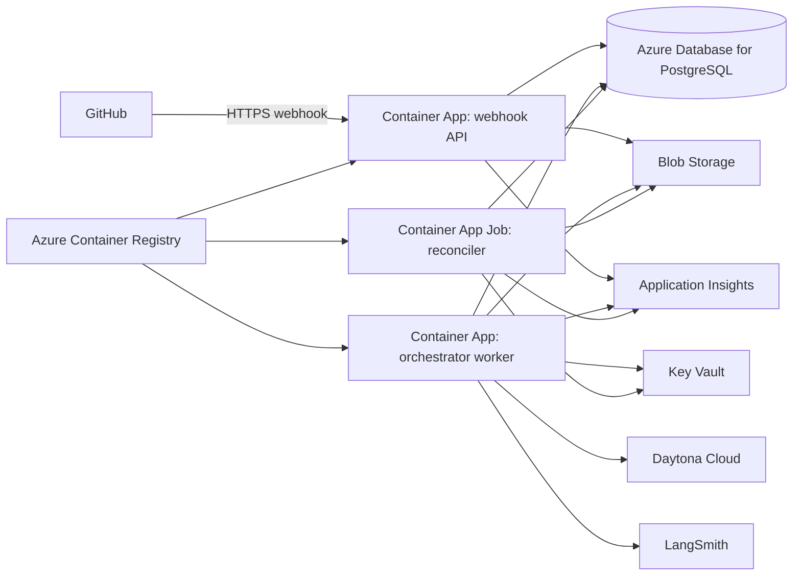

# Phase 7: Azure-Hosted Control Plane

Status: Deployment source complete; live Azure acceptance pending

Depends on: [Phase 6](phase-6-azure-managed-data-and-secrets.md)

Produces: The proven TypeScript webhook API, orchestrator, reconciler, and migration workload run on Azure Container
Apps and Container Apps Jobs while using the Phase 6 managed services and retaining Daytona as the workspace provider.

## Implementation record

Implemented in source:

- One production image for the single `agentic` package, with API, worker, reconciler, and migration selected by process
  arguments.
- ACR, a VNet-integrated Container Apps environment, separate managed identities, API and worker Container Apps,
  scheduled reconciliation, a manual migration job, health probes, replica limits, and digest-only image references.
- A safe three-state deployment gate: infrastructure only, migration ready, then runtime application. Runtime processes
  are disabled by default and require `enableRuntimeProcesses=true` after the migration job succeeds.
- Pinned LangGraph, OpenHands, and Daytona runtime selections persisted atomically with workflow creation.

Verified locally: the composed Bicep template compiles without warnings and focused process, persistence, runtime
selection, and control-plane tests pass. No image has been accepted by ACR and no Container Apps revision has been run
in Azure from this repository state.

Operational constraints are explicit. The polling worker keeps a minimum replica of one; scale-to-zero is not claimed
without a durable event-driven scaler. Container Apps ingress is app-wide, so the current external API surface is not
equivalent to route-level webhook-only ingress. Production acceptance requires an approved gateway or authentication
boundary for non-webhook routes. The unchecked checklist below remains the live acceptance contract. Follow the
[Azure deployment and acceptance runbook](azure-deployment-runbook.md).

## 1. Objective

Move application compute to Azure without changing workflow behavior, agent roles, managed-data providers, or workspace
semantics. Package each deployment unit independently, use workload identities and private service connectivity, scale
request handling separately from workflow execution, and prove recovery under real platform restarts and revisions.

## 2. Azure topology

## 3. Deployment units

| Unit                | Azure service                         | Scaling model                                            | Public ingress            |
| ------------------- | ------------------------------------- | -------------------------------------------------------- | ------------------------- |
| Webhook API         | Container Apps                        | HTTP concurrency, minimum one after production readiness | GitHub webhook route only |
| Orchestrator worker | Container Apps                        | Durable backlog driven, zero to configured maximum       | None                      |
| Reconciler          | Container Apps Job                    | Scheduled and manually invokable                         | None                      |
| Schema migration    | Container Apps Job or CI one-shot job | On deployment only                                       | None                      |

## 4. Granular implementation tasks

### 4.1 Compute infrastructure and identity

- [ ] P7-001 Extend the Phase 6 Bicep modules with ACR, Container Apps environment, workload profiles, Log Analytics,
      workload identities, ingress, and deployment outputs.
- [ ] P7-002 Create separate user-assigned managed identities for API, worker, reconciler, migration, and deployment
      roles.
- [ ] P7-003 Grant each identity only its required registry, PostgreSQL, Blob, Key Vault, and telemetry permissions.
- [ ] P7-004 Connect the Container Apps environment to the Phase 6 private endpoints and DNS zones.
- [ ] P7-005 Restrict public ingress to HTTPS on the webhook API; keep worker, reconciler, migration, and management
      endpoints private or disabled.
- [ ] P7-006 Remove the temporary local or CI production-data access path recorded in Phase 6.
- [ ] P7-007 Verify denied access between deployment units and Azure services outside each unit's role.
- [ ] P7-008 Add environment-specific compute, scaling, ingress, and cost parameters without secret values.

### 4.2 Container build and registry

- [ ] P7-009 Create separate production Dockerfiles or targets for webhook API, orchestrator worker, reconciler, and
      migration job.
- [ ] P7-010 Use pinned base-image digests and a non-root runtime user.
- [ ] P7-011 Build only production workspace dependencies into each image.
- [ ] P7-012 Add container health checks consistent with each process's behavior.
- [ ] P7-013 Generate a software bill of materials and scan every image for vulnerabilities and secret material.
- [ ] P7-014 Push immutable commit-SHA tags to ACR and record image digests.
- [ ] P7-015 Configure deployments by immutable digest rather than mutable tag.
- [ ] P7-016 Verify the images contain no repository credentials, local environment files, or persistent workspace data.

### 4.3 Container Apps deployment

- [ ] P7-017 Deploy the webhook API with HTTPS ingress, health probes, body limits, and a revision strategy.
- [ ] P7-018 Configure the webhook API minimum replica count from measured GitHub delivery latency requirements.
- [ ] P7-019 Deploy the orchestrator worker without ingress.
- [ ] P7-020 Use the Phase 5 durable inbox or another explicitly selected durable claim mechanism for worker dispatch.
- [ ] P7-021 Scale workers from durable backlog and cap replicas so aggregate acquisition respects Daytona and
      PostgreSQL limits.
- [ ] P7-022 Configure graceful shutdown long enough to checkpoint workflows and release leases.
- [ ] P7-023 Deploy the reconciler as a scheduled Container Apps Job with singleton execution protection.
- [ ] P7-024 Deploy database migration as an explicit one-shot job that must succeed before revision promotion.
- [ ] P7-025 Configure CPU, memory, ephemeral disk, execution timeout, and replica limits from measured Phase 5 use.
- [ ] P7-026 Verify workers can scale to zero while durable leases still represent active Daytona sandboxes.

### 4.4 Hosted configuration and readiness

- [ ] P7-027 Define one Zod environment schema per deployment unit.
- [ ] P7-028 Separate non-secret application configuration from Key Vault secret references.
- [ ] P7-029 Authenticate to Phase 6 services with managed identity and remove developer credentials from hosted
      configuration.
- [ ] P7-030 Validate required endpoints, identities, limits, image versions, and feature flags at process startup.
- [ ] P7-031 Fail readiness when PostgreSQL, required Blob containers, Key Vault references, or migration versions are
      unavailable.
- [ ] P7-032 Keep downstream Daytona, GitHub, model, and LangSmith outages out of basic liveness checks.
- [ ] P7-033 Emit a startup configuration summary containing image and provider versions but no credentials.

### 4.5 Observability and operations

- [ ] P7-034 Instrument every deployment unit with OpenTelemetry and Azure Monitor export.
- [ ] P7-035 Preserve run, delivery, graph thread, role attempt, workspace, commit, PR, and LangSmith identifiers as
      correlated structured fields.
- [ ] P7-036 Record request latency, inbox lag, queue depth, active workflows, workspace acquisition, role duration,
      retries, reconciliation drift, and terminal outcomes.
- [ ] P7-037 Propagate distributed traces from webhook receipt through dispatch and graph advancement.
- [ ] P7-038 Keep prompts, patches, source contents, raw webhook bodies, and secrets out of default telemetry.
- [ ] P7-039 Create dashboards for ingress, workflows, providers, database, artifacts, revisions, costs, and failures.
- [ ] P7-040 Alert on signature failures, webhook errors, inbox backlog, stale leases, failed migrations, saturation,
      artifact errors, restart loops, and exhausted budgets.
- [ ] P7-041 Add a synthetic staging probe that verifies authenticated durable receipt without starting paid agent work.

### 4.6 Deployment and rollback

- [ ] P7-042 Add CI stages for install, typecheck, lint, unit and integration tests, image build and scan, IaC
      validation, and deployment preview.
- [ ] P7-043 Use the repository's existing environment controls for production deployment without adding a runtime
      human-approval graph node.
- [ ] P7-044 Apply additive database migrations before deploying revisions that require them.
- [ ] P7-045 Deploy revisions with zero traffic, run smoke tests, and shift traffic progressively.
- [ ] P7-046 Keep the prior compatible revision available for application rollback.
- [ ] P7-047 Define forward-fix procedures for non-reversible database migrations.
- [ ] P7-048 Verify rollback does not orphan inbox leases, graph threads, or Daytona sandboxes.
- [ ] P7-049 Record infrastructure version, image digests, schema version, provider configuration, and prompt registry
      version for every deployment.

### 4.7 Resilience, scale, and cost proof

- [ ] P7-050 Run a staging webhook workflow through Azure-hosted services and Daytona.
- [ ] P7-051 Restart the orchestrator revision during active coding and repair work and verify PostgreSQL recovery.
- [ ] P7-052 Scale workers to zero and verify pending durable work resumes when capacity returns.
- [ ] P7-053 Execute ten concurrent fixture workflows and verify Azure scaling respects the global workspace cap.
- [ ] P7-054 Temporarily block Daytona access and verify durable retry and alert behavior.
- [ ] P7-055 Temporarily block Blob and PostgreSQL access independently and verify no false persistence is claimed.
- [ ] P7-056 Restore PostgreSQL from backup in an isolated environment and run reconciliation without external mutation.
- [ ] P7-057 Measure baseline and ten-run compute, database, storage, egress, logging, Daytona, model, and LangSmith
      costs.
- [ ] P7-058 Configure budgets and anomaly alerts where provider APIs support them.
- [ ] P7-059 Document production capacity, recovery objectives, retention, incident ownership, and operational runbooks.

## 5. Acceptance criteria

1. The complete Phase 5 workflow runs on Azure-hosted application compute while Daytona remains the workspace provider.
2. Public ingress is limited to the authenticated webhook API surface.
3. Every deployment unit accesses Phase 6 services through least-privilege workload identity.
4. PostgreSQL checkpoints and Blob artifacts survive application revision restarts and rollbacks.
5. Workers scale to zero and recover durable queued work when capacity returns.
6. Ten concurrent fixture workflows respect workspace, database, and compute limits.
7. Deployment, migration, rollback, provider-outage, restart, and backup-restore drills produce retained evidence.
8. Azure Monitor and LangSmith correlate platform and agent traces without becoming workflow authorities.

## 6. Non-goals

- Replacing LangGraph or OpenHands with another agent framework.
- Replacing Daytona with an Azure workspace runtime.
- Self-hosting LangSmith without a separate licensing and operations decision.
- Human approval nodes, automatic merge, or general multi-region active-active operation.

## 7. Completion evidence

Retain IaC and deployment outputs, image digests and scan results, workload-identity tests, migration and rollback
evidence, staging workflow traces, scale and outage drills, dashboards, alerts, measured costs, and production runbooks.
