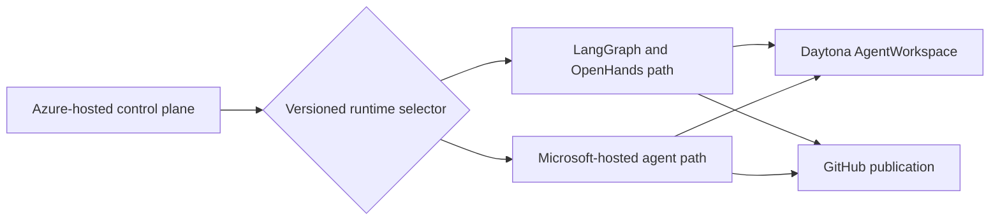

# Phase 8: Microsoft-Hosted Agent Runtime Migration

Status: Deferred on 2026-07-19; no approved Microsoft candidate or parity evidence

Depends on: [Phase 7](phase-7-azure-hosted-control-plane.md)

Produces: Selected orchestration or agent-execution responsibilities run on the approved Microsoft-hosted agent
framework with measured parity, independent rollback, and no change to the Daytona workspace provider.

## Decision record

Decision code: `no-approved-microsoft-candidate-or-parity-evidence`

No exact Microsoft service, API version, support level, region, quota, identity boundary, retention policy, and measured
parity package has passed the entry assessment. P8-008 therefore resolves to deferral rather than an assumed migration.
LangGraph.js 1.4.7 and the pinned OpenHands Agent Server remain authoritative.

The versioned runtime selector is implemented and persisted atomically with each workflow. Startup rejects any
orchestrator or role-runtime provider other than the retained pair, so deployment configuration cannot silently opt into
an unsupported Microsoft path. Reopen this phase only with an approved candidate and evidence for P8-001 through P8-007.
This decision is completion of the gate, not Microsoft runtime parity evidence.

## 1. Objective

Evaluate the Microsoft-hosted agent framework against the proven LangGraph and OpenHands system, then migrate only the
responsibilities it can replace without weakening deterministic routing, durable recovery, coding behavior, evidence, or
operational controls. Replace one component boundary at a time and retain the existing implementation until the new path
passes contract, live-workflow, security, reliability, and cost gates.

This phase does not assume that one Microsoft service replaces both LangGraph and OpenHands. It also does not treat a
hosted agent runtime as a replacement for Daytona's filesystem, process, stop, resume, archive, or isolation semantics.

## 2. Replacement boundaries

Evaluate these boundaries independently:

| Boundary               | Existing implementation        | Required preserved behavior                                      |
| ---------------------- | ------------------------------ | ---------------------------------------------------------------- |
| Workflow orchestration | LangGraph.js and PostgreSQL    | Deterministic routing, checkpoints, retries, leases, recovery    |
| Role execution         | OpenHands Agent Server         | Repository exploration, edits, commands, structured role results |
| Model and tool hosting | Current model provider clients | Model profiles, tool policy, budgets, cancellation, usage        |
| Agent observability    | LangSmith                      | Correlated traces, evaluations, redaction, evidence links        |
| Coding workspace       | Daytona `AgentWorkspace`       | Explicitly unchanged in this phase                               |
| Publication and events | GitHub and Phase 5 services    | Explicitly unchanged in this phase                               |

The capability assessment must name the exact Microsoft products, API versions, regions, quotas, identity model, data
retention, network behavior, and support status being evaluated. Marketing category similarity is not parity evidence.

## 3. Migration strategy

Every workflow records its selected orchestration, role-runtime, model, prompt, and workspace-provider versions. A live
workflow remains on that version set unless an explicit state-migration design has passed recovery tests.

## 4. Granular implementation tasks

### 4.1 Capability and responsibility assessment

- [ ] P8-001 Record the exact Microsoft framework, hosted services, SDKs, API versions, deployment regions, preview or
      general-availability status, quotas, and licensing terms.
- [ ] P8-002 Map every LangGraph responsibility to supported, unsupported, or custom-required Microsoft capability.
- [ ] P8-003 Map every OpenHands responsibility to supported, unsupported, or custom-required Microsoft capability.
- [ ] P8-004 Identify state ownership, checkpoint consistency, retry semantics, cancellation, idempotency, and recovery
      behavior for each candidate service.
- [ ] P8-005 Identify supported models, tool protocols, structured-output enforcement, content limits, and usage data.
- [ ] P8-006 Document identity, private networking, regional processing, retention, deletion, encryption, and diagnostic
      data behavior.
- [ ] P8-007 Measure quota, latency, and cost assumptions against the ten-workflow target.
- [x] P8-008 Produce a decision record that selects the first replaceable boundary or defers migration when no boundary
      passes the entry criteria.

### 4.2 Stable runtime contracts

- [ ] P8-009 Define provider-neutral interfaces for graph advancement, role execution, structured results, usage,
      cancellation, and trace correlation at the existing ownership boundaries.
- [ ] P8-010 Keep assignment, role result, review finding, artifact, workspace handle, webhook, and publication schemas
      unchanged unless a separately versioned backward-compatible extension is required.
- [x] P8-011 Add a versioned runtime selector that independently chooses orchestration and role-execution providers.
- [x] P8-012 Persist every provider and version selection before the first external side effect.
- [x] P8-013 Prevent a workflow from switching providers implicitly during retry, restart, deployment, or rollback.
- [ ] P8-014 Run the same contract suites against legacy and Microsoft implementations.
- [ ] P8-015 Keep Daytona reachable only through the existing `AgentWorkspace` interface from both paths.

### 4.3 Hosted role-execution spike

- [ ] P8-016 Implement the smallest Microsoft-hosted role adapter capable of one read-only planning request against an
      immutable context bundle.
- [ ] P8-017 Enforce the existing structured planning schema independently from model prose.
- [ ] P8-018 Add bounded tool, token, turn, elapsed-time, and spend policy equivalent to the existing role profile.
- [ ] P8-019 Propagate cancellation and classify timeout, quota, authentication, policy, model, and malformed-output
      failures through existing typed results.
- [ ] P8-020 Verify repository text and tool output remain untrusted inputs and cannot alter control-plane policy.
- [ ] P8-021 Extend the adapter to coder, reviewer, and repairer only after planning parity passes.
- [ ] P8-022 Prove the hosted role can use the assigned Daytona workspace without receiving Daytona control-plane
      credentials or bypassing workspace policy.
- [ ] P8-023 Compare patch quality, validation success, review findings, repair behavior, latency, and cost with the
      OpenHands baseline.

### 4.4 Hosted orchestration spike

- [ ] P8-024 Implement one deterministic approved-first-pass route using the Microsoft orchestration capability while
      retaining existing role executors.
- [ ] P8-025 Prove durable state survives process, service, and deployment restarts without duplicate workspace, branch,
      role attempt, commit, or pull request creation.
- [ ] P8-026 Preserve explicit conditional routing, repair limits, budgets, terminal outcomes, and external-state
      reconciliation.
- [ ] P8-027 Persist external identifiers before subsequent side effects and verify retry idempotency.
- [ ] P8-028 Define how existing non-terminal state is resumed, drained on the legacy path, or migrated through a
      versioned and reversible process.
- [ ] P8-029 Prove webhook acknowledgment and durable inbox behavior remain independent from long-running agent work.
- [ ] P8-030 Compare recovery time, checkpoint lag, operational complexity, throughput, and cost with LangGraph.

### 4.5 Identity, network, and data governance

- [ ] P8-031 Authenticate Azure-hosted control-plane calls with managed identity where the service supports it.
- [ ] P8-032 Broker GitHub, model, and Daytona access through existing scoped boundaries rather than copying persistent
      credentials into hosted agent state.
- [ ] P8-033 Keep prompts, source, patches, webhook bodies, and secrets out of default service logs and telemetry.
- [ ] P8-034 Verify private networking or explicitly document and approve every public service path.
- [ ] P8-035 Test tenant, project, agent, thread, tool, and artifact isolation between concurrent workflows.
- [ ] P8-036 Implement deletion and retention reconciliation between Microsoft-hosted state, PostgreSQL, Blob Storage,
      LangSmith, Daytona, and GitHub evidence.
- [ ] P8-037 Update the threat model for hosted tools, indirect prompt injection, cross-thread data exposure, credential
      brokering, service compromise, and control-plane impersonation.

### 4.6 Observability and evaluation parity

- [ ] P8-038 Correlate Microsoft service identifiers with run, delivery, role attempt, workspace, commit, PR, and legacy
      trace identifiers.
- [ ] P8-039 Normalize token, usage, cost, latency, retry, tool, and terminal-outcome metrics across providers.
- [ ] P8-040 Export platform telemetry to Azure Monitor while retaining the authoritative workflow checkpoint outside
      observability systems.
- [ ] P8-041 Run the Phase 3 evaluation dataset against both role runtimes with identical assignments and acceptance
      criteria.
- [ ] P8-042 Compare defect detection, false actionable findings, schema validity, scope adherence, patch completion,
      and repair convergence.
- [ ] P8-043 Define explicit reliability, quality, latency, security, and cost thresholds before production rollout.

### 4.7 Incremental rollout and rollback

- [ ] P8-044 Roll out one selected boundary to fixture repositories before combining Microsoft orchestration and role
      execution.
- [ ] P8-045 Select providers only when a workflow is created and persist the selection for its lifetime.
- [ ] P8-046 Add repository allowlist and percentage gates for new workflows.
- [ ] P8-047 Keep LangGraph and OpenHands operational throughout the rollback window.
- [ ] P8-048 Route new workflows back to the legacy component when reliability, quality, latency, security, quota, or
      cost thresholds are breached.
- [ ] P8-049 Continue or explicitly reconcile already-active Microsoft-hosted workflows during rollback.
- [ ] P8-050 Remove a legacy component only after all retained workflows terminate, recovery obligations expire, and a
      separate decommission decision is recorded.

### 4.8 End-to-end proof

- [ ] P8-051 Run no-op, repair, blocked, approved, repaired, exhausted, and webhook-triggered fixtures unchanged.
- [ ] P8-052 Inject service timeout, quota exhaustion, malformed output, lost response, control-plane restart, and
      partial publication failures.
- [ ] P8-053 Execute ten concurrent workflows and verify unique state, workspace, conversation or thread, branch, and
      artifact ownership.
- [ ] P8-054 Verify every candidate change is independently validated and reviewed before draft PR publication.
- [ ] P8-055 Verify Daytona stop, resume, archive, command, and evidence behavior is unchanged from Phase 7 baselines.
- [ ] P8-056 Run a soak test across deployment, secret rotation, reconciliation, provider failback, and retention jobs.
- [ ] P8-057 Record the final component matrix, measured parity, remaining legacy dependencies, and deferred gaps.

## 5. Acceptance criteria

1. The selected Microsoft services and exact responsibilities they replace are documented with measured evidence.
2. Each migrated boundary passes the same contracts and fixture workflows as its legacy implementation.
3. Deterministic routing, durable recovery, independent validation, review, publication, and reconciliation semantics
   remain intact.
4. A migration or rollback never silently switches an active workflow's provider versions.
5. Security, data-governance, quality, reliability, latency, quota, and cost thresholds pass for ten concurrent runs.
6. Daytona remains the workspace provider and passes unchanged lifecycle and recovery checks from both runtime paths.
7. Unsupported Microsoft framework capabilities remain behind proven legacy components rather than custom assumptions.

## 6. Non-goals

- Replacing Daytona or redefining `AgentWorkspace` semantics.
- Assuming one Microsoft product replaces orchestration, coding, observability, and workspace infrastructure together.
- Rewriting proven contracts solely to match a provider API.
- Migrating active workflow state without a separately validated reversible design.
- Human approval nodes or automatic merge.

## 7. Completion evidence

Retain the capability matrix, decision records, adapter contracts, parity and evaluation reports, identity and isolation
tests, recovery and failure-injection output, ten-run and soak evidence, rollout dashboards, cost comparison, rollback
proof, and the final component ownership matrix.
