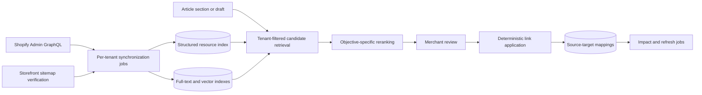

# Link intelligence architecture

## Purpose

Replace prompt-driven article rewriting with a tenant-isolated system that discovers Shopify resources, recommends
commercial crosslinks and further reading, lets merchants review each placement, and applies accepted links without
regenerating article prose.

This design refines Milestones 2, 4, 6, and 7 in [the product plan](./plan.md). The implementation order is tracked in
[the overhaul backlog](./link-intelligence-backlog.md), and reranker selection is governed by
[the reranking decision record](./reranking-decision.md).

## Non-negotiable invariants

1. Every durable record has a non-null installation or tenant ID.
2. Every unique key includes the tenant ID unless it identifies the tenant itself.
3. Tenant, publication, and availability constraints are applied before retrieval and reranking.
4. A retrieval query, cache entry, job, trace, and rerank request contains data from exactly one tenant.
5. Shopify resource IDs are never treated as globally unique without the tenant ID.
6. Authorization derives the tenant from the authenticated installation, never from a client-supplied shop or tenant ID.
7. Deleted, unpublished, and unavailable resources cannot be newly recommended.
8. Model output cannot create or alter a destination URL. URLs come from synchronized, verified resource records.
9. Accepted recommendations are applied deterministically to the reviewed source revision. The model never rewrites the
   full article to insert links.

These rules must be enforced in schema constraints, repository APIs, job payloads, cache keys, and tests. Cohere or any
other hosted reranker is a ranking processor, not a tenant boundary.

## System boundaries



Shopify Admin GraphQL is authoritative for resource identity, handles, canonical routes, publication state,
availability, and update timestamps. Sitemap data supplements route discovery and verifies storefront reachability; it
does not override Shopify resource state.

## Resource index

Store normalized resource metadata separately from generated search representations.

### Common resource fields

- tenant ID;
- Shopify global ID and resource type;
- title, handle, canonical URL, and locale;
- publication and availability state;
- source-created and source-updated timestamps;
- synchronized timestamp and content hash;
- deletion or deactivation timestamp;
- indexing status and representation version.

### Product and collection fields

- description;
- product type, vendor, tags, and collection membership;
- price range;
- product publication and variant availability state.

Price and availability remain relational filters. They are not embedded because they change frequently and can make an
otherwise useful embedding stale.

### Blog, article, and page fields

- owning blog ID where applicable;
- summary, headings, cleaned body, and tags;
- draft or published state;
- article/page revision hash.

Chunk long text deterministically. Each chunk records its tenant, resource, ordinal, heading context, source hash,
embedding model, and embedding version. Re-index only changed chunks and deactivate removed chunks.

## Onboarding and synchronization

Recommendation features remain unavailable until the installation has completed an initial index.

The onboarding state machine is:

```text
pending -> catalog_sync -> content_sync -> indexing -> ready
                                     \-> failed -> retrying
```

The app exposes phase progress, last successful checkpoint, retryable failures, and last reconciliation time. Jobs are
idempotent and resume from persisted cursors; an HTTP request only dispatches work and returns job identity.

Store sync reached this shape only in part. It is owned by n8n rather than by the job table: one workflow synchronizes a
single store and then asks for indexing, and a second sweeps every store that has gone 72 hours without a sync. Both
call one bearer-authenticated endpoint in the app, which scans and persists a whole store in one request and answers
with the tenant and resource count. The workflow layer owns the retries, the ordering, and the run history; the app owns
the Shopify traversal. The paged, resumable form described above is still needed for a catalogue larger than one request
and should land behind the same endpoint.

Request `read_products` for products and collections; `read_content` and `read_online_store_pages` for blogs, articles,
and pages; and `read_locales` and `read_markets_home` to resolve the primary locale. Keep write scopes only for a
separately implemented product or content mutation. A scope change marks affected capabilities unavailable and schedules
a reconciliation.

### Event-driven catalog updates

Subscribe to the verified Shopify API `2025-10` topics:

- `products/create`, `products/update`, and `products/delete`;
- `collections/create`, `collections/update`, and `collections/delete`.

Webhook handlers authenticate, persist a deduplicated event, and enqueue synchronization. They do not perform network
retrieval or embedding in the webhook response path. Update events are hints: the worker fetches current authoritative
state from Admin GraphQL. Delete events deactivate the resource and invalidate dependent recommendations.

### Content reconciliation

Shopify's latest and `2025-10` webhook catalogs do not expose `articles/*`, `blogs/*`, or `pages/*` CRUD topics. Do not
configure invented topics.

Synchronize articles, blogs, and pages through:

1. an initial full traversal during onboarding;
2. scheduled incremental traversal ordered by `updated_at`, using a stable ID tie-breaker and persisted cursor;
3. periodic full identity reconciliation to detect deletion or loss of access;
4. optional sitemap comparison to verify canonical storefront URLs and discover unsupported route types.

Use an overlap window when advancing timestamp checkpoints so equal timestamps, clock skew, or interrupted pages cannot
skip records. Idempotent upserts and content hashes absorb repeated records.

Step 3 ships today as the 72-hour sweep: a full traversal of every active store that has gone that long without one,
which is what makes a deleted page or an edited article converge without a webhook. Steps 2 and 4 are still open, so a
large store pays for a full traversal where an incremental one would do.

A store's content is also compared without a traversal. Settings reads live counts and latest update times per resource
type in one query and compares them against the stored catalogue, so a merchant is told the store has changed before the
sweep gets to it. The comparison is a hint, not a reconciliation: Shopify exposes no article count, so a deleted article
leaves both sides equal and only a sync will notice it.

## Retrieval and reranking

Retrieval runs inside the n8n recommendation workflows in five steps.

1. Read the draft title and body, and embed them with `openai/text-embedding-3-small` through OpenRouter.
2. Select eligible resources. Tenant, active, publication, availability, and resource-type constraints are applied in
   SQL before either ranking branch touches a row.
3. Score the eligible set twice: PostgreSQL full-text ranking with the `english` configuration over title, description,
   and content, and pgvector cosine similarity against the resource's chunk embeddings.
4. Fuse the two orderings with reciprocal rank fusion, keeping component evidence, and cap the pool at 40 candidates.
5. Reorder the pool with `cohere/rerank-4-fast` and keep the top 12 for the selection prompt.

Reciprocal rank fusion is used rather than a weighted sum because `ts_rank_cd` and cosine similarity are not on a
comparable scale, and rank positions need no normalisation.

Reranking is failure-tolerant. The rerank node continues on error, so a timeout or outage falls through to the fused
ordering, and the stored `ranker` value records `rerank:none` for that run. Resource embeddings are written by the
Index Tenant Resources workflow, which the app calls after each store sync. That workflow decides what to embed by
asking the chunk rows rather than by reading a status column: a resource is skipped only when it already has a live
chunk at its current `representation_version` holding a vector under the current `embedding_version`. Deriving the
queue means clearing the vectors or moving to a new embedding model re-queues the work on its own, which a stored flag
did not — migration 0009 cleared every vector and left each resource still claiming to be indexed, so the workflow
succeeded without embedding anything until the flag was removed. A sync that succeeds but fails to queue indexing
still leaves a usable catalogue.

See [the decision record](./reranking-decision.md) for the vendor and privacy position.

## Recommendation objectives

Crosslinks and further reading share infrastructure but use different eligibility, labels, and evaluation criteria.

### Commercial crosslinks

Rank products, collections, and directly useful buying or usage articles against a specific article section. Optimize
for contextual utility and commercial relevance without forcing a product into every section.

### Further reading

Rank published articles and pages that advance the reader's understanding. Optimize for useful topical adjacency,
novelty, and coverage diversity. Exclude the source article, duplicate destinations, and resources that merely restate
the same passage.

Each recommendation stores:

- tenant, source resource, source revision, objective, and destination resource;
- insertion anchor or stable section locator;
- proposed anchor text;
- rationale and supporting retrieval signals;
- ranker identity and version;
- status, reviewer, and review timestamp.

Scores support ordering and diagnostics. Merchant-facing explanations describe concrete relevance rather than exposing
an unexplained numeric score.

## Review and deterministic application

The merchant can accept, reject, or adjust the proposed anchor text and placement. Immediately before application, the
server reloads the destination and verifies tenant, publication, availability, and canonical URL.

Application uses a parsed Markdown or HTML syntax tree rather than string replacement. It must:

1. require the source revision reviewed by the merchant;
2. resolve the stored section locator and unlinked text span;
3. reject ambiguous, missing, nested, or already-linked spans;
4. insert only the approved anchor and verified URL;
5. preserve all unrelated source nodes;
6. return a reviewable diff and a new content hash.

If the source changed after review, mark the recommendation stale and rerun placement. Never silently apply it to a
different revision.

## Dependency mappings

Persist a source-to-target edge when an accepted link or related-content reference is applied. The edge records tenant,
source, target, relationship type, placement, source revision, destination URL, creation mechanism, and last verification
time.

Mappings answer both directions:

- Which resources does this article depend on?
- Which articles are affected if this resource changes?

A product becoming unavailable, a handle changing, an article being unpublished, or a target being deleted schedules
impact analysis for its incoming edges. The refresh scanner creates proposed changes; it does not rewrite published
content automatically.

## Operations and verification

Track per tenant:

- onboarding and reconciliation lag;
- event age, duplicate rate, and dead-letter count;
- indexed resource and chunk counts by state;
- retrieval and reranking latency, cost, and fallback rate;
- stale recommendation and placement-conflict rates;
- broken or unavailable dependency targets.

Traces may include resource IDs, scores, and redacted excerpts for one tenant. Do not put mixed-tenant candidates, full
catalog exports, access tokens, or unbounded article bodies in telemetry.

Required isolation tests attempt cross-tenant reads at repository, retrieval, cache, job, recommendation, and mapping
boundaries. Required behavior tests cover webhook deduplication, reconciliation overlap, deactivation, reranker fallback,
revision conflicts, deterministic insertion, and dependency impact lookup.
