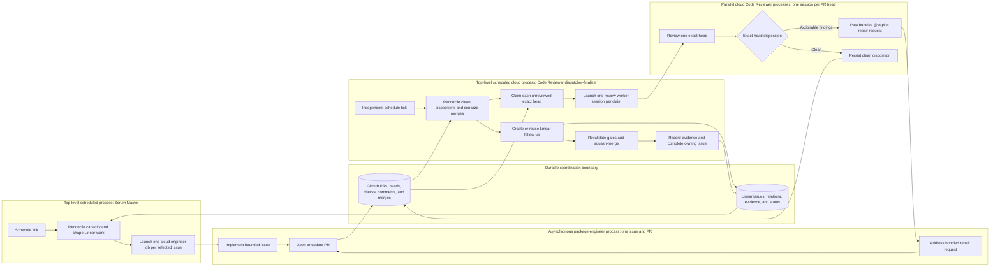

# AI Pull Request Review and Closure Specification

**Status:** Proposed **Repository:** `AndrewCraswell/fencing-club-shopify-theme` **Task system:** Linear
**Implementation system:** GitHub Copilot coding agent **Operating mode:** Fully autonomous unless a human comments on
the pull request

## 1. Purpose

Define an autonomous process that takes a Copilot-authored pull request from its first reviewable commit through review,
repair, merge, and Linear completion.

The process is optimized for more than 50 merged pull requests per rolling 24-hour period while preserving current-head
review, deterministic checks, bounded repair loops, idempotency, and durable GitHub/Linear evidence.

## 2. Responsibilities

### Scrum Master

The Scrum Master owns backlog capacity and task assignment.

It:

- counts distinct active Linear issues represented by a running implementation job or open pull request;
- maintains a target of eight active issues;
- examines candidate Linear issues for scope, acceptance clarity, dependencies, evidence requirements, and whether they
  must be subdivided before delegation;
- selects the best next issue when capacity is available, using dependency leverage, feature continuity, architectural
  readiness, risk reduction, repository health, and Linear priority as inputs;
- delegates implementation through the Shopify Engineer profile;
- creates child issues only when subdividing an existing candidate;
- does not create review-discovered follow-up, review, repair, merge, or complete implementation issues.

The Scrum Master uses **GPT-5.6 Sol**.

One Scrum Master invocation may start multiple independent Shopify Engineer cloud jobs. It repeats selection and
delegation until the target active capacity is full or no eligible issue remains. Each delegation creates a separate
asynchronous cloud job, branch, and PR; the Scrum Master records the returned job state and continues without waiting
for implementation to finish.

### Shopify Engineer

The Shopify Engineer owns code changes for one Linear issue and one pull request.

It:

- implements the bounded issue;
- runs focused validation;
- opens one pull request against the intended base branch;
- responds to top-level `@copilot` repair comments on the same branch;
- may challenge review findings with specific code, test, contract, or acceptance evidence;
- treats the assigned scope as authoritative and reports contradictory or impossible acceptance criteria without
  independently decomposing the issue;
- reports validation evidence without claiming unavailable proof.

Initial delegation should select **GPT-5.6 Terra**. Follow-up `@copilot` comments continue the existing pull-request
task; the comment cannot select a model.

The Shopify Engineer applies the same engineering standard as the Code Reviewer before opening or updating the PR:
choose the right solution to the problem, preserve correctness, reuse existing abstractions, apply DRY and SOLID where
they improve the design, use an established design pattern when the problem calls for it, avoid premature optimization,
and follow YAGNI. It may refactor tightly coupled existing code when necessary for a correct and maintainable result,
but it does not expand into unrelated cleanup.

### Code Reviewer

The Code Reviewer owns the pull request after it becomes reviewable.

It:

- runs one scheduled `dispatcher-finalizer` invocation that inventories PRs, claims reviewable heads, launches
  concurrent reviewer sessions, and serializes finalization;
- runs one independent cloud `review-worker` session per claimed PR and exact head SHA;
- performs an independent professional review of every new head SHA and persists one disposition;
- sends bundled repair instructions to the existing Shopify Engineer and re-reviews every changed head;
- keeps review workers merge-disabled;
- revalidates and squash-merges clean pull requests only through the dispatcher-finalizer;
- creates or reuses required feature follow-up and orthogonal repository-health issues discovered during implementation
  and review;
- records merge and acceptance evidence in Linear;
- marks the owning Linear issue Done when its bounded acceptance contract is satisfied.

The Code Reviewer uses **GPT-5.6 Sol** in both modes. The dispatcher-finalizer is a singleton for merge and Linear
mutations. Review-worker sessions run concurrently for different PR heads, subject only to platform capacity.

## 3. End-to-End Flow



The Scrum Master and Code Reviewer dispatcher-finalizer are separate top-level scheduled processes with independent
recurrence and no dependency on each other's runtime. The dispatcher starts review-worker sessions only to assign one PR
and exact head; all resulting dispositions, repairs, merges, and completion state pass through GitHub and Linear.

## 4. Pull Request State Model

Each pull request is in exactly one operational state:

| State                  | Meaning                                                 | Next owner               |
| ---------------------- | ------------------------------------------------------- | ------------------------ |
| `waiting-for-engineer` | Initial implementation is still running                 | Shopify Engineer         |
| `review-ready`         | PR has a head SHA not yet dispositioned                 | Code Reviewer            |
| `review-claimed`       | An exact head has an unexpired reviewer-session claim   | Code Reviewer dispatcher |
| `reviewing`            | One review-worker session is reviewing the claimed head | Code Reviewer worker     |
| `repair-requested`     | Actionable findings were posted with `@copilot`         | Shopify Engineer         |
| `repair-running`       | Shopify Engineer is updating the existing branch        | Shopify Engineer         |
| `merge-ready`          | Current head is clean and required checks pass          | Code Reviewer            |
| `merging`              | Final merge checks and squash merge are in progress     | Code Reviewer            |
| `merged`               | GitHub reports the PR merged                            | Code Reviewer            |
| `completed`            | Merge evidence is recorded and Linear is Done           | None                     |
| `human-engaged`        | A human authored a PR comment after automation began    | Human/Code Reviewer      |
| `blocked`              | Automation cannot safely continue                       | Code Reviewer            |

State is derived from GitHub and Linear. No repository-local state file is permitted.

## 5. Review Trigger and Scheduling

The Code Reviewer runs in two modes:

- on a pull-request opened, synchronized, review-requested, check-completed, or Copilot-comment event when an event
  bridge is available;
- as one scheduled `dispatcher-finalizer` invocation at a time;
- as one independent cloud `review-worker` session for each claimed PR and exact head;
- with duplicate or overlapping invocations handled idempotently.

An observed scheduled-workflow probe on 2026-07-17 showed serialized execution: a run scheduled for 23:30 UTC did not
overlap the invocation already running; after that invocation completed at 23:31:38 UTC, the next invocation began at
23:32:02 UTC. A five-minute schedule therefore does not imply three concurrent reviewer instances when reviews take
fifteen minutes. The configuration still exposes no concurrency controls, and the probe did not establish whether
multiple missed ticks are queued individually or coalesced, so every invocation remains bounded and idempotent.

Parallelism therefore comes from the dispatcher launching separate cloud project sessions, not from shortening its
schedule. On each pass it first serializes eligible finalization, then launches one cloud Code Reviewer session for
every independent reviewable head without waiting for those sessions to finish.

The dispatcher writes a pending claim with the PR number, exact head SHA, dispatcher run ID, and claim time. It calls
`create_session` with `execution_location: cloud`, the PR's remote head branch, Default agent, `model: gpt-5.6-sol`,
`reasoning_effort: medium`, and a one-PR prompt that loads the Code Reviewer `review-worker` contract from
`origin/master`. Selecting the Code Reviewer custom agent for the child is prohibited because a live probe showed that
cloud startup substituted Claude Sonnet 5 at Low despite the requested GPT-5.6 Sol and Medium settings. The claim
becomes active only after a cloud session ID is returned and recorded with the requested and, when exposed, confirmed
model and effort plus an expiry. A claim is valid only for that head and lifetime. A new commit invalidates it
immediately; a launch failure or explicit model substitution releases it; duplicate dispatchers must reuse an equivalent
live claim rather than launch duplicate review.

The dispatcher must verify that its scheduled runtime exposes cloud `create_session` before claiming work. If
unavailable, it records a capability blocker rather than performing an unbounded sequential review pass. It never falls
back to a local review session or worktree.

The current Copilot workspace workflow system exposes scheduled and on-demand runs, not a native GitHub-event trigger. A
future event bridge may invoke the same dispatcher or launch one worker directly; scheduled polling remains the recovery
path if event delivery is missed.

A head SHA requires review when no completed clean disposition exists for that exact SHA.

A previous clean review is invalid immediately after any new commit.

## 6. Review Inputs

For each assigned candidate PR, the review worker reads:

- owning `FEN-###` Linear issue and acceptance criteria;
- PR title, body, base branch, draft state, author, commits, and head SHA;
- complete diff and changed-file list;
- required and non-required check results;
- current-head Copilot review and unresolved review threads;
- previous repair requests and repair-round count;
- Shopify Engineer-reported validation evidence;
- repository instructions and affected documentation;
- human-authored comments made after automation started.

A PR without an unambiguous owning Linear issue is blocked rather than guessed.

## 7. Professional Review Standard

The review prioritizes:

1. whether the proposed solution actually solves the owning problem and acceptance contract;
2. correctness, completeness, and regression risk;
3. architectural fit with the repository and whether a simpler or more reliable controlling path exists;
4. reuse of existing abstractions and appropriate application of DRY and SOLID;
5. established design patterns when the problem calls for them;
6. restraint under YAGNI, avoiding speculative abstraction and premature optimization;
7. missing, ineffective, or misleading tests;
8. security, privacy, authorization, and secret-handling defects;
9. destructive or irreversible mutations;
10. unsupported Shopify, deployment, database, storefront, or validation claims;
11. incomplete error handling and silent failure paths;
12. concurrency, retry, idempotency, and lifecycle races;
13. unrelated scope or generated/transient artifacts;
14. documentation that contradicts executable behavior.

The desired outcome is the highest practical degree of correctness while continuing to deliver. The Code Reviewer should
not overcomplicate the implementation or demand theoretical purity. It may require refactoring tightly coupled
pre-existing code when that is necessary to make the solution correct, coherent, testable, or maintainable.

Independent repository improvements remain follow-up work rather than scope expansion, but the Code Reviewer owns making
that work durable in Linear. For every concrete deferred technical-debt, cleanup, refactoring, missing-test, or
architectural-health finding, the Code Reviewer must:

1. search Linear for an existing issue representing the same work;
2. update and relate the existing issue when one exists rather than creating a duplicate;
3. otherwise create a child-sized issue with the affected surface, observed evidence, impact, proposed outcome,
   acceptance criteria, focused verification, and reason it was not included in the current PR;
4. relate the follow-up to the owning issue and reference the originating PR and review finding;
5. assign an appropriate project, priority, dependency, and feature or technical-debt relationship;
6. distinguish required prerequisite debt from optional cleanup so the Scrum Master can sequence it correctly.

The Code Reviewer does not create speculative cleanup issues for subjective preferences. A follow-up must describe an
observable problem, risk, duplication, maintenance cost, missing contract, or blocked future change.

Style-only preferences and subjective best practices do not block a pull request unless they materially affect
correctness, maintainability, or an enforced repository contract.

## 8. Repair Protocol

When actionable findings exist, the Code Reviewer posts one top-level comment beginning with `@copilot`.

The comment must:

- identify the repair round;
- state the reviewed head SHA;
- combine all current CI failures and review findings;
- provide file/symbol locations and required outcomes;
- request focused regression coverage;
- require changes on the same branch and PR;
- request exact validation results;
- explicitly allow the Shopify Engineer to reject a finding with concrete evidence and propose `Won't Fix` or
  `By Design`;
- avoid requesting unrelated cleanup.

Example:

```text
@copilot Repair round 1 for head abc123 on this existing PR.

Address all current findings together:
1. Prevent the inactive lifecycle path from enqueueing follow-up work.
2. Add a regression proving the finalizer is not triggered.
3. Preserve active and canceled behavior.

Run the focused tests first, then required repository verification. Push only to this branch and report exact results or evidence for any rejected finding.
```

The Code Reviewer does not create a replacement branch or duplicate PR.

### Finding Adjudication

The Shopify Engineer may push back on any finding. Pushback must identify the finding and provide concrete evidence such
as executable behavior, tests, repository contracts, API documentation, or a demonstrated design tradeoff.

The Code Reviewer adjudicates every challenged finding:

- `Fixed`: the new head resolves the finding;
- `By Design`: the observed behavior is intentional, correct for the owning contract, and documented when non-obvious;
- `Won't Fix`: the finding is valid but non-blocking, outside the bounded issue, or not worth the complexity/risk; the
  rationale and any follow-up issue are recorded;
- `Still Blocking`: the evidence is insufficient or the defect remains material.

Only the Code Reviewer resolves the review thread or records the final disposition. A challenged finding does not
automatically consume another repair round unless the Code Reviewer issues a new repair request.

## 9. Repair Round and Terminal Resolution Policy

- Maximum automated repair rounds: three per PR.
- A round begins when the Code Reviewer posts an `@copilot` repair request.
- Multiple findings discovered for one head are one round.
- A Shopify Engineer push does not increment the round by itself.
- Every new head must be re-reviewed.

After the third repair round, the PR must enter **terminal resolution mode**. It may not remain indefinitely open
waiting for another ordinary review cycle.

Terminal resolution is split by agent boundary:

1. the review worker adjudicates every remaining finding as `Fixed`, `By Design`, `Won't Fix`, or `Still Blocking`;
2. it records `merge-ready` when no blocking finding remains;
3. when one bounded final repair remains viable, it sends the complete terminal finding set to the existing **GPT-5.6
   Terra Shopify Engineer** on the same branch;
4. an independent review-worker session reviews the resulting new head;
5. when the approach is unsound, disproportionately complex, inconsistent with repository architecture, or unlikely to
   reach an acceptable result, the worker records `terminal-closure-recommended` with evidence;
6. the dispatcher-finalizer alone revalidates and performs merge, abandonment, supersession, rejection, redesign
   closure, Linear state changes, and replacement-contract creation;
7. every terminal result is recorded in GitHub and Linear.

An abandoned PR is a valid terminal result after the third repair round. The Code Reviewer is not required to merge a
poor approach merely because it can be made to pass tests.

Before closing an abandoned PR, the Code Reviewer must add a Linear update containing:

- the PR number, URL, final head SHA, and terminal disposition `abandoned`;
- the problem the PR attempted to solve;
- a concise description of the implemented approach;
- the repair rounds and material alternatives attempted;
- the specific correctness, architecture, complexity, maintainability, or evidence reasons the approach was rejected;
- useful code, tests, discoveries, or constraints that should be preserved;
- the recommended next approach or the question that must be answered before retrying;
- whether the original issue remains valid, needs revised acceptance criteria, should be decomposed, or should be
  canceled.

The owning Linear issue must not be marked Done. It returns to the most accurate actionable state with the abandoned PR
linked. A replacement Shopify Engineer must not immediately repeat the same approach without a materially revised
implementation contract.

The terminal outcome is therefore always one of:

- merged and Linear completed;
- merged with separately tracked non-blocking follow-up work;
- abandoned after three rounds with the failed approach and lessons recorded in Linear;
- closed as superseded by a replacement approach;
- closed as rejected because the proposed solution is not acceptable;
- closed for redesign with the owning Linear issue remaining open.

Human interaction is not required merely because three rounds were exhausted.

## 10. Merge Gates

The Code Reviewer may squash-merge only when:

1. the PR is not a draft and targets the intended base branch;
2. the reviewed head SHA is still current;
3. every required check completed successfully;
4. no actionable current-head finding or unresolved thread remains;
5. the diff matches the owning Linear issue;
6. no unrelated files, secrets, credentials, build output, or transient evidence are included;
7. implementation-level acceptance criteria are evidenced;
8. documentation required by the behavior change is current;
9. GitHub reports the PR mergeable;
10. no human comment has placed the PR in `human-engaged` state.

Immediately before merging, the Code Reviewer refreshes the head SHA, base SHA, checks, review disposition, and
mergeability. A changed value aborts the merge and returns the PR to review.

Merges are serialized. After each merge, remaining PRs are re-evaluated against the updated base branch.

## 11. Acceptance and Linear Completion

Issues delegated to Shopify Engineers must be child-sized so the associated PR can satisfy their implementation
contract.

Before merge, the Code Reviewer determines whether implementation or review revealed required work outside the bounded
issue. It searches Linear, reuses existing work when present, and otherwise creates:

- a child issue that blocks the owning parent when the work is required for the parent outcome;
- a related issue when the work is orthogonal technical debt, cleanup, or an optional enhancement;
- a blocking prerequisite only when useful implementation cannot proceed without it.

Every created issue includes the originating PR, observed evidence, affected surface, outcome, acceptance criteria, and
focused verification.

After merge, the Code Reviewer records:

- PR number and URL;
- reviewed head SHA;
- merge commit SHA;
- required-check results;
- review and repair-round disposition;
- acceptance-criterion evidence;
- known limitations and separately tracked follow-up work.

The Code Reviewer then marks the implementation issue Done when every bounded criterion for that child-sized issue is
evidenced.

In Linear vocabulary:

- work required to complete the parent outcome is a **child issue** and **blocks** the parent issue;
- technical debt or cleanup that is useful but not required for the parent outcome is a separate issue **related to**
  the originating implementation issue and PR;
- an optional enhancement is also **related to**, not blocking, unless the parent acceptance criteria are explicitly
  revised to require it.

When the reviewed issue is the owning parent, the Code Reviewer marks it Done only when it has no incomplete blocking
children and every parent-level acceptance criterion has evidence.

Independent live-store, deployment, product-approval, or operational proof should be represented by a separate Linear
issue before implementation begins. It must not deadlock an otherwise complete implementation PR.

## 12. Human Comment Policy

The system is autonomous unless a human comments on the PR.

Agent names do not change the GitHub identity used to create comments. When automation authenticates with the repository
owner's token, its comments appear under the owner's GitHub account. Author login alone is therefore insufficient to
distinguish human and automated comments.

Every comment or review created by the Scrum Master or Code Reviewer must include durable automation provenance:

```text
<!-- ai-automation:v1
actor: code-reviewer
run-id: <workflow-run-id>
head-sha: <reviewed-head-or-none>
-->
```

The visible comment should also begin with a role label such as `**AI Code Reviewer**` or `**AI Scrum Master**`.

For non-text mutations such as merge, PR closure, thread resolution, or Linear status change, the responsible agent
writes an adjacent marked GitHub or Linear comment containing the mutation type, target identifier, result, and workflow
run.

The automation identity registry consists of:

- GitHub-native bot identities such as `copilot-swe-agent`, `copilot-pull-request-reviewer`, and the Linear integration;
- comments carrying the recognized `ai-automation:v1` marker and a run ID recorded by the workflow;
- any future dedicated GitHub App or machine account explicitly configured for these automations.

A comment or review is considered human when it is created after the automation adoption timestamp and is neither from a
registered bot identity nor associated with a recognized automation marker/run. Historical comments before that
timestamp do not retroactively pause automation.

The preferred long-term implementation is a dedicated GitHub App identity for the Scrum Master and Code Reviewer. This
produces an unambiguous bot author and stronger provenance. Creating a custom agent name alone does not alter the GitHub
comment author.

When a human comments:

- move the PR to `human-engaged`;
- stop automated repair comments and merging for that PR;
- allow existing non-mutating checks to finish;
- require the Code Reviewer to interpret and address the human thread before automation resumes;
- never overwrite, dismiss, or silently ignore a human request.

Automation resumes only after the human thread is resolved or the human explicitly instructs it to continue.

## 13. Idempotency and Concurrency

- One owning Linear issue maps to one active branch and one PR.
- One clean review disposition maps to one exact head SHA.
- One unexpired review claim maps to one PR and exact head SHA.
- Duplicate scheduled invocations must not duplicate comments, repair rounds, merges, or Linear updates.
- Duplicate dispatcher invocations must not launch another worker for a live equivalent claim.
- Review workers never merge or complete Linear.
- Before posting a repair request, search for an equivalent request for the same head and round.
- Before merging, verify the PR remains open and unmerged.
- Before completing Linear, verify it is not already Done.
- Merge mutation is singleton and serialized.
- Read-only reviews may run concurrently for different PRs.

## 14. Failure and Recovery

| Failure                                              | Required response                                                                                      |
| ---------------------------------------------------- | ------------------------------------------------------------------------------------------------------ |
| CI pending                                           | Leave PR open and revisit after check completion                                                       |
| CI failed                                            | Include failures in the next bundled repair request                                                    |
| Shopify Engineer failed or unavailable               | Start a replacement Shopify Engineer on the same branch when possible                                  |
| Merge conflict                                       | Request a non-destructive base update and fresh validation                                             |
| Stale review                                         | Review the new head; never merge using old disposition                                                 |
| Missing Linear issue                                 | Block PR and record the missing ownership contract                                                     |
| GitHub or Linear API unavailable                     | Make no guessed mutation; retry on reconciliation pass                                                 |
| Human comment                                        | Pause autonomous mutation for that PR                                                                  |
| Third repair round exhausted                         | Enter terminal resolution mode and drive the PR to merge or closure                                    |
| Code Reviewer rejects the approach after round three | Close as abandoned, preserve the failure record in Linear, and revise the next implementation contract |

A failure on one PR must not stop independent PR review or queue throughput.

## 15. Throughput Controls

Target operating values:

- eight distinct active implementation issues;
- one scheduled reviewer dispatcher-finalizer invocation at a time;
- one concurrent cloud review-worker session per eligible independent PR head, with no policy limit below returned cloud
  capacity;
- one merge mutation at a time;
- Code Reviewer and Scrum Master reconciliation at their configured workflow cadences;
- target at least 60 merges per rolling 24 hours to provide margin over the 50-merge requirement.

The Scrum Master keeps all eight implementation slots filled whenever eligible ready work exists. A review backlog
changes selection toward smaller, low-conflict, independently reviewable issues, but it does not justify idle
implementation capacity. Every unfilled slot requires a candidate-specific dependency, human pause, configuration
failure, platform launch failure, or an explicit finding that no eligible ready issue exists. The Scrum Master must not
subdivide work solely to inflate implementation throughput.

## 16. Queue Selection Policy

Linear priority is an input, not a strict sorting rule. The Scrum Master uses engineering judgment to select the best
next task or coherent task sequence.

Selection should consider:

1. dependency-unblocking leverage;
2. continuity toward completing a feature or workstream;
3. architectural prerequisites and technical debt that would otherwise make upcoming work riskier or more expensive;
4. correctness and risk reduction;
5. shared-context efficiency from completing nearby work while the relevant design is active;
6. likelihood of merge conflicts with current work;
7. issue readiness, acceptance clarity, and available evidence;
8. review and implementation capacity;
9. Linear priority, age, and fairness;
10. whether the task is independently mergeable and child-sized.

Related tasks may be deliberately sequenced to complete a capability, but tasks that modify the same controlling files
should not run concurrently unless their boundaries are demonstrably independent. The controller records a concise
selection rationale in Linear when it intentionally chooses a lower-priority issue over a higher-priority one.

### Issue Shaping and Subdivision

Before delegation, the Scrum Master determines whether the candidate is one coherent engineer-sized outcome or an
aggregate that requires child issues.

Subdivision is required when the issue:

- spans multiple independently testable routes, packages, services, integrations, or operational proofs;
- requires more than one independently mergeable pull request;
- mixes implementation with separate deployment, storefront, migration, or external-evidence work;
- contains acceptance criteria with different dependencies or safe execution boundaries;
- combines prerequisite technical debt with the feature that depends on it;
- cannot reasonably complete as one bounded cloud-agent task;
- would create a review diff too broad to evaluate confidently;
- would benefit from different specialized engineer profiles.

When subdividing, the Scrum Master:

1. keeps the aggregate issue as the parent outcome;
2. creates the smallest set of coherent, independently mergeable child issues;
3. gives every child a concrete outcome, owned surface, acceptance criteria, focused verification, dependencies, and
   required evidence;
4. records sequencing and blocking relations;
5. identifies which children may run concurrently without conflicting on controlling paths;
6. selects exactly one best next ready child and assigns it to one Shopify Engineer;
7. leaves the remaining children queued or blocked according to their dependencies rather than launching the entire
   decomposition at once;
8. never delegates the aggregate parent;
9. leaves parent completion to the Code Reviewer after every required child and final reconciliation criterion is
   complete.

“Exactly one” applies to the current decomposed parent during that selection pass. The Scrum Master may continue filling
other available capacity with unrelated or independently selected issues in the same invocation. It does not launch
every child from one decomposition merely because capacity exists.

The Scrum Master avoids excessive fragmentation. A child should normally produce one meaningful pull request, but
closely coupled code and tests remain together. Splitting solely to make issue counts smaller is not allowed.

## 17. Observability

Metric collection, aggregation, and reporting are not responsibilities of the Scrum Master, Code Reviewer, or Shopify
Engineer. They will be implemented by separate dynamic tooling that reads durable GitHub, Linear, and execution history
without adding reporting work to delivery-agent prompts.

The primary service objective remains **more than 50 merged PRs per rolling 24 hours without merging an unreviewed
head**.

## 18. Agent and Automation Artifacts

The scheduled automation prompt alone is not sufficient for every role because model selection, tool authority, and
durable behavioral contracts differ.

The repository contains three role contracts. Only the Shopify Engineer is domain-specific; the Scrum Master and Code
Reviewer are reusable across engineering domains:

- `.github/agents/scrum-master.agent.md` for capacity, issue shaping, sequencing, and delegation, pinned to GPT-5.6 Sol;
- `.github/agents/shopify-engineer.agent.md` for one bounded implementation issue and PR, pinned to GPT-5.6 Terra;
- `.github/agents/code-reviewer.agent.md` with `dispatcher-finalizer` and one-PR `review-worker` modes for parallel
  review, adjudication, terminal resolution, serialized merge, and Linear completion, pinned to GPT-5.6 Sol.

The `agents` frontmatter field is not required for dynamic cloud delegation and must not hardcode Shopify Engineer into
the generic Scrum Master or Code Reviewer. Those agents resolve the concrete engineer through `.agent-definition.yml`;
`agents` is reserved for direct statically declared subagent invocation.

The agent files define identity, model, tools, authority, modes, and permanent rules; workflow prompts supply bounded
invocation parameters and recurrence. The Code Reviewer schedule runs locally with Default agent so the dispatcher
retains one sub-agent level for cloud workers. It reads the Code Reviewer contract directly and invokes only
`dispatcher-finalizer`; concurrent workers are separate cloud sessions launched with Default agent, explicit GPT-5.6 Sol
model and Medium effort, and a prompt that loads the Code Reviewer `review-worker` contract for one exact PR/head
assignment. The Scrum Master schedule selects Scrum Master and remains local.

No additional agent profile is required for terminal resolution. The Code Reviewer launches the existing Shopify
Engineer with a terminal-resolution prompt against the existing branch.

## 19. Bot Identity

The preferred automation identity is a GitHub App installed only on the repositories it manages.

Setup is straightforward:

1. Create a GitHub App under the owning account or organization.
2. Grant only the required repository permissions: metadata read, contents read/write when branch repair is required,
   pull requests read/write, issues read/write for PR comments, checks read, and actions read.
3. Subscribe to pull-request, pull-request-review, issue-comment, check-suite, and workflow-run events if the app will
   provide the future event bridge.
4. Install the app on selected repositories.
5. Generate and securely store the app private key outside the repository.
6. Exchange the app ID, installation ID, and private key for short-lived installation tokens at runtime.
7. Use the installation token for GitHub API and `gh` mutations.

Comments then appear under an identity such as `delivery-automation[bot]`, making human detection unambiguous. The
GitHub App should use one bot identity with the visible role label and provenance marker distinguishing Scrum Master
from Code Reviewer actions.

Creating the app and installing it is easy; the material work is securely generating installation tokens and injecting
them into the current workflow runtime. A dedicated machine-user account with a fine-grained token is simpler but has
weaker lifecycle, attribution, and least-privilege properties and is not preferred.

Bot identity and agent execution are separate concerns. Today:

- the Scrum Master runs as a scheduled workflow in the GitHub Copilot app;
- the Shopify Engineer runs as the GitHub Copilot cloud coding agent;
- the Code Reviewer dispatcher-finalizer runs as a separate scheduled workflow in the GitHub Copilot app and launches
  concurrent one-PR Code Reviewer sessions;
- an optional GitHub App token changes the author of Reviewer and Scrum Master GitHub mutations, but does not run their
  agent logic.

Mentioning a custom bot such as `@delivery-automation` does not automatically wake a Copilot app workflow. GitHub
delivers the mention as an `issue_comment` webhook to the GitHub App, but a webhook service would still need an
authenticated Copilot workflow-run endpoint to start the Code Reviewer. That bridge is not available in the current
workflow contract.

Only GitHub's built-in `@copilot` integration currently reactivates the Shopify Engineer on its existing PR. Therefore
the initial Code Reviewer remains schedule-driven. The specification does not depend on the Shopify Engineer mentioning
or waking the Code Reviewer.

## 20. Monorepo Project Configuration

The Scrum Master and Code Reviewer remain generic. Engineering specialization is selected by discovering package-owned
`.agent-definition.yml` files.

The initial schema contains only values the current automation can use when delegating a cloud session:

```yaml
version: 1
paths:
  - path: apps/structured-data/**
    agent:
      definition: .github/agents/shopify-engineer.agent.md
      model: gpt-5.6-terra
  - path: shopify-operations/**
    agent:
      definition: .github/agents/shopify-engineer.agent.md
      model: gpt-5.6-terra
  - path: shopify-theme/**
    agent:
      definition: .github/agents/shopify-engineer.agent.md
      model: gpt-5.6-terra
```

Each `paths` entry binds one path glob to its agent configuration. `definition` is a concrete repository-relative agent
file under `.github/agents/`. `model` is a model identifier accepted by the cloud-session delegation API. The automation
validates that each referenced file exists and that every path is owned by at most one agent configuration.

The Scrum Master discovers all `**/.agent-definition.yml` files, matches the selected issue's owning paths, and
delegates using the matching path entry's agent definition and model. A PR touching paths mapped to different agent
configurations is blocked for decomposition unless one selected configuration explicitly owns the complete work.

This structure permits future `React Engineer`, `Backend Engineer`, or other specialized profiles without changing the
Scrum Master or Code Reviewer contracts.

Timeouts, schedules, validation commands, concurrency, merge policy, Linear routing, conflict paths, and completion
evidence are intentionally excluded from this initial schema. They remain in agent instructions, repository rules,
workflow configuration, and GitHub/Linear state only when the current platform can enforce them.

## 21. Prompt Invocation Parameters

The Scrum Master and Code Reviewer prompts must declare all runtime parameters at the beginning of the prompt body,
immediately after supported agent frontmatter. Do not add unsupported arbitrary keys to the agent frontmatter.

Scrum Master prompt:

```yaml
parameters:
  repository: AndrewCraswell/fencing-club-shopify-theme
  linearTeam: Fencing Club
  linearTeamId: b9c888b8-e2d4-4694-8820-065e4c65cdcb
  linearProject: JSON-LD Shopify App
  linearProjectId: b54cf0a2-9c97-4434-b6fd-462f86e4c9c0
  agentDefinitions: "**/.agent-definition.yml"
  delegationCommand: gh agent-task
  delegationAuth: gh-keyring-oauth
  targetActiveIssues: 8
  automationIdentity: delivery-automation
  humanPausePolicy: unmarked-human-comment
```

Code Reviewer prompt:

```yaml
parameters:
  repository: AndrewCraswell/fencing-club-shopify-theme
  agentDefinitions: "**/.agent-definition.yml"
  mode: dispatcher-finalizer
  reviewPullRequest: null
  reviewHeadSha: null
  reviewWorkerExecution: cloud
  reviewWorkerAgent: default
  reviewWorkerModel: gpt-5.6-sol
  reviewWorkerReasoningEffort: medium
  reviewClaimMinutes: 45
  maxRepairRounds: 3
  mergeSerialization: true
  automationIdentity: delivery-automation
  humanPausePolicy: unmarked-human-comment
```

At runtime each agent validates the parameter block, discovers package agent definitions, and records the resolved
values in its iteration report. The Scrum Master queries the configured Linear team and project directly by ID rather
than enumerating the workspace. Its local automation invokes preview `gh agent-task` commands through the validated
`Invoke-GhAgentTask` PowerShell wrapper in the Scrum Master contract. The wrapper starts an isolated child process,
removes `GH_TOKEN` and `GITHUB_TOKEN` only from that child's environment, preserves argument boundaries, captures
output, and fails on nonzero exit so `gh` can use the authenticated keyring OAuth credential without exposing or
persistently changing credentials. The current preview `create` command supports repository, base branch, prompt input,
and custom-agent selection but exposes no model or reasoning-effort flag; the Scrum Master records model enforcement as
unavailable unless returned evidence confirms it. Missing, overlapping, or invalid definitions block delegation for the
affected paths but do not block independent paths.

## 22. Event Integration

The preferred future design is event-driven with scheduled reconciliation:

- PR opened or synchronized -> Code Reviewer iteration;
- check suite completed -> Code Reviewer iteration;
- Copilot repair comment or Shopify Engineer push -> Code Reviewer iteration;
- PR merged or closed -> Scrum Master iteration.

The current scheduled workflow interface supports cron and manual runs but does not expose a GitHub-event subscription
in its configuration. Therefore the initial implementation uses short polling intervals. The GitHub App described above
can receive events and mentions, but it still needs an authenticated endpoint capable of starting the corresponding
Copilot workflow. A GitHub Action, webhook receiver, or Trigger.dev task can provide the bridge once that endpoint
exists. The bridge must be idempotent, and scheduled polling must remain enabled as a missed-event safety net.

The GitHub Copilot app workflow definitions are the sole source of schedule truth. Cron values are not duplicated in
this specification, `.agent-definition.yml`, agent files, or prompt parameters. The current workflow setup does not
expose an enforceable execution-timeout field, so no timeout is specified. Each iteration remains bounded and idempotent
by contract.

## 23. Mapping to Current Repository Automation

- The repurposed Scrum Master workflow selects the Scrum Master agent, remains local, and owns capacity, triage, issue
  shaping, delegation, and stale-state reconciliation.
- The Code Reviewer dispatcher workflow runs locally with Default agent, reads `.github/agents/code-reviewer.agent.md`
  directly in `dispatcher-finalizer` mode, launches exact-head cloud review-worker sessions, serializes mutations, and
  exits.
- Review workers use Default agent and load the Code Reviewer profile from their prompt in `review-worker` mode with one
  PR number and exact head SHA through `create_session` with `execution_location: cloud`, `model: gpt-5.6-sol`, and
  `reasoning_effort: medium`; selecting the Code Reviewer custom agent, cloud defaults, and local fallback are
  prohibited.
- Package implementation resolves through `.agent-definition.yml` to `.github/agents/shopify-engineer.agent.md`.
- Recurrence exists only on the two top-level workflows; engineers and review workers are separately launched sessions,
  not scheduled loops.
- Superseded queue, combined-builder, cloud-worker, specialist-adviser, and review-prompt artifacts are removed.

No external review service is required for the initial implementation.

## 24. Acceptance Criteria for the Automation

- Every Copilot-authored PR is reviewed at its current head before merge.
- Actionable findings reactivate the existing Shopify Engineer through one bundled top-level `@copilot` comment.
- A changed head invalidates prior clean disposition.
- Clean PRs are squash-merged without human interaction unless a human comments.
- Merge evidence is recorded and the owning child-sized Linear issue is completed.
- Before merge, the Code Reviewer creates or reuses required blocking follow-up and orthogonal related work, then
  completes the owning issue only when its applicable acceptance and child-dependency contract is satisfied.
- Implementers can challenge findings, and every challenge receives a recorded `Fixed`, `By Design`, `Won't Fix`, or
  `Still Blocking` adjudication.
- Exhausting three ordinary repair rounds produces a terminal merge or closure disposition rather than an indefinitely
  open PR.
- The Code Reviewer may abandon a poor approach after round three, with the PR linked and the attempted approach,
  failure reasons, reusable learning, and recommended next direction recorded in Linear.
- Every actionable repository-health finding deferred from the current PR is deduplicated and represented by a related,
  implementation-ready Linear issue.
- Duplicate runs do not duplicate work or mutations.
- One blocked PR does not block unrelated throughput.
- Package `.agent-definition.yml` files map owned paths to a concrete `.github/agents/*.agent.md` definition and
  supported model without changing the generic Scrum Master or Code Reviewer.
- Scrum Master and Code Reviewer prompts expose their runtime parameters at the top of the prompt body and validate them
  before mutation.
- The system sustains more than 50 merges in a rolling 24-hour load test or production observation window.
