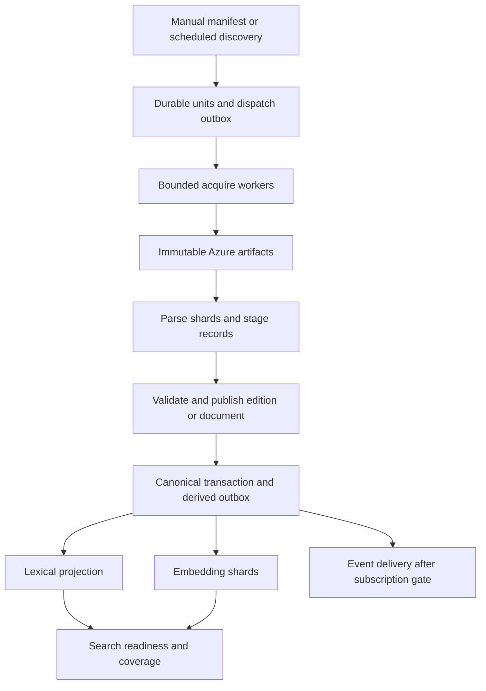

# Regulatory acquisition, backfills and Trigger.dev workflows

Proposed implementation contract, September 14, 2026. Parent: [implementation](implementation.md).
Uses the [data contract](data-contract.md) and [federal reuse decision](federal-collector-baseline.md).

## Scope and default backfill order

| Wave | Contents | Completion boundary |
| --- | --- | --- |
| Pilot | eCFR titles 1, 21 and 40; one ordinary FR publication day plus selected correction/proposal fixtures | Bounded manifest, not federal coverage |
| Current foundation | Every active eCFR title; latest 90 days of FR rules, proposals and notices; latest available U.S. Code | Current baseline and recent publication history |
| Recent history | FR 2020 through the day before the recent window; annual CFR 2020 through latest available edition | Per-year/per-volume gates |
| Extended history | FR 2000–2019; annual CFR 1996–2019 | Separate bounded year manifests |
| Optional archive expansion | FR 1994–1999 and earlier editions where accessible in other renditions | Explicit format-specific source validation |

These are implementation defaults, not completed downloads or a launch promise. Record absolute start/end dates and
discovery cutoff in each manifest; never let `today` change a resumed backfill. Overlap between waves is safe under
canonical uniqueness. Start recurring collection when the current foundation passes, without waiting for decades of
history. Historical work sets `historical: true` and does not send customer change notifications by default.

GovInfo documents FR bulk XML from 2000 and annual CFR XML from 1996. Do not copy the inspected scraper's 1994 bulk
assumption. Discover actual files/volumes through source listings; a year with unavailable XML can have other
renditions. Before each wave, freeze an inventory and measure its actual bytes, units and parser workload.
[GovInfo developer hub](https://www.govinfo.gov/developers)

## Adapter implementation and code reuse

TypeScript workers own provider HTTP, credentials, host budgets, Azure artifacts, transactions and orchestration.
Reuse/adapt Vaquill parsing logic from pinned commit `2f7aeb85a434a54a351ac44e3c188fec318f78ba`. Federal HTML website
scraping is not the default: prefer official metadata APIs, XML and package downloads. Do not copy browser/proxy state
collectors into this federal feature.

For XML parsing, first extract bounded pure parsers into `python/regulations/` using Python standard-library XML
streaming where sufficient. A TypeScript parser bridge invokes them on downloaded files and receives validated NDJSON
plus a summary manifest. No provider credentials or database writes in parser subprocesses. Package through the already
configured `@trigger.dev/python` extension; the existing Open States extension configuration alone does not include
these files. Add exact scripts, validate deployed runtime/startup, pin dependencies if required, and preserve Apache
notices. Reuse existing document/PDF/OCR services for non-XML material. A new parsing library needs the repository's
normal dependency decision; no new service is implied by this spec.

The bridge must enforce process timeout, streamed stdout/output file limits, safe stderr, nonzero failure propagation,
manifest hash/count agreement, temporary-directory cleanup and maximum XML nesting. Disable external entity/network
resolution; bound decompression and reject path traversal in archives. Never execute source markup or accept arbitrary
user URLs. Validate redirect destinations against each adapter's approved source hosts, including established official
download hosts. Parser output is untrusted until Zod validation and content/hierarchy checks pass.

## Federal Register acquisition

Work units: one month of metadata discovery, one publication day of XML acquisition, then document or bounded-document
batch parsing. One daily XML contains many documents: download it once and retain fragment locators rather than one
download per section. Parsing streams the daily file and writes bounded normalized shards; large documents can have
their own shard. Dates with no issue require inventory evidence, not an assumption about weekends/holidays.

1. Enumerate GovInfo publication/package inventory for the frozen range. Save expected issues and document identities
   where available. Use returned artifact links rather than assuming a constructed path exists.
2. Query FederalRegister.gov document metadata in monthly date/type partitions. Follow pagination to completion and
   record totals/cursors. Split saturated partitions into days, then supported type partitions; never stop at a provider
   result cap while claiming the month complete.
3. Acquire source XML and official PDF/other renditions available in the declared scope. Required text artifact failure
   blocks the document. PDF availability is independently reported: unavailable PDF is not a reason to discard valid
   XML, but missing publisher-listed required PDF blocks an `artifactsComplete` claim.
4. Parse RULE, PRORULE and NOTICE explicitly, preserving tables, preamble, supplementary information, amendatory text,
   footnotes, appendices, page markers and original document number. Other daily-file document types are classified
   outside initial scope, not silently included in rule counts. Vaquill's inspected CLI only permits RULE/PRORULE.
5. Join metadata to text by normalized document number. Retain agency, RIN, docket, CFR references, dates and source
   links. Zero or multiple matches are explicit exceptions. A metadata outage creates pending enrichment; usable source
   text remains available with `metadataComplete: false` and no invented fields.
6. Reconcile the union of publisher inventory, parsed daily documents and metadata records. Publication coverage cannot
   depend exclusively on FederalRegister.gov finding a record. Classify missing text, missing metadata and malformed
   IDs separately. Promotion of an advertised fully enriched slice requires those gaps resolved or excluded in its scope.
7. Detect old-publication changes via GovInfo lastModified windows and periodic inventory/ETag/hash reconciliation.
   Link new correction documents, retain prior renditions, and queue affected projections/embeddings by input hash.

Default recurrence: discover hourly with a 72-hour overlap in source modification time; retry daily recent-window
reconciliation over 30 publication days; rotate full-history modification/inventory reconciliation so every supported
year is checked within seven days. These are Tabra operating targets to validate, not upstream freshness guarantees.
If a source lacks a dependable modification signal, record that limitation and use revalidated artifact inventories.

## eCFR acquisition

Work unit: title + publisher issue date + observed source revision. Discover from the eCFR title inventory, preserving
`latest_issue_date`, `latest_amended_on`, `up_to_date_as_of` and `reserved`. An `import_in_progress` signal defers current
edition promotion and schedules a fresh inventory read; do not label the previous published edition empty or failed.

1. Freeze title inventory and select each nonreserved title's publisher issue date. A missing issue date blocks that
   title; reserved titles remain explicit inventory entries without text work.
2. Download versioned full-title XML. Retain hash and headers; a cached file is reusable only after source revision
   validation. Revalidate known issue URLs periodically for same-date corrections.
3. Stream-parse title/chapter/subchapter/part/subpart/section/appendix/table structure. Count source and emitted nodes.
   Preserve citations with lettered/dotted section numbers and exact anchors, not only integer section keys.
4. Write parser shards to normalized storage, targeting at most 5,000 provisions or 16 MiB uncompressed per shard,
   whichever occurs first. Split only at legal node boundaries; oversized nodes have dedicated shards and chunk later.
   Parsing workers consume the local artifact, so fan-out does not multiply eCFR requests.
5. Normalize in bounded staging transactions, validate every shard and the full title manifest, then publish the edition
   pointer. Missing sections/failed shards cannot result in partial-title replacement. New versions become searchable
   only through the separate derived-generation gate.
6. Use title/version/revision checkpoints, never the inspected code's title-number-only `--resume` skip. Retain historical
   membership and generate provision deltas from two fully validated editions. A disappearing section is not auto-repealed.

Default recurrence: inventory hourly; changed titles enter the freshness queue; daily revalidation of current-title
metadata and rotating artifact verification. Currency-only changes update coverage without re-embedding unchanged text.
Query eCFR point-in-time facilities only for source-supported dates; observed local snapshots do not establish earlier history.

## Annual CFR and U.S. Code

Annual CFR discovery is edition year -> title -> volume/artifact. Acquire and parse by volume; promotion is by the full
title edition after every required volume validates. Preserve each title's revision date, annual-edition provenance and
volume/page locators. Reconcile reserved/missing titles explicitly. Historical versions use the same provisions and
passages as current eCFR where identity is established, but remain distinct editions. Default semantic rollout targets
current eCFR and FR; annual historical text receives lexical indexing first and a separate explicit embedding manifest.

U.S. Code supports statutory context and authority resolution. Reuse official GovInfo download/parser patterns with
discovered edition/release keys; replace hardcoded 2024/2023 targets. Discovery runs daily once enabled. Do not describe
published annual packages as a current USLM release. In Phase 0, choose the latest verified official package scope and
record currency; add House USLM release discovery separately if the latest package is insufficient. A regulation may
ship with unresolved authority citations while the U.S. Code is incomplete; this cannot block independent regulatory text.
Statutes at Large and COMPS remain optional acquisitions with separate manifests, not hidden requirements of every rule.

## Trigger task graph

Proposed IDs/files under `src/trigger/tasks/`; workers call reusable services under `src/ingestion/regulations/`.
Tasks return IDs/counts, never full XML, large record arrays or embeddings.

| Task ID | Bounded unit | Initial queue/concurrency | Maximum active duration |
| --- | --- | --- | --- |
| `regulatory-backfill-controller` | One manifest, one dispatch window | regulatory-control / 1 | 10 minutes |
| `regulatory-discover` | One provider partition or inventory page | regulatory-discovery / 2 | 10 minutes |
| `regulatory-acquire` | One artifact or bounded package | regulatory-acquisition / 4 | 30 minutes |
| `regulatory-parse` | One artifact or normalized shard stage | regulatory-parsing / 4 | 30 minutes |
| `regulatory-publish` | One document revision or complete title edition | regulatory-publication / 2 | 10 minutes |
| `regulatory-embed` | One deterministic passage shard window | regulatory-embedding / 4 | 15 minutes |
| `regulatory-project` | One projection generation/window | regulatory-projection / 2 | 10 minutes |
| `regulatory-reconcile` | One coverage scope/window | regulatory-control / shared 1 | 10 minutes |

These limits are initial measured-rollout settings, not throughput promises or allocations additive to unlimited
existing jobs. Source DB pools are capped at one per worker with short transactions; projection workers additionally
use one target connection each. The table allows at most 19 source and two target connections when all queues run.
Controllers close pools before checkpointed waits. Do not use the main API pool size inside these tasks.

Before activation, calculate available database and Trigger headroom alongside existing bills, OCR, embedding and search
copy tasks. Persist an operator-configured aggregate regulatory admission cap at or below the smaller of measured DB
and Trigger headroom. Queue totals are ceilings; stage admission can be lower. If no safe headroom exists, pause backfill.
Do not change existing production queue limits or introduce a new database image as a side effect of this spec.

## Dispatch, leases and retries

- Strict payload: manifestId, unitId, requestedGeneration, mode (`backfill`, `incremental`, `repair`), expected source
  revision and bounded shard coordinates. Mode is checked against the manifest; callers cannot supply arbitrary URLs,
  credentials, SQL, provider ranges or parser paths. Read configuration and safe source URLs from stored manifests.
- Deterministic unit keys include environment/provider/corpus/jurisdiction/edition-or-window/shard/parser contract.
  Trigger idempotency adds requested generation. Database unique work keys and fencing remain durable even after
  Trigger idempotency expires; choose global scope for cross-parent dispatch and an explicit TTL. Replaying a completed
  unit for a new parser uses a new generation rather than forcing a stale successful run to execute again.
- Claim pending outbox rows in a short transaction, submit `batchTrigger` pages of at most 100, retain task handles,
  then acknowledge accepted dispatches. A crash between submission and acknowledgement safely redispatches through
  idempotency and database claims. The installed SDK is 4.5.10; use its typed API, not copied obsolete SDK examples.
- Keep at most 200 dispatched/running regulatory units per environment at first. The remaining history stays in the
  database, not an enormous Trigger queue. A continuation controller replenishes the window as units finish; queue
  admission failures, expired tasks and cancelled runs return to durable reconciliation.
- Prefer dispatched children plus durable completion counts for large backfills. Use bounded `batchTriggerAndWait`
  only for small child groups and check every result; do not use `Promise.all` around Trigger wait helpers. Parent and
  child queues are separate. Close DB pools and persist progress before checkpointed waits.
- Lease key is unit scope, renewable every 30 seconds with an initial five-minute expiry; long parser work renews via
  the bridge without holding a transaction. Every state transition checks fencing. Check cancellation between shards
  and before publication. Cancellation preserves committed artifacts/checkpoints and leaves source state unchanged.
- HTTP retry: at most three attempts per active unit attempt for transient timeout/5xx, respecting Retry-After; count
  every attempt against provider budgets. Trigger task retry: two attempts for unexpected crashes. This gives a bounded
  maximum of six HTTP attempts for the same request in an ordinary cycle, not nested unbounded retry loops.
- A 429 writes a provider cooldown shared by all callers. Stop allocating that provider, release leases/slots or persist
  a resumable retry, and use a checkpointed wait/continuation. No long `setTimeout` sleeps holding a worker/pool.
- Permanent schema/parse failure enters quarantine with artifact/locator and safe reason. Missing listed artifacts are
  retryable then unresolved gaps, never successful empties. Operator repair takes IDs and reason, reuses the same stages,
  and does not reset whole corpora.

Official mechanics: [batch triggering](https://trigger.dev/docs/management/tasks/batch-trigger),
[idempotency](https://trigger.dev/docs/idempotency), [queues](https://trigger.dev/docs/queue-concurrency).
Queue concurrency limits active runs, not requests/second. `concurrencyKey` creates per-key queues; it is not a global
provider budget. The application must enforce shared request-start and connection allowances across keys and deployments.

## Throughput controls and scale test

Reuse application provider cooldown and publisher download leases. GovInfo API budgets must be shared with current
BILLSTATUS/committee callers using the same credentials. Treat GovInfo API, bulk host, FederalRegister.gov and eCFR as
distinct policies; respect actual redirects/hosts. Initial policies for sources without published numeric limits:
metadata at one request start/second and two in flight per host; bulk downloads two in flight per host. These are
conservative starting settings, not publisher entitlements. Existing stricter host limits win.

Reserve at least 25 percent of regulatory admission and provider allocations for incremental/repair work while backfill
runs; a saturated backfill pauses allocation as soon as freshness work is pending. Borrowed spare capacity is reclaimed
between bounded units. Update traffic from existing legislation remains included in aggregate source budget accounting.
Priority alone does not reserve capacity, so admission must enforce the reservation.

Normalize/commit at most 500 records or 2 MiB per transaction initially. Embedding batches use at most 64 texts plus
model token/byte limits. Avoid full-title arrays in RAM, OFFSET scans and one Trigger task per tiny section. Persist
large records externally and dispatch references. Reuse immutable artifacts for parser replays without network traffic.

Benchmark acquisition, parsing, DB writes, projections and embeddings separately. Increase one stage at a time:
2 -> 4 -> 8 -> 16 workers, only within measured aggregate headroom. Use a fixed manifest, one-minute warm-up plus
nine-minute measurement at each stage. Record completed/validated searchable provisions per minute, bytes, request
attempts, rate limits, parser RSS, pool wait, commit p95, lexical lag, provider/model cost and backlog age. A promotion
requires at least 10 percent throughput gain, no completeness loss, no growing live lag and no DB/provider saturation.
Choose the previous stage when a higher one fails; do not infer linear speedup from task count.

Suggested starting machines: small workers for discovery/control/publication; medium workers for XML acquisition/parsing
and embeddings. Select actual Trigger presets against measured peak RSS and deployment availability in Phase 0. A large
XML OOM is evidence to stream/split or deliberately resize the bounded task; retrying the identical oversized unit on
the same machine is not a recovery strategy.

## Schedules, health and operator surface

Extend `src/trigger/manifest.ts`, identities, activation policy and the existing schedule reconciler. Schedules remain
disabled until corresponding phase gates pass. Schedule dispatcher adds explicit regulatory scopes; historical
controllers stay manual. UTC schedules include jitter/stagger to avoid all current feeds firing simultaneously.

Planned CLI entry points, to implement under `scripts/`: `plan-regulatory-backfill.ts`, `run-regulatory-backfill.ts`,
`inspect-regulatory-readiness.ts`, `repair-regulatory-units.ts`. Planning/readiness are read-only. Running requires a
saved manifest, exact environment and `--apply`; schedule activation uses existing explicit activation semantics.
Never accept an implicit production target. Resuming an existing import takes the same manifest ID and cutoff.

Every report records requested/eligible/excluded/failed units, unresolved native IDs, bytes, parser revisions, source
currency, discovery watermark, projection generation and embedding route. Completion requires no unresolved required
units, not merely a green controller run. Persist compact metrics in run records; structured logs carry correlation,
manifest/unit/source IDs and counts, not secrets or entire source/user query bodies.
