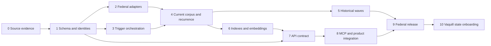

# Regulatory implementation phases, tasks and validation gates

Implementation backlog, September 14, 2026. All boxes are uncompleted implementation work. This specification update
does not execute backfills, create schemas/schedules, enable endpoints, purchase data or close any runtime gate.
Parent: [implementation](implementation.md). Task IDs are stable checklist references, not filenames.

## Execution and evidence rules

Implement coherent slices, run their focused executable checks, then required `pnpm verify`. Do not create tests that
only parse this checklist or assert prose. Smoke scripts below are proposed artifacts to implement, not existing commands.
Use existing authenticated smoke harness, built Next router tests, Trigger deployments and API-backed MCP client.

Every phase produces a retained evidence manifest in the configured artifact store: git SHA, parser/schema/model
contracts, environment/deployment, source manifest hashes and cutoff, exact commands/task IDs, requested/actual counts,
timings, failures/exclusions, sampled source locators, costs and approver/operator where required. Keep a concise linked
report under `docs/regulations/validation/` when real execution occurs; do not prepopulate success reports.

Gate status is `not_started`, `running`, `failed`, `partial` or `passed`. Partial scope may ship only with explicit
capability/coverage boundaries. An excluded state/year does not count as passing nationwide/history coverage. A failed
or delayed retry counts as pending even when the queue's immediately runnable count is zero.

Planned executable smoke entry points: `scripts/smoke-regulatory-acquisition.ts` for fixture/live bounded acquisition,
`scripts/smoke-regulatory-workflows.ts` for Trigger dispatch/recovery, `scripts/smoke-regulatory-search.ts` for generation
and retrieval checks, `scripts/smoke-regulatory-embeddings.ts` for model execution and comparative retrieval, and
`scripts/smoke-regulatory-api-mcp.ts` for authenticated parity. Each accepts a retained fixture
manifest and explicit environment, reports every assertion with expected/actual IDs/counts/hashes, emits machine-readable
JSON plus a concise summary, and exits nonzero when a required assertion fails. Fixture mode must need no provider
credentials; live mode must never create an unbounded import. Keep existing harness utilities instead of duplicating
token, server-startup and response-validation code. Source evidence fixtures retain real provenance; fault/rights
fixtures are clearly synthetic. An external 429 or unavailable source is a blocked/failed live check, not a skipped pass.

Contract/staging/test work for later phases can proceed earlier. Search/API may release a bounded current corpus before
extended history finishes, but Phase 9's history claim includes only completed manifests. Phase 10 synthetic contract
tests begin in Phase 1; actual vendor integration waits for feed/rights evidence.
Deliver a gated canary API/MCP path from Phases 7–8 during Phase 6 so model evaluation can exercise real query routing
before bulk embeddings. This bounded path is not full endpoint/tool release and does not require the complete history
or production embedding corpus; it avoids making the model-selection gate depend on its own bulk rollout.

## Phase 0: source and runtime evidence

Deliverable: approved bounded source manifest and measured runtime assumptions.

- [ ] SRC-01 Add `src/ingestion/regulations/contracts.ts` with strict adapter/envelope/source-capability schemas from the data contract.
- [ ] SRC-02 Define initial corpus/kind/history defaults and explicit exclusions; write absolute cutoff/ranges into a retained manifest.
- [ ] SRC-03 Implement read-only `scripts/plan-regulatory-backfill.ts`; produce file/unit counts, estimated bytes and no Trigger/DB mutations by default.
- [ ] SRC-04 Capture eCFR title metadata, reserved-title and import-in-progress fixtures; include different issue/currency dates.
- [ ] SRC-05 Capture FR metadata/list pagination, a daily XML, proposed/final/notice documents and an older-publication correction.
- [ ] SRC-06 Verify GovInfo discovery URLs and XML availability for sampled 2000+, annual CFR 1996+ and optional pre-2000 renditions.
- [ ] SRC-07 Determine U.S. Code package/release currency from the publisher and document the chosen current-edition source.
- [ ] SRC-08 Inventory actual Trigger environment concurrency, DB connection headroom, existing source budgets and deployed parser runtime.
- [ ] SRC-09 Pin the audited Vaquill commit; identify reusable functions, copied-code notices and required corrections in a code provenance record.
- [ ] SRC-10 Measure sample transfer, parse time, peak memory, output count and calls; choose initial machine presets and file-size limits.
- [ ] SRC-11 Define rights profiles for official sources and synthetic licensed fixtures; classify source-dependent external standards separately.
- [ ] SRC-12 Freeze source manifests and fixture provenance; sanitize credentials and retain hashes/source URLs without invented content.

Smoke: execute planner twice with a fixed cutoff and compare unit identities; inspect official sample artifacts; exercise
unsupported period, reserved title, empty genuine inventory and failed inventory separately. Confirm planner cannot
dispatch tasks or write production state.

Gate: real source formats and bounded inventory reproduced, all required unknowns classified, runtime budget stated,
no unsupported 1994 XML assumption. This is source feasibility, not national coverage or performance acceptance.

## Phase 1: schema, identity, versions and durable work

Deliverable: regulatory records independent of bills, with atomic publication and licensed-source capability tests.

- [ ] DATA-01 Add legal source/code/edition/provision/version/membership schema, constraints and indexes.
- [ ] DATA-02 Add regulatory publication/version/action/agency-alias records and explicit action-document relationships.
- [ ] DATA-03 Add artifacts/observations/relationships/events/deadlines with date precision and source evidence.
- [ ] DATA-04 Add passages and embedding storage with exactly-one-owner validation and model/input-contract fields.
- [ ] DATA-05 Add manifest/unit/staging/outbox/coverage records or compatible extensions to existing ingestion primitives.
- [ ] DATA-06 Implement source-alias resolution and stable provision/publication identities; reject ambiguous collisions.
- [ ] DATA-07 Implement edition membership for unchanged text reuse, moved nodes, renamed headings and explicit renumbering links.
- [ ] DATA-08 Implement typed selectors for latest/edition/version/asOf with coverage-aware rejection and provenance basis.
- [ ] DATA-09 Implement bounded staging writes, full-unit validation and fenced compare-and-swap publication.
- [ ] DATA-10 Implement transactional derived/event outboxes and idempotent replay with stale-generation protection.
- [ ] DATA-11 Implement absence/repeal/restriction distinction; preserve historical citations after current membership changes.
- [ ] DATA-12 Implement rights checks reusable by DB queries, projections, artifact delivery and API/MCP serialization.
- [ ] DATA-13 Test synthetic state fixtures: arbitrary citation scheme, unknown date, partial history, non-English text and restricted artifacts.
- [ ] DATA-14 Verify migration/schema on disposable DB and write query-plan fixtures for keyset/browse/source lookups.

Smoke: replay the same edition twice; alter one section; deliver old and new editions out of order; interrupt staged
import; lose a lease before publication; simulate missing child shard and vendor restriction. Verify stable IDs, one
current pointer, unchanged historical text, no duplicate events and no forbidden text visibility.

Gate: unique/FK constraints enforce identity, no bill/session ownership dependencies, no partially validated title
promotion, rights and unsupported-date cases fail closed, rollback of a failed generation preserves prior visibility.

## Phase 2: source collectors and parsers

Deliverable: reusable local acquisition/parsing services producing validated regulatory envelopes.

- [ ] COL-01 Add GovInfo FR inventory adapter using provider-returned package/artifact links and frozen windows.
- [ ] COL-02 Add FederalRegister.gov metadata adapter with complete pagination and deterministic saturated-window splitting.
- [ ] COL-03 Add daily XML artifact acquisition, content-type/hash validation, raw retention and shared host budgets.
- [ ] COL-04 Extract/port FR parser for RULE/PRORULE/NOTICE, tables, footnotes, page anchors and amendatory instructions.
- [ ] COL-05 Implement document-number metadata join; retain missing/multiple matches and independent text/enrichment status.
- [ ] COL-06 Add eCFR title discovery and dated XML acquisition; preserve reserved/import/currency metadata.
- [ ] COL-07 Extract streaming eCFR parser; generate structural nodes, exact locators and deterministic normalized shards.
- [ ] COL-08 Replace title-only resume with title/version/revision/hash checkpoints; detect same-date source corrections.
- [ ] COL-09 Add annual CFR title-volume discovery/parser mapping with all-volume completeness validation.
- [ ] COL-10 Adapt U.S. Code acquisition with discovered editions instead of fixed years; retain unresolved authority links.
- [ ] COL-11 Add Python bridge/package entries, validate output envelopes and propagate parser failures; no subprocess DB/provider credentials.
- [ ] COL-12 Add required-rendition download/status; route non-XML text through existing PDF/OCR extraction only where needed.
- [ ] COL-13 Add archive path/decompression/XML entity/redirect/size guards and safe quarantine records.
- [ ] COL-14 Add fixture tests for malformed XML, truncated body, failed pages, duplicated IDs, ambiguous citations and unexpected source schema changes.
- [ ] COL-15 Add literal authority/CFR/Public Law citation extraction preserving evidence and unresolved references; no AI-created links.

Smoke: local bounded pilot writes artifact/normalized manifests, not production; compare source versus normalized nodes
and tables for each selected artifact. Run the packaged parser inside a deployed Trigger development task. Deliberately
fail a title shard, metadata page and XML parse; verify no complete coverage claim and no partial edition replacement.

Gate: selected artifacts reconcile exactly on supported source nodes and required types, critical text/identity defects
are zero, representative tables/appendices pass visual/source review, output is deterministic across retry, and deployed
runtime imports/starts successfully. Comments in upstream code are not accepted as benchmark evidence.

## Phase 3: bounded Trigger fan-out and recovery

Deliverable: restartable graph with source/DB budgets and observable stage completion.

- [ ] FLOW-01 Add task payload schemas and reusable services for every task in the workflow table.
- [ ] FLOW-02 Implement manifest/controller dispatch windows and at-most-100-item batch submissions with durable handles.
- [ ] FLOW-03 Implement cross-parent idempotency plus database unit uniqueness; test expiration and late duplicate dispatch.
- [ ] FLOW-04 Implement acquire/parse/publish children with stage cursors and bounded output references.
- [ ] FLOW-05 Implement lease claim/renew/release and fencing across scheduled/manual/retried/deployment-overlap work.
- [ ] FLOW-06 Implement shared source rate/cooldown budgets across existing GovInfo and new regulatory callers.
- [ ] FLOW-07 Implement aggregate regulatory admission and 25-percent freshness/repair reservation; measure DB pool ceilings.
- [ ] FLOW-08 Implement outbox dispatcher replay after submit-before-ack crash and lost/expired/cancelled Trigger runs.
- [ ] FLOW-09 Implement bounded retries, Retry-After cooldown, quarantine, operator repair and cancellation at stage boundaries.
- [ ] FLOW-10 Add `run-regulatory-backfill.ts` with read-only preview, saved manifest/environment validation and explicit apply.
- [ ] FLOW-11 Add `inspect-regulatory-readiness.ts` and `repair-regulatory-units.ts` with safe summaries and explicit target IDs.
- [ ] FLOW-12 Extend Trigger task registration, build configuration, manifest/identities and inactive schedule declarations.
- [ ] FLOW-13 Capture stage metrics/correlations/costs and alerts for stuck units, empty parser output and rising queue age.
- [ ] FLOW-14 Run 2/4/8/16-worker scale stages within measured limits; retain throughput, RSS, pool/provider and freshness results.

Smoke: deploy the graph to development and dispatch a bounded manifest with a 429, transient 5xx, missing blob, process
crash, duplicate parent, cancelled child and restarted controller. Check every child disposition and retained checkpoint.
Run a freshness unit during a busy historical wave; confirm reserved capacity and global host limits across workers.

Gate: no lost work or duplicate canonical publication/events, no provider/DB budget multiplication, controllers cannot
declare completion with failed/delayed work, and selected fan-out improves completed-unit throughput within limits.

## Phase 4: current federal baseline and recurring operation

Deliverable: all active eCFR titles and recent FR scope validated, with current updates independent of history.

- [ ] LIVE-01 Build the current foundation manifest at a fixed cutoff and validate its source denominators.
- [ ] LIVE-02 Import eCFR titles with title-specific issue/currency and global coverage summary; distinguish reserved slots.
- [ ] LIVE-03 Import recent 90-day FR rules/proposals/notices and independently reconcile text/metadata/renditions.
- [ ] LIVE-04 Import the selected current U.S. Code scope and report its currency; keep unresolved links visible where unavailable.
- [ ] LIVE-05 Implement hourly FR modification discovery and eCFR title discovery with overlap and persisted cursor advancement.
- [ ] LIVE-06 Implement daily recent FR and current-title reconciliation plus rotating full supported-history audit.
- [ ] LIVE-07 Implement old-publication correction, same-date eCFR correction and currency-only metadata update paths.
- [ ] LIVE-08 Implement current-generation precedence so an older backfill cannot replace a newer observed publisher issue.
- [ ] LIVE-09 Implement semantic/lexical/event outbox emission keyed by changed input and publication generation.
- [ ] LIVE-10 Reconcile schedules read-only, then explicitly activate only passed development scopes and record activation timestamps.
- [ ] LIVE-11 Run seven days of collection observations, outage/recovery and synthetic change replay; record what live changes were actually seen.

Smoke: replay an old FR correction, a new eCFR issue, a newer currency date with identical text and a failed title refresh.
Confirm prior content remains selectable, new work catches up, no false repeal and no repeated backfill alerts. Re-run
with the same cutoff after interruption and confirm exact IDs/hash parity.

Gate: no unexplained required-unit gaps in advertised scope; observed discovery-to-canonical p95 <=30 minutes for the
approved workload, with lexical <=45 minutes and semantic <=120 minutes after discovery once Phase 6 is active. Report
source publication delay separately; these are internal measured targets. If large title processing misses the target,
adjust fan-out/machine or reduce the explicitly advertised scope before release, not the evidence definition.

## Phase 5: historical backfills and temporal validation

Deliverable: bounded recent and extended history with reproducible edition/version selection.

- [ ] HIST-01 Build FR year/month manifests and CFR edition/title/volume manifests with explicit inclusion and source availability.
- [ ] HIST-02 Run recent history first; allow concurrent current updates under reserved resource budgets.
- [ ] HIST-03 Reconcile yearly document inventories, required text/metadata and all CFR volumes before marking each year available.
- [ ] HIST-04 Implement validated historical edition selection and explicit unsupported-day responses; preserve publisher revision dates.
- [ ] HIST-05 Dedupe unchanged text across editions while preserving separate membership, provenance and source observations.
- [ ] HIST-06 Replay historical corrections and interrupted volume/title imports without changing newer current pointers.
- [ ] HIST-07 Backfill extended FR 2000–2019 and annual CFR 1996–2019 in separately resumable waves.
- [ ] HIST-08 Keep annual historical lexical and semantic eligibility separate; generate historical embedding manifests only when selected.
- [ ] HIST-09 Produce per-year count/hash manifests, exclusions, parse-quality samples, pending-age and actual cost reports.
- [ ] HIST-10 Evaluate 1994–1999 only as a separate source-format phase; no automatic promotion from the vendor script's advertised range.

Smoke: compare two CFR editions of a changed provision; choose a day unsupported by annual history; inspect a multi-volume
title; kill/restart a historical worker; race old history against a new current version. Validate no snapshot is mislabeled
as a complete point-in-time history and historical events do not reach normal subscriber delivery.

Gate: every advertised history partition has zero unexplained inventory gaps, exact source/citation/version locators,
replay parity and classified exclusions. Current freshness must remain within its measured targets while history runs.

## Phase 6: lexical search, embeddings and performance

Deliverable: independently gated current/historical retrieval capabilities.

- [ ] SEARCH-01 Implement deterministic legal-passage chunking with source offsets, table headers and no silent truncation.
- [ ] SEARCH-02 Add canonical citation/FTS/filter indexes and explain plans for common and selective queries.
- [ ] SEARCH-03 Add legal-passage projection schema and entity kinds in the isolated search database canary.
- [ ] SEARCH-04 Implement generation-aware snapshot copy, transactional outbox replay, tombstones and rights restrictions.
- [ ] SEARCH-05 Implement source/target count/hash/cursor readiness including delayed retries; inspect existing bill copy status separately.
- [ ] SEARCH-06 Add legal-passage embedding route and input-hash/model/dimension validation with no changes to existing product routes.
- [ ] SEARCH-07 Implement deterministic shard jobs, token-aware batches, partial-response recovery, stale-input sweeps and dedup metrics.
- [ ] SEARCH-08 Create frozen 60-query judgments and negative controls; obtain domain/product review of evidence labels.
- [ ] SEARCH-09 Run existing available model candidates and lexical/semantic/hybrid/rerank comparisons; select a regulatory route from evidence.
- [ ] SEARCH-10 Implement filter-before-ranking, owner-version grouping, exact canonical hydration and explicit dependency degradation.
- [ ] SEARCH-11 Implement generation-bound lexical and frozen-candidate semantic/hybrid pagination.
- [ ] SEARCH-12 Run selected current/FR embedding manifest and report every ineligible/missing input; keep annual historical status separate.
- [ ] SEARCH-13 Run concurrency/latency benchmark with ongoing ingestion and rights/correction churn using the performance targets.
- [ ] SEARCH-14 Promote lexical then semantic/rerank capabilities independently and retain rollback generation/configuration.
- [ ] SEARCH-15 Implement bounded live embedding-model smoke for OpenAI Small and Voyage 4, including input pairing, dimensions, source-version retrieval and API/MCP confirmation.
- [ ] SEARCH-16 Freeze stratified development/held-out queries and hard negatives; compare semantic/hybrid/rerank configurations on human-reviewed source judgments.
- [ ] SEARCH-17 Publish the quality/latency/cost comparison and selected route rationale; block bulk semantic rollout until the held-out and deployed model smoke gates pass.

Smoke: search a corrected/restricted/removed record before and after outbox catch-up; crash target copy after commit but
before ack; change one embedding input; return wrong vector dimensions; simulate missing model service; page filtered
results without repeats and prove unsupported historical semantic scope is explicit.

Gate: all [retrieval acceptance thresholds](search-indexing.md#evaluation-and-promotion-gates) pass for the declared
scope, projection parity reaches watermark, no wrong-version or forbidden hits, and no regressions to legislative search.
The [mandatory model comparison](search-indexing.md#mandatory-model-smoke-test-and-comparative-evaluation) must pass
before full embedding rollout; inherited bill benchmarks or successful vector generation alone do not close this gate.

## Phase 7: HTTP endpoints and typed client

Deliverable: every operation in the [API inventory](api-mcp-contract.md#endpoint-inventory) implemented and documented.

- [ ] API-01 Add shared legal code/edition/provision/version/publication/action/passage/coverage DTOs and strict request schemas.
- [ ] API-02 Implement code/edition browsing and structural provision traversal with stable pagination.
- [ ] API-03 Implement provision/version/text/detail selection and citation resolution with ambiguity/historical coverage behavior.
- [ ] API-04 Implement publication/action retrieval and collections with date/kind/agency filters.
- [ ] API-05 Implement exact-version diff and evidence-backed relationship/event queries.
- [ ] API-06 Implement regulatory search using canonical query service and explicit mode/coverage metadata.
- [ ] API-07 Implement coverage reporting and rights-aware short-lived artifact access.
- [ ] API-08 Add explicit Next route files and typed methods in `src/api-client/client.ts`; enforce operation inventory consistency.
- [ ] API-09 Add WorkOS auth/audience/access tests, strict unknown-field validation and correlation-safe errors.
- [ ] API-10 Add cursor/version/filter/text-limit tests and restricted-source/cached-result tests.
- [ ] API-11 Extend built-router smoke harness with real retained fixture IDs and no placeholder success cases.
- [ ] API-12 Update normative HTTP endpoint/schema pages and actual implemented operation count only when routes ship.

Smoke: local composed services, then built Next app, then authenticated deployed development API with current, historical,
partial and restricted fixtures. Validate every route/method, 400/401/403/404/409/503 cases, large text and exact source hashes.

Gate: endpoint inventory complete for the released capability, strict typed client parity, no secret/internal path leakage,
performance targets met, and source availability is not conflated with successful HTTP responses.

## Phase 8: API-backed MCP and product integration

Deliverable: regulatory tools use the same API contract and source evidence as Tabra clients.

- [ ] MCP-01 Add tool schemas/descriptions/read-only annotations for each tool in the proposed mapping.
- [ ] MCP-02 Implement adapter calls through the typed API client; no MCP database/provider shortcuts.
- [ ] MCP-03 Enforce text/row budgets and continuation across tools that compose multiple API calls.
- [ ] MCP-04 Add exact API/MCP parity tests for IDs, version hashes, citations, dates, pagination and coverage warnings.
- [ ] MCP-05 Verify WorkOS audience handling and restricted state-source behavior through the full HTTP-backed tool path.
- [ ] MCP-06 Add proposed/final/history/source-text instruction-injection negative tests to retrieval/answer integration.
- [ ] MCP-07 Exercise tool discovery and real client calls against deployed development MCP, including failure/degradation cases.
- [ ] APP-01 Add explicit regulatory discriminators to universal search/client rendering in a separately tested integration slice.
- [ ] APP-02 Extend research-answer citations only after exact-version grounding and legal-status uncertainty tests pass.
- [ ] APP-03 Extend existing subscriptions/webhook target/event unions with regulatory sources and historical suppression.
- [ ] APP-04 Verify signed delivery retry/idempotency and ownership; parser-only replay cannot create new customer notifications.
- [ ] APP-05 Add minimal regulatory browse/detail/search coverage UI to existing app patterns when enabled; run integrated-browser desktop/mobile/keyboard acceptance and available copy review.

Smoke: use MCP to discover coverage, resolve a citation, retrieve exact text, compare editions and list a published
proposal. Compare HTTP result hashes; simulate unavailable history/model/source rights. Subscribe to one current source
change and replay it; verify one event identity and existing delivery retry semantics, with no historical flood.

Gate: every released MCP tool has deployed API parity, supported tool discovery, bounded output, correct auth and no
invented current-law assertion. Any added UI passes browser acceptance; any event delivery has replay/ownership evidence.

## Phase 9: federal release and operating handoff

Deliverable: evidence-backed production capability and runbook, including independent rollback paths.

- [ ] REL-01 Freeze release manifest with jurisdiction/corpus/history, source inventory cutoff and explicitly excluded scope.
- [ ] REL-02 Run read-only canonical/projection/embedding readiness against the actual target deployments and desired generations.
- [ ] REL-03 Complete seven-day recurrence/freshness soak and load/chaos recovery with representative current source changes or disclosed synthetic evidence.
- [ ] REL-04 Review source/text/citation correctness samples and retrieval judgments; resolve critical temporal/rights defects.
- [ ] REL-05 Run focused feature checks and clean required repository verification; record unrelated blockers rather than claiming a pass.
- [ ] REL-06 Deploy routes/tasks with schedules/capabilities gated; inspect runtime/startup and authenticated smoke before enabling serving.
- [ ] REL-07 Activate passed schedules and lexical capability explicitly; enable semantic/history scopes only after their individual gates.
- [ ] REL-08 Verify ordinary legislative ingestion/search/API/MCP latency and behavior under the combined workload.
- [ ] REL-09 Exercise rollback: pause dispatch/schedules, restore previous selectable search generation, disable new capability and retain pending work/artifacts.
- [ ] REL-10 Write operator runbook for 429 cooldown, poison XML, stuck lease, incomplete title, correction lag, model outage and snapshot restore.
- [ ] REL-11 Record actual storage/compute/model costs and recurring growth; internal measurement does not add customer usage quotas.
- [ ] REL-12 Mark only demonstrated scope complete in coverage/product/source catalogs and link the deployed evidence report.

Smoke: production read-only API/MCP known-item checks plus operator readiness; explicit authorized bounded source update
and replay if needed. Confirm rollback retains canonical history and does not return stale text under a new version ID.

Gate: source-to-search-to-API/MCP evidence is tied to actual deployments, all required scope has passed, no pending critical
work is hidden, and rollback/operator ownership is concrete. Do not reset canonical data to make readiness pass.

## Phase 10: licensed state expansion

Deliverable: first approved state cohorts through the same model/pipeline/query surfaces, following
[state onboarding](state-onboarding.md).

- [ ] STATE-01 Obtain actual licensed feed schema, dated coverage inventory, sample snapshot/deltas and written permitted uses.
- [ ] STATE-02 Compare state-only/full-license cost and scope; record source-specific gaps without assuming all-state rulemaking.
- [ ] STATE-03 Add Vaquill adapter transport/config with bounded provider budgets, secure credential handling and artifact retention.
- [ ] STATE-04 Map aliases/citations/hierarchy/dates to canonical records; quarantine collisions and preserve source language/provenance.
- [ ] STATE-05 Implement snapshot/delta sequencing, gap recovery, corrections, removal and rights restriction handling.
- [ ] STATE-06 Pilot representative statute/admin-code scopes and compare vendor sample to official published text.
- [ ] STATE-07 Validate no state rollout changes federal IDs, current pointers, provider budgets or query defaults.
- [ ] STATE-08 Extend state-specific citation/temporal/relevance judgments and API/MCP parity checks.
- [ ] STATE-09 Exercise restriction/termination/cache/artifact behavior under the contract using a test rights profile.
- [ ] STATE-10 Run cohort soak and promote individual jurisdiction/corpus scopes with explicit history/rulemaking capabilities.
- [ ] STATE-11 Repeat cohort process for remaining contracted scope; quantify discrepancies and missed/late changes per state.
- [ ] STATE-12 Evaluate separate state rulemaking feeds only if actually supplied; never synthesize action completeness from code deltas.

Smoke: duplicate/missing/out-of-order deltas, vendor outage, partial snapshot, citation collision, unknown effective date,
unsupported asOf, restricted artifact and state/federal concurrent ingestion. Reuse federal search/API/MCP fixtures to
demonstrate no regression, while adding real licensed samples for state acceptance.

Gate: licensed scope passes its own source/rights/freshness/retrieval evidence; federal operation stays healthy. Synthetic
fixtures establish extensibility only. Contracting and actual vendor delivery remain required for this phase's completion.
