# SEO Navigation and Sitelinks Specification

Created: 2026-07-10

Status: Proposed for review; no navigation or SEO-title changes implemented

Storefront: `https://fencing.club`

Theme: Shopify Impulse 8.0.0, live theme `183028089129`

This is a separate theme-navigation workstream. Its Search Console references
are optional post-deployment measurements for navigation, not Structured Data
launch support or proof. The Structured Data launch boundary is defined by the
[FEN-15 product plan](../../docs/product-plan.md) and its
[schema support matrix](../../docs/schema-support-matrix.md).

## 1. Purpose

Define a simpler, search-oriented storefront hierarchy that helps customers and search engines identify the most important Fencing Club destinations. The intended outcome is stronger branded-search presentation and eligibility for useful Google sitelinks.

Google generates sitelinks algorithmically. This project cannot force sitelinks, choose their order, or guarantee their appearance. It can improve the signals Google uses by creating stable parent pages, descriptive titles and anchors, clear internal hierarchy, useful landing pages, and consistent branded demand.

## 2. Goals

1. Establish a small set of unmistakable commercial hubs.
2. Make shoes a prominent fencing category.
3. Preserve detailed collections beneath clear parent categories.
4. Reduce repeated and ambiguous global-navigation labels.
5. Improve SEO titles for likely branded-sitelink candidates.
6. Preserve existing collection handles, canonicals, translations, and product assignments.
7. Maintain efficient access to parts, scoring equipment, tools, and youth products.
8. Measure results through Search Console rather than assuming sitelinks will appear.

## 3. Non-goals

- Do not add schema solely to force sitelinks.
- Do not add a `SearchAction` expecting Google to display a sitelinks search box.
- Do not create thin collections or duplicate landing pages.
- Do not rename collection handles or break existing URLs.
- Do not remove detailed collections from the sitemap or internal-link graph.
- Do not copy a competitor's wording, brand positioning, or exact menu.
- Do not treat a temporary Google result layout as a guaranteed product feature.

## 4. Reference weighting

The benchmark intentionally weights three established manufacturers most heavily:

| Reference | Weight | Reason for weighting |
| --- | ---: | --- |
| Leon Paul | Primary | Mature branded-search presentation, prominent category hubs, deep but coherent category tree, editorial content, and strong brand/entity signals. |
| Uhlmann | Primary | Clear separation of clothing, masks, weapons/accessories, shoes, and fencing-hall equipment; mature international storefront and institutional positioning. |
| Prieur | Primary | Concise commercial hierarchy, strong weapons/masks/clothing/shoes emphasis, club support, technical safety positioning, and long-lived brand architecture. |
| Allstar | Supporting | Confirms clothing/footwear, masks, weapons, bags, coaching, and signaling-installation demand. |
| Absolute Fencing Gear | Supporting | Strong US-market validation for starter sets, weapons, uniforms, shoes/socks, bags, kids, scoring, coaching, and tools. |
| The Fencing Post | Supporting | Extensive category-demand evidence for weapon disciplines, uniforms, masks, footwear, bags, tools, scoring, and coaching; hierarchy is too deep to copy directly. |
| Blue Gauntlet | Supporting | Confirms US search vocabulary for weapons, masks, outfits/lames, protectors, shoes, bags, scoring, beginner sets, and tools. |
| Alliance Fencing Equipment | Supporting | Confirms flat US shopping vocabulary: starter sets, bags, gloves, masks, uniforms, shoes/socks, weapons, parts, repair/testing, kids, and coaching. |
| Fence With Fun | Supporting | Confirms weapon/blade, 350N/800N clothing, masks, shoes, bags, testing, scoring, and reel-parts demand. |

Weighting reflects the maturity and clarity of observable information architecture and branded presentation. It does not assert private SEO expenditure or ranking causation.

## 5. Detailed competitor comparison

### 5.1 Primary references

| Category area | Leon Paul | Uhlmann | Prieur | Implication for Fencing Club |
| --- | --- | --- | --- | --- |
| Weapons | Primary `Weapons`; complete weapons, blades, and parts beneath it | Primary `Weapons and Accessories`; foil, epee, saber, assembled weapons, and blades | Primary `Armes`; weapon disciplines and assembled weapons beneath it | Keep one strong Weapons parent, then organize by weapon and component type. |
| Masks | Primary `Masks`; complete masks and mask parts, then weapon-specific children | Primary `Masks`; FIE and standard 350N subdivisions | Primary `Masques`; foil, epee, saber, 350N and 1600N emphasis | Keep Masks primary, but route complete-mask shopping directly by weapon. Keep parts as a separate branch; do not add an overlapping `Complete Masks` menu node. |
| Clothing | Primary `Clothing`; uniforms, plastrons, lames, gloves, protection | Primary `Clothing`; gloves, underplastrons/protection, shoes, socks | Primary `Tenues`; women, men, children, 800N positioning | Keep Clothing primary and give every product type one explicit home. Do not use `Unisex Clothing` as a residual menu bucket. |
| Shoes | `Shoes & Socks` featured beside Clothing, Masks, and Weapons | Dedicated `Shoes` and `Socks` children; shoe editorial prominence | `Chaussures` is a homepage commercial category | Promote Shoes & Socks to a primary hub. This is the clearest current hierarchy gap. |
| Bags | Primary Bags category with weapon, fencing, coach, and other bags | Primary Bags with fencing bags, rucksacks, and rollbags | `Housses` is a maintained commercial category | Keep Bags primary even while selection grows. |
| Starter/youth | Starter Kits and Mini-Fence beneath More | Youth/plastic weapons and related equipment | Strong child/audience navigation and club support | Keep Starter Kits primary or near-primary; place Kids beneath it or Clothing based on customer testing. |
| Scoring/club | Scoring and Clubs beneath More | Tournament and fencing-hall equipment is a major shop branch | Dedicated club offering and fencing-hall support | Group institutional scoring equipment and workshop tools under a concise `Club & Tools` menu. |
| Tools/repair | Tools & Testers beneath More; parts beneath Weapons | Spare parts and testing/repair categories | Weapon parts beneath disciplines | Put general repair tools under `Club & Tools`; keep weapon-specific replacement components under Weapons. |
| Editorial/brand | Heritage, craftsmanship, sustainability, blog | Company, service, distributors, news and technical content | History, innovations, club support, boutique, news | Maintain About, guides, and blog as strong branded/support links outside the core Shop hierarchy. |

### 5.2 Supporting US and international retailers

| Retailer | Observable category pattern | Useful lesson | Pattern not to copy |
| --- | --- | --- | --- |
| Absolute Fencing Gear | Starter Sets, Weapons, Fencing Bags, Uniforms, Shoes & Socks, Kids Gear, Scoring Equipment & Piste, Coaching Gear, Tools & Misc. | Closest US-market validation for seven proposed hubs. | Large promotional and sale branches should not displace stable categories. |
| The Fencing Post | Foil, Epee, Sabre, Uniforms, Protective Gear, Lames, Masks, Gloves, Socks & Shoes, Bags, Tools, Scoring, Coaching. | Strong evidence for detailed long-tail demand and discipline-specific parts. | Extremely deep and duplicated hierarchy creates ambiguous paths and labels. |
| Blue Gauntlet | Weapon disciplines, Outfit & Lame, Masks, Protectors, Scoring, Shoes, Bags, Beginner Sets, Tools. | Confirms familiar US fencing terminology and dedicated scoring/shoes demand. | Flat category index and inconsistent naming are not suitable as primary navigation. |
| Alliance | Starter Set, Bags & Covers, Gloves, Masks, Uniforms, Shoes & Socks, Blades, Complete Weapons, Parts, Repair & Testing, Children, Coach Gear. | Confirms concise customer-facing labels and shoes as a named destination. | Brand-first merchandising should not replace product-intent parents. |
| Allstar | Clothing & Footwear, Masks, Weapons, Bags, Coaching, Signaling Installations. | Supports a separate institutional/scoring branch and grouped footwear. | Do not make all specialist coaching branches top-level before inventory supports them. |
| Fence With Fun | Weapons/blades, 350N and 800N clothing, protectors, shoes, bags, testers, scoring, reel parts. | Confirms technical-rating and repair/scoring search intent. | Legacy URL structure and product-level navigation are not models for clean hierarchy. |

## 6. Current Fencing Club baseline

### 6.1 Existing strengths

- All required parent and child collections already exist.
- Collection handles are stable and indexed.
- English, German, and Spanish collection descriptions are published.
- Collection pages emit canonical URLs, hreflang, breadcrumbs, and page-local `ItemList` data.
- The homepage emits canonical `WebSite` and `OnlineStore` entities for Fencing Club.
- The primary commercial collections are linked from the homepage and menu.

### 6.2 Current hierarchy problems

The live homepage exposes 49 unique collection destinations. The previous global-navigation audit identified 45 collection destinations. Detailed child collections therefore compete with their intended parents as nearly equal sitewide signals.

Repeated or ambiguous anchor labels include:

| Label | Destinations or problem |
| --- | --- |
| `Epees` | Used for both epee blades and complete epee weapons. |
| `Foils` | Used for both foil blades and complete foil weapons. |
| `Sabers` | Used for both saber blades and complete saber weapons. |
| `Jackets` | Repeated beneath men's and women's branches without audience in the anchor. |
| `Pants` | Repeated beneath men's and women's branches without audience in the anchor. |
| `Chest Protectors` | Repeated for men's and women's destinations. |
| `Equipment` | Links to Unisex Clothing; destination is not obvious from the anchor. |
| `Parts` | Links to Weapon Parts; too broad without context. |
| `More` | Mixes scoring and miscellaneous equipment without communicating user intent. |
| `Shop Now` | Links to `/collections/all`; weak descriptive value. |

Current top candidate titles are generic:

- `Weapons - Fencing Club`
- `Masks - Fencing Club`
- `Clothing - Fencing Club`
- `Shoes - Fencing Club`
- `Bags - Fencing Club`
- `Starter Kits - Fencing Club`

The homepage description is 316 characters, contains broad promotional claims, and still says the business is based in Seattle. It is too long and is inconsistent with the approved Woodinville identity language.

## 7. Proposed information architecture

### 7.1 Primary shopping hubs

Use seven stable top-level shopping destinations:

1. **Weapons** -> `/collections/weapons`
2. **Masks** -> `/collections/masks`
3. **Clothing** -> `/collections/clothing`
4. **Shoes & Socks** -> `/collections/shoes`
5. **Bags** -> `/collections/bags`
6. **Starter Kits** -> `/collections/starter-kits`
7. **Club & Tools** -> navigation group; parent destination requires a deliberate decision

The initial `Club & Tools` group has two ready destinations and one conditional destination:

- `Scoring Equipment` -> `/collections/scoring`
- `Repair Tools` -> `/collections/tools`
- `Reels & Floor Cables` -> add only after a dedicated collection or a deliberately re-scoped existing collection provides an accurate destination

Do not use `/collections/more` as the Reels & Floor Cables destination in its current state. It overlaps the Scoring collection and does not represent one clear customer intent.

### 7.2 Proposed hierarchy

```mermaid
flowchart TD
    Shop[Shop]
    Shop --> Weapons[Weapons]
    Shop --> Masks[Masks]
    Shop --> Clothing[Clothing]
    Shop --> Footwear[Shoes & Socks]
    Shop --> Bags[Bags]
    Shop --> Kits[Starter Kits]
    Shop --> ClubTools[Club & Tools]

    Weapons --> CompleteWeapons[Complete Weapons]
    CompleteWeapons --> FoilWeapons[Foil Weapons]
    CompleteWeapons --> EpeeWeapons[Epee Weapons]
    CompleteWeapons --> SaberWeapons[Saber Weapons]
    Weapons --> Blades[Blades]
    Blades --> FoilBlades[Foil Blades]
    Blades --> EpeeBlades[Epee Blades]
    Blades --> SaberBlades[Saber Blades]
    Weapons --> BodyCords[Body Cords]
    Weapons --> WeaponParts[Weapon Parts]
    WeaponParts --> Points[Points & Tip Screws]
    WeaponParts --> Grips[Grips]
    WeaponParts --> Guards[Guards & Pads]
    WeaponParts --> Pommels[Pommels & Nuts]
    WeaponParts --> Sockets[Sockets]

    Masks --> FoilMasks[Foil Masks]
    Masks --> EpeeMasks[Epee Masks]
    Masks --> SaberMasks[Saber Masks]
    Masks --> MaskParts[Mask Parts]
    MaskParts --> MaskBibs[Mask Bibs]
    MaskParts --> MaskCords[Mask Cords]

    Clothing --> Mens[Men's Clothing]
    Mens --> MensJackets[Men's Jackets]
    Mens --> MensPants[Men's Pants]
    Mens --> MensChest[Men's Chest Protectors]
    Mens --> MensLames[Men's Lames]
    Clothing --> Womens[Women's Clothing]
    Womens --> WomensJackets[Women's Jackets]
    Womens --> WomensPants[Women's Pants]
    Womens --> WomensChest[Women's Chest Protectors]
    Womens --> WomensLames[Women's Lames]
    Clothing --> Plastrons[Underarm Protectors]
    Clothing --> Gloves[Gloves]

    Footwear --> Shoes[Shoes]
    Footwear --> Socks[Socks]

    Kits --> FoilKits[Foil Kits]
    Kits --> EpeeKits[Epee Kits]
    Kits --> SaberKits[Saber Kits]
    Kits --> Kids[Kids' Equipment]

    ClubTools --> Scoring[Scoring Equipment]
    ClubTools --> RepairTools[Repair Tools]
    ClubTools -. add when a dedicated destination exists .-> Reels[Reels & Floor Cables]
```



Text-tree equivalent:

```text
Shop
├── Weapons
│   ├── Complete Weapons
│   │   ├── Foil Weapons
│   │   ├── Epee Weapons
│   │   └── Saber Weapons
│   ├── Blades
│   │   ├── Foil Blades
│   │   ├── Epee Blades
│   │   └── Saber Blades
│   ├── Body Cords
│   └── Weapon Parts
│       ├── Points & Tip Screws
│       ├── Grips
│       ├── Guards & Pads
│       ├── Pommels & Nuts
│       └── Sockets
├── Masks
│   ├── Foil Masks
│   ├── Epee Masks
│   ├── Saber Masks
│   └── Mask Parts
│       ├── Mask Bibs
│       └── Mask Cords
├── Clothing
│   ├── Men's Clothing
│   │   ├── Men's Jackets
│   │   ├── Men's Pants
│   │   ├── Men's Chest Protectors
│   │   └── Men's Lames
│   ├── Women's Clothing
│   │   ├── Women's Jackets
│   │   ├── Women's Pants
│   │   ├── Women's Chest Protectors
│   │   └── Women's Lames
│   ├── Underarm Protectors
│   └── Gloves
├── Shoes & Socks
│   ├── Shoes
│   └── Socks
├── Bags
├── Starter Kits
│   ├── Foil Kits
│   ├── Epee Kits
│   ├── Saber Kits
│   └── Kids' Equipment
└── Club & Tools
    ├── Scoring Equipment
    ├── Repair Tools
    └── Reels & Floor Cables [add when a dedicated destination exists]
```

`Complete Masks` and `Unisex Clothing` are intentionally absent from the menu diagram. They remain valid canonical collection pages but are not customer-facing navigation concepts:

- Foil Masks, Epee Masks, and Saber Masks are already complete-mask destinations.
- Mask Parts owns bibs, cords, padding, straps, and repair components.
- Products currently assigned to Unisex Clothing must be surfaced through their explicit garment or equipment category. The collection may remain indexed during catalog cleanup, but it must not be labeled `Equipment` or used as a catch-all branch.

### 7.3 Existing-collection mapping

No new URL is required for the initial implementation. Existing collections map as follows:

| Proposed destination | Existing collection |
| --- | --- |
| Weapons | `/collections/weapons` |
| Masks | `/collections/masks` |
| Clothing | `/collections/clothing` |
| Shoes & Socks | `/collections/shoes`, with `/collections/socks` as child |
| Bags | `/collections/bags` |
| Starter Kits | `/collections/starter-kits` |
| Scoring Equipment | `/collections/scoring` |
| Repair Tools | `/collections/tools` |
| Reels & Floor Cables | No clean dedicated collection yet; do not link to `/collections/more` without re-scoping it. |
| Kids' Equipment | `/collections/kids` |
| Weapon Parts | `/collections/weapon-parts` |

`Shoes & Socks` can initially link to `/collections/shoes` because shoes are the stronger commercial intent and socks remain a child link. A combined footwear collection should be created only if product assignment, content, and canonical strategy justify a separate URL.

Legacy collection disposition:

| Existing collection | Navigation treatment | URL treatment |
| --- | --- | --- |
| `/collections/complete-masks` | Remove from global navigation because it overlaps Foil, Epee, and Saber Masks. | Preserve canonical URL, sitemap inclusion, description, and contextual links where useful. Do not redirect while it remains a valid collection page. |
| `/collections/unisex-clothing` | Remove from global navigation and never label it `Equipment`. | Preserve canonical URL during product-assignment cleanup. Link products through Gloves, Underarm Protectors, Shoes & Socks, or audience-specific clothing instead. Reassess the collection after catalog expansion. |

## 8. Intended Google sitelink candidates

Google chooses sitelinks. The site should clearly support these six preferred candidates:

| Priority | Destination | Likely concise sitelink label | Why |
| ---: | --- | --- | --- |
| 1 | `/collections/weapons` | Weapons | Universal competitor category and core purchase intent. |
| 2 | `/collections/masks` | Masks | Universal protective-equipment category with strong technical intent. |
| 3 | `/collections/clothing` | Clothing | Universal category spanning 350N/FIE equipment and multiple audiences. |
| 4 | `/collections/shoes` | Shoes | Prominent across every mature competitor; currently under-signaled by Fencing Club. |
| 5 | `/collections/bags` | Bags | Universal equipment-storage category with distinct intent. |
| 6 | `/collections/starter-kits` | Starter Kits | Strong beginner and parent intent; common across US competitors. |

Alternative candidates:

- `/collections/scoring` -> `Scoring Equipment`
- `/collections/tools` -> `Repair Tools`
- `/pages/about-us` -> `About Fencing Club`
- `/pages/size-charts` -> `Fencing Size Charts`

## 9. SEO title specification

Update the Shopify search-engine title field, not the collection title or handle.

| Destination | Current title | Proposed English SEO title |
| --- | --- | --- |
| Weapons | `Weapons - Fencing Club` | `Fencing Weapons: Foil, Epee & Saber | Fencing Club` |
| Masks | `Masks - Fencing Club` | `Fencing Masks: Foil, Epee & Saber | Fencing Club` |
| Clothing | `Clothing - Fencing Club` | `Fencing Clothing & Protective Gear | Fencing Club` |
| Shoes | `Shoes - Fencing Club` | `Fencing Shoes & Court Footwear | Fencing Club` |
| Bags | `Bags - Fencing Club` | `Fencing Bags & Weapon Cases | Fencing Club` |
| Starter Kits | `Starter Kits - Fencing Club` | `Fencing Starter Kits: Foil, Epee & Saber | Fencing Club` |
| Scoring | `Scoring - Fencing Club` | `Fencing Scoring Equipment | Fencing Club` |
| Tools | `Tools - Fencing Club` | `Fencing Tools, Testers & Repair Gear | Fencing Club` |

Requirements:

- Preserve collection titles used as visible H1s unless a separate content review approves changes.
- Preserve handles and canonical URLs.
- Translate SEO titles into German and Spanish based on native search vocabulary, not literal word order.
- Keep each locale's title unique.
- Avoid changing all 54 SEO titles in this phase; focus on parent hubs.

## 10. Navigation label specification

Use descriptive labels that remain understandable outside their submenu context.

| Current label | Required label |
| --- | --- |
| `Weapons` | `Weapons` at top level; `Complete Weapons` as child |
| `Masks` | `Masks` at top level |
| `Clothing` | `Clothing` at top level |
| `Shoes` | `Shoes & Socks` at top level |
| `Bags` | `Bags` at top level |
| `Starter Kits` | `Starter Kits` at top level |
| `Scoring` | `Scoring Equipment` under `Club & Tools` |
| `Tools` | `Repair Tools` under `Club & Tools` |
| `Epees` on blade URL | `Epee Blades` |
| `Epees` on weapon URL | `Epee Weapons` |
| `Foils` on blade URL | `Foil Blades` |
| `Foils` on weapon URL | `Foil Weapons` |
| `Sabers` on blade URL | `Saber Blades` |
| `Sabers` on weapon URL | `Saber Weapons` |
| `Equipment` | Remove. Do not expose `Unisex Clothing` as a residual navigation category. |
| `Parts` | `Weapon Parts` |
| `More` | Remove as a customer-facing category label. Do not reuse it for Reels & Floor Cables until its collection scope is corrected. |
| repeated `Jackets` | `Men's Jackets` / `Women's Jackets` where rendered independently |
| repeated `Pants` | `Men's Pants` / `Women's Pants` where rendered independently |
| repeated `Chest Protectors` | `Men's Chest Protectors` / `Women's Chest Protectors` where rendered independently |

Menu labels must be localized in German and Spanish through Shopify navigation localization.

### 10.2 Retranslation contract

Any change to customer-facing or search-facing source content invalidates the corresponding German and Spanish translation until both locales are reviewed and registered again.

| Changed English source | Required localized follow-up |
| --- | --- |
| Navigation label or hierarchy | Retranslate every changed label in German and Spanish; verify both locales have the same destination tree and no English fallback. |
| Collection visible title or H1 | Retranslate the collection title and verify localized H1, breadcrumb, menu label, and page title remain coherent. |
| Collection SEO title | Produce native German and Spanish SEO titles; register against the current source digest and verify `outdated=false`. |
| Collection SEO description | Produce native German and Spanish descriptions; register against the current `meta_description` digest and verify exact readback. |
| Collection scope or product remapping | Re-review the English title and description for accuracy, then retranslate any changed source copy. Product remapping alone still requires a semantic review even if text is retained. |
| Homepage SEO description or category-band copy | Retranslate all changed copy and verify localized initial HTML, Open Graph, and Twitter values. |
| ARIA or accessible navigation text | Translate for meaning and interaction context; do not copy English or add SEO keywords. |

Required Shopify translation workflow:

1. Export current translatable content and locale values before mutation.
2. Preserve the rollback export with resource IDs, keys, values, digests, locale, and `outdated` state.
3. Update the English source only after its final review.
4. Fetch the new source digest after the English update.
5. Generate native German and Spanish translations from the final English source.
6. Independently proofread both locale sets with a high-capability translation model or qualified reviewer.
7. Register translations using the exact current digest.
8. Read translations back independently and require exact values with `outdated=false`.
9. Block preview approval and live deployment if any changed field is missing a locale, falls back to English, or is outdated.
10. Include rollback operations for English, German, and Spanish together; never roll back only one locale.

### 10.1 Visible labels, page titles, and accessible names

Use each text surface for its intended purpose:

| Surface | Example for `/collections/weapons` | Purpose |
| --- | --- | --- |
| Visible menu label | `Weapons` | Fast customer scanning inside an obviously fencing-specific storefront. |
| Link accessible name | `Weapons` | Screen-reader name. It should normally match the visible label. |
| Optional submenu navigation label | `Weapons menu` on the submenu container, not the link | Gives assistive technology structural context where needed. |
| Visible H1 | `Weapons` | Clear page heading without redundant brand/category wording. |
| SEO title | `Fencing Weapons: Foil, Epee & Saber | Fencing Club` | Descriptive search-result and browser-tab text. |
| Meta description | Existing approved collection description | Search snippet context and page summary. |
| Internal contextual link | `Shop fencing weapons` where natural in prose | Descriptive anchor text outside the menu when the extra context helps. |

Do not put hidden SEO keywords in `aria-label`. ARIA labels are for accessibility and can override the visible link text announced by screen readers. An accessible name that differs unnecessarily from the visible label can confuse voice-control and screen-reader users. Search engines do not need an expanded ARIA label to understand these pages because the SEO title, H1, metadata, breadcrumbs, collection copy, structured data, and contextual links already provide fencing context.

Implementation rule:

- For a visible `Weapons` link, use `<a ...>Weapons</a>` without an `aria-label` unless accessibility testing identifies a genuine ambiguity.
- Label the overall navigation container, for example `aria-label="Primary"` or the localized equivalent.
- Label submenu toggles by action only when the visible text and control semantics do not already provide a complete accessible name.
- Keep visible menu labels concise; keep SEO titles descriptive.

## 11. Homepage specification

### 11.1 Primary category band

Create or update a homepage category band containing the six preferred sitelink candidates:

- Weapons
- Masks
- Clothing
- Fencing Shoes
- Bags
- Starter Kits

Requirements:

- Use one direct canonical link per category.
- Use descriptive visible anchor text.
- Use real category/product imagery.
- Do not duplicate a child menu tree inside the section.
- Keep Scoring Equipment or Club & Tools visible elsewhere on the first or second homepage screen where practical.

### 11.2 Homepage SEO description

Replace the current 316-character description with a concise, factual description. Proposed English draft:

> Shop foil, epee, and saber fencing equipment, including weapons, protective clothing, masks, shoes, scoring gear, bags, and accessories.

Requirements:

- Remove the outdated Seattle-base statement.
- Do not claim premium, elite, nationwide trust, or engineering superiority without maintained evidence.
- Translate and register German and Spanish descriptions.
- Confirm homepage Open Graph and Twitter descriptions use the localized value.

## 12. Internal linking specification

1. Every primary hub must be linked from desktop and mobile global navigation.
2. Every child collection must have at least one crawlable link from its parent hub or submenu.
3. Parent hubs must use the same label in header, homepage category band, breadcrumbs where applicable, and contextual links.
4. Do not add sitewide footer links for every child collection.
5. Footer `Shop` links should include the seven parent hubs at most.
6. Blog guides should link contextually to the relevant parent hub and selected child collections.
7. Product recommendations should remain product-focused and should not substitute for category links.
8. Avoid links to sorted, filtered, search, AJAX, or preview URLs.

## 13. Structured-data position

No sitelink-specific schema change is required.

Keep:

- One canonical `WebSite` entity.
- One canonical `OnlineStore`/`Store` entity.
- Breadcrumbs on collection and content pages.
- Collection `ItemList` matching visible products and pagination.
- Product/ProductGroup data on purchase pages.

Do not add:

- `SiteNavigationElement` solely to force sitelinks.
- A `SearchAction` expecting Google's retired sitelinks search box.
- Duplicate WebSite, Organization, CollectionPage, or ItemList providers.
- Schema entities for menu links that are not meaningful page entities.

## 14. Implementation plan

### Deployment model: additive menu, not in-place editing

Shopify store mutations are permitted for this project when they are additive and independently reversible.

Required model:

1. Keep the existing `main-menu` unchanged as the production rollback menu.
2. Create a separate menu with a stable handle such as `seo-navigation-v1` and a descriptive admin title such as `SEO Navigation v1`.
3. Populate and localize the new menu without changing the live theme's header setting.
4. Create or reuse an unpublished preview theme cloned from the live theme.
5. Change only the preview theme's `main_menu_link_list` setting from `main-menu` to `seo-navigation-v1`.
6. Validate the new hierarchy, locale labels, collection destinations, mobile drawer, desktop navigation, homepage links, titles, descriptions, and structured-data regressions on the preview theme.
7. Promotion to live, after explicit review, is one setting change on the live theme: `main_menu_link_list: seo-navigation-v1`.
8. Immediate rollback is the inverse one-setting change: `main_menu_link_list: main-menu`.
9. Do not delete or overwrite `main-menu` during the observation period.
10. Do not delete `seo-navigation-v1` after rollback; retain it for diagnosis until the change is formally closed.

If Shopify requires a unique handle variation, record the actual menu ID, handle, title, and creation timestamp in the implementation report and rollback package.

### Phase A: Preserve baseline

1. Export the current Shopify `main-menu` structure, IDs, labels, destinations, and localization values.
2. Capture desktop and mobile screenshots of every menu level.
3. Save homepage title, description, category links, and internal-link counts.
4. Save Search Console branded-query and internal-link baselines.
5. Record current SEO titles for the eight proposed parent hubs.
6. Record the live theme ID, preview/rollback theme IDs, and the current `main_menu_link_list` value.

### Phase B: Build menu in preview

1. Create `SEO Navigation v1` as a new Shopify menu; do not edit `main-menu` in place.
2. Build the seven parent hubs and approved child hierarchy in the new menu.
3. Promote Shoes & Socks to top level.
4. Replace vague and duplicate labels with the labels in section 10.
5. Preserve every existing collection destination in an appropriate submenu or document its non-navigation disposition.
6. Localize German and Spanish menu labels.
7. Point only an unpublished preview theme at the new menu.
8. Preview desktop keyboard, pointer, touch, and mobile drawer behavior.

### Phase C: Update parent-hub SEO titles

1. Apply English SEO titles to the eight parent/secondary hubs.
2. Produce native German and Spanish SEO-title translations.
3. Register translations through Shopify's translation API.
4. Preserve collection H1 titles and handles.
5. Verify initial HTML, Open Graph titles, canonicals, and hreflang.

### Phase D: Homepage category signals

1. Add or update the six-category homepage band.
2. Replace the homepage SEO description.
3. Translate the homepage description.
4. Check homepage title, H1, category anchors, image alt text, and layout stability.

### Phase E: Deploy and validate

1. Deploy navigation and homepage changes to an unpublished theme first; the live theme must continue using `main-menu` during validation.
2. Crawl the preview with a browser-compatible user agent.
3. Compare discovered canonical URLs with the saved 807-URL sitemap inventory.
4. Publish only after menu usability and SEO checks pass.
5. Validate the live storefront in English, German, and Spanish.
6. Submit updated priority URLs for recrawl where Search Console permits.
7. Roll back immediately by restoring the live header setting to `main-menu` if any critical navigation, locale, purchase, or SEO regression appears.

### Phase F: Observe

1. Annotate the deployment date in Search Console reporting.
2. Monitor branded query `Fencing Club` and variants.
3. Monitor impressions and CTR for the parent hubs.
4. Check whether Google begins to show compact or expanded sitelinks.
5. Do not repeatedly rename or reorganize hubs during the observation period.
6. Review after 4, 8, and 12 weeks.

## 15. Acceptance tests

### NAV-001: Parent hub count

- Desktop and mobile global navigation expose exactly seven primary shopping hubs.
- Utility links such as About, Contact, Search, and Account are not counted as shopping hubs.

### NAV-002: Shoes prominence

- Shoes & Socks appears as a top-level shopping destination.
- It links directly to `/collections/shoes` in the initial implementation.
- Shoes and Socks child links are both present.

### NAV-003: Descriptive anchors

- No customer-facing global-navigation link uses `More`, `Equipment`, or context-free `Parts`.
- Blade and weapon destinations never share the same visible anchor.
- Independently rendered audience links include Men's, Women's, or Unisex context.
- `Complete Masks` is not a global-navigation branch; mask shopping routes directly to Foil Masks, Epee Masks, or Saber Masks.
- `Unisex Clothing` is not a global-navigation branch or fallback bucket.
- Gloves, Underarm Protectors, Shoes, Socks, and Lames each have one explicit navigation home.
- `Club & Tools` contains `Scoring Equipment` and `Repair Tools` as real links.
- `Club Systems`, `Testing Equipment`, and `Replacement Components` are not menu nodes.
- `Reels & Floor Cables` is not published as a link until it has a dedicated, accurate collection destination.

### NAV-004: URL preservation

- No collection handle changes.
- No new redirect is required for the menu reorganization.
- All previous menu destinations remain crawlable from a parent menu or landing page.
- `/collections/complete-masks` and `/collections/unisex-clothing` remain canonical and indexable while removed from global navigation.
- `/collections/scoring` and `/collections/tools` remain the canonical destinations for Scoring Equipment and Repair Tools.
- `/collections/more` is not relabeled as Reels & Floor Cables without a separate collection-scope review.

### NAV-005: Locale parity

- English, German, and Spanish menus have the same hierarchy and destination count.
- Labels are naturally localized.
- No locale falls back to English for a top-level shopping label.

### NAV-006: Retranslation gate

- Every changed menu label, hierarchy label, SEO title, SEO description, homepage description, and accessible label has reviewed German and Spanish values.
- Translation registration uses digests fetched after the final English source update.
- Independent readback matches the approved locale artifacts exactly.
- Every changed translation reports `outdated=false`.
- The rollback package restores English, German, and Spanish values together.

### NAV-006: Accessibility and interaction

- Desktop menu works by keyboard and pointer.
- Mobile drawer works by touch and keyboard.
- Focus order is logical.
- Expanded/collapsed states are exposed correctly.
- Menu text does not overflow at supported mobile and desktop widths.

### SEO-NAV-001: Parent titles

- Each parent hub emits exactly one unique localized `<title>`.
- Proposed English titles are present without changing H1s or handles.
- German and Spanish titles are registered and not outdated.

### SEO-NAV-002: Canonical and hreflang

- Parent pages emit one self-canonical URL.
- English, German, Spanish, and x-default hreflang links are reciprocal.
- No menu URL contains sort, filter, search, AJAX, or preview parameters.

### SEO-NAV-003: Homepage signals

- Homepage description is concise, factual, localized, and present in initial HTML.
- Six preferred category links are present with descriptive anchor text.
- Homepage has one H1 and no duplicate WebSite/OnlineStore providers.

### SEO-NAV-004: Crawl graph

- Every sitemap collection remains discoverable through crawlable internal links.
- Primary hubs are within one click of the homepage.
- Priority child collections are within two clicks.
- No avoidable internal redirect or 404 is introduced.

### SEO-NAV-005: Regression

- Product, collection, cart, search, locale, and account workflows remain functional.
- Existing collection descriptions, breadcrumbs, `ItemList`, Product/ProductGroup, and policy markup do not regress.
- Full focused Theme Check passes for touched theme files.

## 16. Measurement plan

Sitelinks are an observation metric, not an immediate pass/fail deployment test.

Track:

| Metric | Source | Baseline | Review cadence |
| --- | --- | --- | --- |
| Branded impressions and clicks | Search Console query report | Capture before deployment | Weekly |
| Homepage branded CTR | Search Console page/query report | Capture before deployment | Weekly |
| Parent-hub impressions and CTR | Search Console page report | Capture before deployment | Every 2 weeks |
| Indexed parent hubs | Search Console URL inspection/pages | Confirm before deployment | At deploy, 4 weeks |
| Internal links to parent hubs | Search Console links + local crawl | Capture before deployment | At deploy, 4 weeks |
| Crawl depth and orphan URLs | Local browser crawl | Capture before deployment | Every release |
| Sitelink appearance and selected URLs | Manual branded SERP observation | Screenshot baseline | 4, 8, 12 weeks |

Do not use rank checks from one location or one logged-in browser as the sole measurement. Search presentation varies by location, device, language, and query.

## 17. Risks and mitigations

| Risk | Mitigation |
| --- | --- |
| Menu consolidation hides useful parts categories | Keep weapon-specific components under Weapons and general repair tools under Club & Tools; validate task completion with representative users. |
| Empty Starter Kit or mask child collections disappoint users | Preserve evergreen descriptions but review collection population before emphasizing them visually. |
| Shoes hub links to a single category rather than combined footwear | Use `/collections/shoes` initially; create a combined collection only with a content/canonical plan. |
| SEO title changes reduce recognition | Keep brand suffix and visible H1 unchanged; monitor CTR after deployment. |
| Google does not display sitelinks | Treat improved usability, hierarchy, crawl graph, and parent-page performance as independent success criteria. |
| Localized labels become inconsistent | Treat every English source change as a mandatory retranslation event; register with current digests and read back exact German and Spanish values before publication. |
| Merchant Center review is disrupted | Do not change robots access in this navigation project. |
| Reorganization causes theme-editor churn | Export the menu baseline and make one reviewed navigation change rather than repeated incremental edits. |
| New menu causes a live regression | Keep `main-menu` unchanged and switch the live theme back to it with one header-setting update. |

## 18. Definition of done

The project is complete when:

- Seven primary shopping hubs are live and consistent across desktop, mobile, English, German, and Spanish.
- The original `main-menu` remains unchanged and usable as an immediate rollback target.
- The new menu ID, handle, localized values, preview-theme setting, promotion operation, and rollback operation are documented and independently reproducible.
- Shoes & Socks is a top-level destination.
- Ambiguous and duplicate menu labels are resolved.
- Eight parent/secondary hub SEO titles are localized and verified.
- Every changed source field has current, reviewed German and Spanish translations with `outdated=false`, plus a three-locale rollback payload.
- Homepage category links and description reinforce the chosen hierarchy.
- Existing handles, canonicals, hreflang, structured data, and child collection discoverability are preserved.
- Navigation accessibility and customer workflows pass.
- Search Console and crawl baselines are saved for 4-, 8-, and 12-week comparison.
- Any Google sitelinks that appear point to useful canonical parent destinations; absence of sitelinks alone does not invalidate the implementation.
